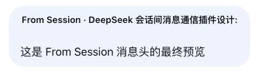

# dsh-agent-message

English | [中文](./README.md)

> A cross-session Agent communication plugin for DeepSeek Harness: it lets different Agent sessions running in the same process send and receive messages to each other, just like messaging.


---

## What is this

In DeepSeek Harness, a single process hosts multiple Agent sessions at once. This plugin equips each session with three tools so they can "message" each other:

- Before sending, first **list every sendable independent session** (non-archived, excluding actual subagents, including offline sessions that have not been reopened), and find the target by its title;
- Once found, **deliver the message to the target session** — ordinary messages always enter a new independent turn; if the target is offline (not loaded since the last process restart), the plugin resumes it through Harness's public API, delivers the message, and keeps the handle loaded for later communication until plugin teardown;
- When needed, **query the delivery status of a message on demand** (queued / claimed / discarded / unknown), with the target runtime status reported separately for supervision scenarios.

Typical scenarios: an orchestrator Agent dispatching work to a developer Agent, two Agents collaborating in a relay, a main session sending instructions to a test session, or a supervisor Agent watching over several workers.

## Features

| Capability | Description |
|---|---|
| `list_peer_agents` | List all **sendable independent sessions**: non-archived, excluding actual subagents while retaining ordinary forks; returns id, title, working directory, and runtime status |
| `send_agent_message` | Send a message to a session id; `followup` creates an independent turn by default and offline targets are resumed automatically; explicit modes are `followup`, `inject`, and `steer` |
| `check_delivery` | Query receipts on demand (pending/claimed/discarded/unknown); a successful send first returns accepted, while pre-admission failure is a tool error; explicit message ids remain queryable after restart |
| `@` session locator | Type `@` at the beginning of the composer and choose a target; candidates show only the session title and `Running`/`Idle`, excluding blank placeholders and subagents. The user sees a readable title while the current Agent receives the stable session id; `@` only locates the session, and the full-sentence intent determines whether to send, read, or analyze |
| Visible Agent message card | Relay keeps its true plugin provenance while the Client presents it as a left-aligned Agent message card; `From Session · <name>:` opens the sender by click or keyboard |
| Copy session id | A "Copy ID" button is added to the session header for one-click copying of the current session id |

### Sender navigation example



Current relay messages are displayed as visible Agent message cards; clicking the header opens the sender session. The persisted source remains plugin `relay` provenance rather than impersonating human input. The full session id remains in typed source metadata and in a Host-generated model-visible protocol header, so the receiving Agent never has to guess the sender.

### Delivery modes (the `mode` parameter of `send_agent_message`)

| mode | Meaning |
|---|---|
| (default, omitted) | `followup`: create an independent turn; an offline target is resumed automatically before delivery |
| `followup` | Same as the default; queue directly when online, or resume and queue when offline |
| `steer` | Intervene in the target's current work immediately (`running` sessions only) |
| `inject` | Add next-step context without interrupting the current goal (`running` sessions only) |

**Archived sessions and actual subagents are always rejected**; ordinary forks remain independent and sendable. Sending to yourself is also rejected.

## Installation

### Option 1: One-liner (recommended)
```sh
dsh plugin --profile web add dsh-agent-message
```

It self-registers on install; no extra configuration is needed.

Compatibility: Node.js 24 and DeepSeek Harness `>=0.1.0-rc.6 <0.2.0`; currently verified with Node.js `24.x` and Harness `0.1.0-rc.6`.

### Option 2: Install from GitHub

```sh
dsh plugin --profile web add github:GengDaPeng/dsh-agent-message
```

### Option 3: Just tell your Agent

Open any DSH session and send it this message:

> Help me install the cross-session communication plugin by running: `dsh plugin --profile web add dsh-agent-message`

The Agent will run this command via bash; once installed it auto-mounts and is immediately available to all sessions.

### What happens automatically after install

The plugin ships a `cordis.patch.yml` (pointed to by `dsh.bundle.patch` in `package.json`) that mounts itself into the host composition on install — so you do **not** need to manually edit presets or `cordis.patch.yml`. All sessions automatically gain `list_peer_agents`, `send_agent_message` and `check_delivery`.

## Usage

1. Type `@` at the beginning of session A's composer and choose the target from the native candidate menu; each candidate shows its title and `Running`/`Idle` activity;
2. `@` only tells A where the relevant session is; it does not mean send. A calls `send_agent_message` only when the current request or an orchestration responsibility already granted by the user requires cross-session communication. For example, `@B tell it to stop after opening the draft PR` sends, while `@B analyze its latest conversation result` must not send a message to B;
3. For an explicit forwarding request, A only delivers and reports whether the message was accepted or failed. It must not execute the forwarded task itself or ask B for an extra acknowledgement. B sends a message to `senderSessionId` only when the body explicitly asks it to return business content;
4. You can still ask the Agent to call `list_peer_agents` and send directly with a full session id;
5. Session B receives a native `UserMessage` with a typed relay source plus a minimal Host-generated source header on the first body line, so B does not have to guess the sender. The Client presents it as a visible Agent message card whose header opens the sender session;
6. (Supervision) Say "check the status of my messages to `<session id>`" — it calls `check_delivery`.

## How it works

Each Agent has an inbox `Inbox` containing two FIFO queues:

- `next-turn`: messages queued to be processed as an **independent turn**;
- `next-step`: steering input consumed at the **next step boundary** within the current turn.

Delivery paths of `send_agent_message`:

- **Ordinary online message**: find the target Agent through the `agents` registry and call `followup()` so it enters an independent `next-turn`;
- **Running-mode semantics**: users do not need to name a mode. The Agent selects `steer()` when the full request clearly asks for immediate intervention, or `inject()` when it clearly asks to add context without interrupting the current task. The target must actually be `running`; when intent is unclear, the Agent keeps the default `followup()`;
- **Ordinary offline message**: first read and validate one logical-session snapshot through `sessionQuery.readSession()`, then restore it through the public `agents.resume()` API and call `followup()`. The plugin retains and reuses the returned handle, keeps the target loaded after it becomes idle, and releases the handle only when the plugin unloads. Resume failures are returned directly; the plugin does not forge core Inbox events as a fallback note.

Session enumeration, batched titles, and offline log reads use Harness's `sessionQuery.listSessions()`, `readTitleSnapshots()`, and `readSession()` respectively. `SessionId` is the only address; `parentSession` records fork lineage only, and only `origin: subagent` identifies an actual subagent. The plugin does not scan `sessionPersistence` directly to rebuild a parallel session directory.

After `send_agent_message` submits the native message to the target Inbox, it immediately returns `accepted` with the native `messageId`; the model receives only a terse “delivered” projection while the complete result stays in tool presentation metadata. `check_delivery` then derives `pending` (still queued), `claimed` (claimed by a turn), `discarded` (cancelled), or `unknown` from Inbox events on demand. `claimed` is transport evidence only: it does not prove that the message was read, answered, or completed. Pre-admission failure remains a Harness tool error and writes nothing to the target Inbox. Runtime state is reported separately as `targetRuntimeStatus`, so unrelated Agent activity never changes the message state. A known `messageId` remains queryable from the target Inbox log after a process restart.

Every cross-session message is created by Harness `createUserMessage()`, and `UserMessage.id` is its only message identity. Its source always uses `kind: dsh-agent-message` and `form: relay`, plus the protocol version, sender/target Session ids, and display title. Because current Harness model requests do not expand custom source fields, the Host also writes a minimal `<dsh-agent-message>` header containing only `senderSessionId` on the first body line. The typed source is the durable/UI truth; the header is only the model-visible projection needed for reply addressing. The plugin registers no global system prompt; send admission lives only in the `send_agent_message` tool contract. The Client only projects relay as a visible Agent message card and never rewrites an Agent message as human `user` provenance.

Relay only means “a message addressed by another session”; it neither requires nor forbids a reply. When the body explicitly requests business content in return, the receiving Agent may send a message to `senderSessionId` with the same tool. Otherwise it must not send a transport acknowledgement or a bare “received.” The plugin does not automatically correlate requests and replies or forward ordinary Agent answers.

The composer-side `@` session locator reuses Harness's native `inputTriggers` command marker. The visible selected title is capped at 40 Unicode characters with an ellipsis; submission replaces it with the full stable `@session-...` id for the current Agent. The sent bubble still projects that id with a chat icon and the live session title, so renaming a session does not change the locator target.

See [`docs/architecture-v2.md`](./docs/architecture-v2.md) for the current architecture contract.

## Directory structure

```
dsh-agent-message/
├── lib/
│   ├── index.js        # host half: list_peer_agents / send_agent_message / check_delivery
│   └── client.js       # client half: @session references, session navigation and copy-session-id button
├── cordis.patch.yml    # self-registration patch (pointed to by dsh.bundle.patch)
├── package.json        # DSH plugin manifest (dsh.bundle / dsh.client / dshx.contributes)
├── docs/               # current architecture and README example screenshot
├── README.md           # Chinese documentation
└── README.en.md        # English documentation
```

## Limitations

- The target session must be **non-archived** and present in local persistence; archived sessions are always rejected.
- These tools are only for communication between independent sessions; actual subagents are neither listed as targets nor allowed to call them.
- One Session pair, regardless of direction, may receive at most 10 deliveries in a rolling 60-second window. The 11th is rejected before the target Inbox is changed. This window belongs to the current Harness process and resets on restart.
- Automatically resuming an offline session uses the **default model** (it does not inherit a model manually selected earlier in that session); if resume fails, the message is not written to the target Inbox.
- Bulk receipt queries without `messageId` rely on in-memory bookkeeping and cover only the most recent 1000 sends in the current process (FIFO eviction). After a restart, a known `messageId` remains queryable, but the volatile `sentAt` and `mode` fields are no longer returned.
- Cross-process / cross-machine communication is out of scope.

## License

[MIT](./LICENSE)
