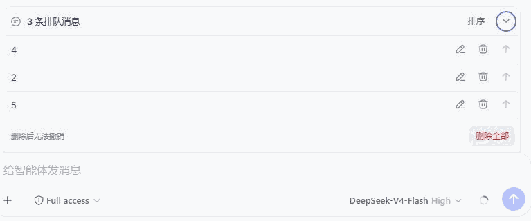

# dsh-queue-plus

English | [简体中文](./README.md)

A cleaner DSH queue panel for **editing, removing, steering, reordering, and bulk removal**.



Queue Plus takes over QueueDock through DSH's public slot mechanism without hiding or duplicating queued messages. The stock queue returns automatically when the plugin is disabled or removed.

## Features

- Edit, remove, or steer queued prompts.
- Drag messages, or use the arrow buttons to reorder them.
- Remove all with confirmation and DSH's official per-item removal.
- Auto-expand new queues and remember manual collapse.
- Supports Chinese, English, keyboard, and touch controls.

## Install

The recommended install is the prebuilt Release archive, which needs no install-script permission:

```sh
dsh plugin --profile web add -w https://github.com/starslittle/dsh-queue-plus/releases/download/v0.3.0/dsh-queue-plus-0.3.0.tgz
```

Restart `dsh web`. Queue at least two prompts while an agent is running; **Sort** appears next to the queue title.

## Check that it loaded

| What you see | What to do |
|---|---|
| **Sort** appears after two queued prompts | It is on |
| No **Sort** | Restart, and use queue-send rather than send-now |
| Uninstall restores the stock queue | Expected |

## Limits

- Single and bulk removal both call DSH's official `conversation.updateQueue(..., { kind: 'remove' })` operation.
- Remove all targets only the rows visible at confirmation time; concurrent changes may cause partial completion but later messages are not removed.
- Reordering uses server confirmation and stale-order protection, rejecting a changed queue instead of scrambling it.
- The plugin does not touch steering/context queues or queues owned by a parent Agent.
- The stock queue returns automatically after uninstall.

<details>
<summary>Pin a version, source install, and development</summary>

```sh
dsh plugin --profile web add github:starslittle/dsh-queue-plus#v0.3.0
```

Source install runs this repo's `prepare` build. pnpm 10+ requires an explicit allow in that profile's `pnpm-workspace.yaml`; only grant it to source you trust.

```sh
pnpm install
pnpm run check
dsh plugin --profile web add -w link:/absolute/path/to/dsh-queue-plus
```

```sh
dsh plugin --profile web update dsh-queue-plus
dsh plugin --profile web remove dsh-queue-plus
```

Built against the public `@deepseek-ai/* 0.1.0-rc.6` Agent Inbox and Web plugin contracts. Those are still release candidates.

</details>

## License

MIT
