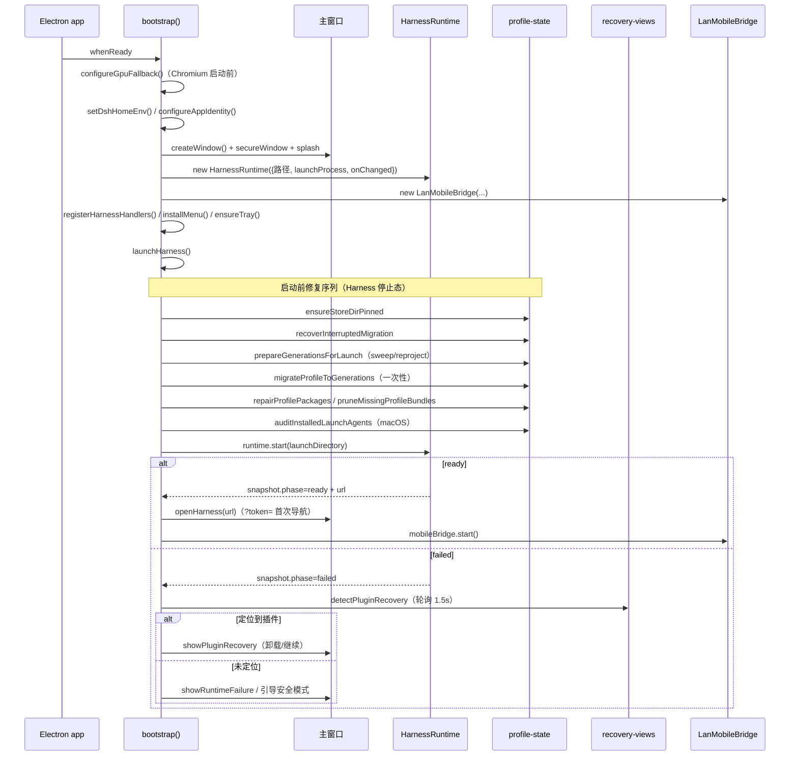

# 应用引导与主进程生命周期（app-bootstrap）

`src/main/index.ts`（约 2300 行）是 Electron **主进程唯一入口**：装配窗口、Harness 运行时、移动桥、更新管理器，持有全部模块级单例状态，并编排"启动前修复 → 启动 Harness → 失败自愈"的主循环。各策略细节分散在 [[window-shell]]、[[harness-runtime]]、[[profile-state]]、[[recovery-views]]、[[auto-update]]、[[mobile-bridge]]、[[preload-ui]]；本文件是把它们粘起来的地方。

## 架构概述

启动失败时的**代次回滚**（`launchHarness` 尾部）：新插件集未达 ready → 若迁移过则 `rollBackMigration` 回滚到升级前快照并重启；否则 `desiredIsUntried` 为真时 `rollBackToLastKnownGood` 回到上一个渲染成功的代次再启动。注意注释强调：到达 ready 只是必要条件，**窗口真正渲染**（`markHarnessRendered`）才提交 last-known-good。

## 组件约束索引

| Component | Constraints | Risks | Summary |
|-----------|------------|-------|---------|
| `launchHarness` | 6 | 2 | 启动前 8 步修复序列；失败按 migration/LKG 两级回滚；并发去重 |
| `bootstrap` | 4 | 1 | 装配全部单例；dshHome 便携化；launchProcess 按平台分叉 |
| `registerHarnessHandlers` | 5 | 2 | 每个 IPC handler 校验 event.sender === 主窗口 webContents |
| `portableDshHome` / `setDshHomeEnv` | 2 | 2 | data 目录在可执行文件旁；Win 写 HKCU\Environment 持久化 |
| `dshEntryPath` / `harnessNodeRuntime` | 3 | 1 | 打包态走 resourcesPath，dev 态走 app 路径；优先复用 Electron 二进制 |
| `executeDesktopMenuCommand` | 2 | 1 | 19 个命令分发；命令经 isDesktopMenuCommand 守卫 |
| `launchSafeHarness` | 2 | 1 | 安全模式用独立 SAFE_MODE_PROFILE，阻断第三方 bundle |
| `showPluginRecovery` 流程 | 3 | 2 | waitForPluginRecoveryAction 阻塞等待用户动作；卸载后重跑检测 |

## 组件职责

### 便携化与路径解析

- `portableDshHome()`：**打包态** = `dirname(process.execPath)/data`（exe 旁）；**dev 态** = `app.getAppPath()/data`（项目根，避免落到 node_modules/electron 的 electron.exe 旁）。这是"零安装便携部署"的根——profile/settings/凭据全在可执行文件旁的 data 目录，不写用户家目录。
- `setDshHomeEnv()`：当前进程设 `DSH_HOME`，Windows 额外 `reg add HKCU\Environment`（无需管理员、重启保留），让 CLI 等未来进程也能看到；失败非致命（进程级已设）。
- `dshEntryPath()`：打包态 `<resources>/app/node_modules/@deepseek-ai/dsh/lib/bin.js`，dev 态项目 node_modules 下同路径。
- `harnessNodeRuntime()`：**优先复用运行中的 Electron 二进制作为 Node 运行时**（省一个独立 Node 进程，此时子进程需 `ELECTRON_RUN_AS_NODE=1`）；不可用时回退包内 `node_modules/node/bin/node`。
- `harnessNodeEntryPath()`：打包态 `<resources>/harness-node-entry.mjs`，dev 态 `build/harness-node-entry.mjs`。
- `bundledPnpmEntryPath()`：`node_modules/pnpm/bin/pnpm.cjs|.mjs`；`bundledPnpmRunnerPath()` 指向 `dsh-desktop-market-installer/pnpm-runner.mjs`（Windows 锁文件恢复 runner，见 [[harness-runtime]] 关于 shim 必须路由到 runner 的约束）。
- 补丁文件 `desktopResourcePath('dsh-desktop.patch.yml')` 作为 `dshPatchPath` 传给运行时。

### 启动编排 `launchHarness()`

单飞（`harnessLaunchOperation` 去重，重复调用复用同一 Promise）。Harness 必须在停止态才能修包，所以序列为：

1. `showSplash()` 显示启动屏；`runtime.stop()` 停旧进程（restart 路径下旧进程还在）。
2. `ensureStoreDirPinned(dshHome)`：钉住 pnpm store——未钉 store 会让所有包操作（含修复）失败。
3. `recoverInterruptedMigration`：恢复上次中途中断的代次迁移快照。
4. `prepareGenerationsForLaunch`：冷启动清扫无引用的插件代次并 reproject，使 profile 链接匹配 desired。
5. `migrateProfileToGenerations`：一次性把升级前的旧 profile（共享树中的社区插件）迁到 generation 模型；成功即替代共享树修复。
6. 未迁移则 `repairProfilePackages(dshHome)`；随后 `pruneMissingProfileBundles`、`reportProfileConsistency`、`auditInstalledLaunchAgents`（macOS）。
7. `runtime.start(launchDirectory)`。
8. 未 ready → 回滚分支（见架构图）。

`launchSafeHarness()`：`ensureSafeModeProfile` 物化独立安全 profile（阻断第三方 web bundle），以 `SAFE_MODE_PROFILE` 启动；ready 后才启动移动桥。

### IPC handler 注册

`registerHarnessHandlers()` 注册 Harness/菜单/标题栏相关通道，**每个敏感 handler 先校验 `event.sender === mainWindow.webContents`**（部分还要求 `event.senderFrame === mainFrame`），拒绝来自其他窗口/webview 的调用：

| 通道 | 作用 |
|------|------|
| `harness:restart` | 重启 Harness（仅 ready 态、仅主窗口） |
| `desktop-menu:execute` | 执行菜单命令（经 `assertTrustedDesktopMenuEvent` + `isDesktopMenuCommand` 双校验） |
| `desktop-menu:get-zoom-factor` | 读当前缩放 |
| `desktop-titlebar:set-menu-open/close-menu/set-theme` | Windows 自定义标题栏菜单/主题 |
| `directory-picker:open` | 工作区目录选择（记住上次目录到 `last-workspace-dir.txt`） |
| `mobile:open-pairing` / `mobile:status` | 移动配对（受 `ENABLE_MOBILE_BRIDGE` 守卫） |
| `harness:show-log` / `harness:open-in-finder` / `harness:open-recovery` | 日志/定位/打开恢复页 |
| `recovery:action` | 插件恢复页动作（uninstall/show-log/quit/restart/safe-mode） |
| `safe-mode:action/status/manage/exit` | 安全模式页动作（apply 选中插件/问题、退出重启） |
| `harness:reset-plugins` | 重置指定插件 |

`bootstrap()` 内还注册更新 handler（`registerUpdateHandlers`，见 [[auto-update]]）。

### 菜单、托盘与窗口装配

- `createWindow()`：创建主 `BrowserWindow`，`secureWindow` 加固（见 [[window-shell]]），加载 splash；`configureAppIdentity`（app 名/ID/路径）、`installMenu`（应用菜单，命令走 `executeDesktopMenuCommand`）、`ensureTray`（托盘，Windows 关窗驻留）。
- `executeDesktopMenuCommand(command)`：分发 [[shared-contracts]] 定义的 19 个 `DesktopMenuCommand`（重启、安全模式、显示日志、检查更新、编辑命令、缩放、devtools、全屏、关于、退出等）；缩放命令返回新 zoomFactor 给 renderer。
- Windows 菜单子窗口：`attachWindowsMenuView`/`setWindowsMenuOpen`/`updateWindowsMenuViewBounds` 用 `WebContentsView` 在标题栏承载自定义菜单（bounds 计算见 [[window-shell]] 的 `windowsMenuViewBounds`，DOM 见 [[preload-ui]]）。

### 失败恢复编排

- 运行时 `onChanged` 回调：`ready` 且有 url → `openHarness(url)`（经 `desktopHarnessUrl` 挂 token，见 [[window-shell]]）；`failed` → `showRuntimeFailure(snapshot)`。
- `showPluginRecovery`：调 [[recovery-views]] 的 `detectPluginRecovery`（合并子进程日志与渲染进程实时 console，1.5s 内轮询），构建视图模型加载恢复页；`waitForPluginRecoveryAction` 阻塞等待用户选择 → uninstall（`removeProfilePluginCompletely` 后重跑检测循环）/ safe-mode / show-log / quit / restart。
- `showSafeMode`/`showSafeModeManager`：`buildSafeModeViewModel` 构建安全模式页；`waitForSafeModeAction` 等待 apply（`removeSafeModePlugin`/`repairSafeModeCompatibilityIssues`）/ agent / restart / quit。
- 渲染进程/GPU 崩溃：`installMainWindowRendererRecovery` + `recordMainWindowRendererLoss` + `shouldReloadAfterMainWindowRendererLoss`（≤3 次、冷却 5s）决定 `reloadMainWindowAfterRendererLoss`；前端插件故障经 `harness:open-recovery` 进入恢复流程（`queuePendingFrontendPluginRecovery`）。

### macOS launchd 审计

`auditInstalledLaunchAgents(dshHome)`（冷启动）与 `quarantineInstalledLaunchAgentsForUpdate`（更新前）委托 [[profile-state]] 的 launch-agent-audit：扫描 `~/Library/LaunchAgents` 中指向 app bundle 的 daemon 化残留条目并隔离/修复；更新前若隔离失败会中止更新（旧条目在新 bundle 路径下失效）。

## 关键业务约束

- **DSH_HOME 便携化，data 随可执行文件走**（confidence: 0.95）
  > Evidence: `portableDshHome()`（`:127-129`）打包态取 `dirname(process.execPath)/data`；`bootstrap` 注释 `:2053-2058` 明确便携意图。

- **敏感 IPC 只接受主窗口 webContents**（confidence: 0.95）
  > Evidence: `harness:restart` handler（`:1188-1190`）与 `directory-picker:open`（`:2096-2103`）均校验 `event.sender !== mainWindow.webContents` 即抛错；菜单命令另过 `assertTrusted*` 与 `isDesktopMenuCommand`。

- **修包必须在 Harness 停止态、且先钉 store**（confidence: 0.9）
  > Evidence: `launchHarness` 注释 `:1089-1096`：restart 时先 `runtime.stop()` 再修复；`ensureStoreDirPinned` 先于一切 pnpm 操作。

- **last-known-good 以窗口渲染为准，非 ready**（confidence: 0.9）
  > Evidence: `:1134-1137` 注释 "Reaching 'ready' is necessary but not sufficient — the window-rendered commit in markHarnessRendered is what confirms it"。

- **Node 运行时优先复用 Electron 二进制**（confidence: 0.85）
  > Evidence: `harnessNodeRuntime()`（`:558-565`）：`process.execPath` 存在则 `useElectronRuntime: true`，回退包内 node；对应子进程 `ELECTRON_RUN_AS_NODE` 注入见 [[harness-runtime]]。

- [candidate] 移动桥在非安全模式下随应用自动启动（confidence: 0.6）
  > Evidence: `:2094` `if (!startInSafeMode) void mobileBridge.start()`；安全模式在 ready 后才启动（`:1168`）。

## 数据流与状态

模块级单例：`mainWindow`、`windowsMenuView`、`runtime`（HarnessRuntime）、`mobileBridge`、`harnessLaunchOperation`（启动单飞 Promise）、`safeModeVisible`/`failureRecoveryVisible`（当前页状态）、`gpuFallbackState`。持久化状态：GPU 降级（`userData/gpu-fallback.json`）、更新跳过版本、上次目录选择；profile 侧状态（marker/ledger/generations）全部在 `dshHome` 内，见 [[profile-state]]。

## 与其他模块的关系

- [[harness-runtime]]：`HarnessRuntime` 实例由本文件创建并驱动；`launchProcess` 在 macOS 注入 `launchDisclaimedUtilityProcess`（dev 态 disclaim=false）、Windows 用 `spawn`。
- [[profile-state]]：启动前修复序列的全部委托对象。
- [[recovery-views]] / [[auto-update]] / [[mobile-bridge]] / [[window-shell]] / [[preload-ui]]：本文件装配并持有。
- [[shared-contracts]]：菜单命令、运行时/更新状态类型。

## 跨模块引用

- 打包后 resources/data 布局由 [[build-tooling]] 的 electron-builder 配置决定。
- 插件市场安装触发的 profile 变更走 [[desktop-extensions]] 的 market-installer host 服务。
