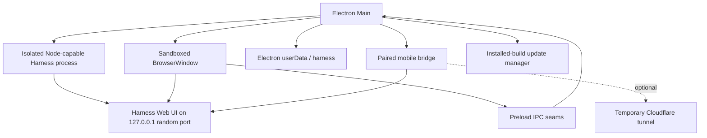

---

title: "Architecture"
type: Module
description: "DSH Desktop 作为 DeepSeek Harness 的 Electron host，不维护第二套 Agent 运行时，也不重实现 Harness 前端。其核心价值在于提供原生桌面能力：启停 Harness、原生目录管理、系统主题适配、更新、移动端桥接等。"
generated: { by: codewiki/5.5.0, at: 2026-08-30T13:34:13Z }
stale_after: 2026-11-28
aliases: [architecture]
status: stable

---

# DSH Desktop 架构文档

## 项目定位

DSH Desktop 作为 DeepSeek Harness 的 Electron host，不维护第二套 Agent 运行时，也不重实现 Harness 前端。其核心价值在于提供原生桌面能力：启停 Harness、原生目录管理、系统主题适配、更新、移动端桥接等。

## 运行时拓扑



### 操作系统差异

- **macOS**：Harness 运行在 Electron UtilityProcess 中，拥有 Node 能力
- **Windows**：Harness 使用捆绑的 target-native Node.js 启动

### Cordis HMR

- `--expose-internals` 权限仅授予 isolated process，而非 web renderer

## 启动流程

1. 配置稳定的应用身份与 user-data 目录
2. 获取单实例锁
3. 创建应用所有的 `launch-root` 目录
4. 打开启动表面，检查正常 web profile
5. Pin profile 的 pnpm store，在需要时修复不完整的包状态
6. 在可用的 `127.0.0.1` 端口上启动 Harness，使用 tracked desktop patch layer
7. 轮询端点直到保持健康，然后加载到主窗口
8. 启动 paired mobile bridge，在 installed builds 中启动 update manager

## 持久化数据

```
Electron userData/
├── launch-root/                 中立的 Harness 进程工作目录
├── harness/                     DSH_HOME
│   ├── profiles/                正常与 Safe Mode profile
│   ├── sessions/                对话状态
│   ├── settings.yaml            Harness-backed settings
│   └── plugins and package data
├── bin/                         缓存的桌面辅助二进制文件
└── update-skip.json             记住的更新选择（存在时）
```

生产和开发构建使用独立的 user-data root。应用升级不替换 profile、plugin、workspace、session 或 model 配置数据。

## 窗口与 IPC 安全

主 Harness 窗口使用：

- `contextIsolation: true`
- `nodeIntegration: false`
- Electron 渲染器沙箱
- web security enabled
- blocked webviews
- 导航和新窗口限制
- 狭窄的权限白名单

仅信任本地 Harness、打包文件和桌面恢复 URL。普通 HTTP/HTTPS 链接在外部打开。IPC handler 在执行开放 native directory picker、重启 Harness、管理 Safe Mode、安装更新等特权操作前，会验证发送窗口和主帧。

## Profiles and Plugin Recovery

正常 web profile 可能包含社区插件及其传递包。启动时执行有界一致性检查，可在发布 Harness 前修复不完整的包操作。

Safe Mode 是非破坏性的：启动包含官方核心 bundle 的隔离 profile，保持 Agent 和用户数据可用，允许用户在返回正常 profile 前移除选中的第三方插件。

## Mobile Access Boundary

Harness 保持在随机 loopback port。移动端访问由单独的 bridge 提供：

- bridge 在专用 LAN 端口监听
- 配对使用短随机 token 和 desktop approval
- 移动端 API 访问需要授权 session
- 请求按 origin、地址和连接状态限制
- 可启用临时 Cloudflare Quick Tunnel 实现 LAN 外访问

公开隧道是可选的，仅转发 paired mobile surface，不重绑定 Harness service 到公开接口。

## Updates

已发布的 macOS 和 Windows 构建使用 `electron-updater`。应用启动后不久、每六小时以及长系统恢复后检查可用版本。新版本提供后，用户确认才开始下载。只有用户选择重启并安装时，安装才开始。用户可以跳过一个版本而不抑后续发布。

更新元数据和发布成果由原生 release 工作流产生。macOS arm64 和 x64 元数据合并用于 generic provider；已签名的 Windows 安装器在签名后重新生成 blockmap 和 metadata。

## Desktop Customization Boundary

大部分产品 UI 保持 upstream Harness。DSH Desktop 通过 Electron Main 和 preload code 添加原生 host surface，在可用时使用 Harness extension slots，并追踪不可避免的 upstream package 变更为 reproducible `patch-package` 文件。这使得 desktop 层可审查，同时使 upstream 升级成为明确的兼容性练习。

### 自定义范围

- **Provider Onboarding**：官方 DeepSeek 模型与第三方提供商的接入
- **Preset Transfer**：可移动的 Agent preset 管理
- **Workspace Management**：项目工作空间的本地管理
- **Branding**：应用图标、名称、主题适配
- **Layout**：原生菜单、标题栏行为、窗口焦点