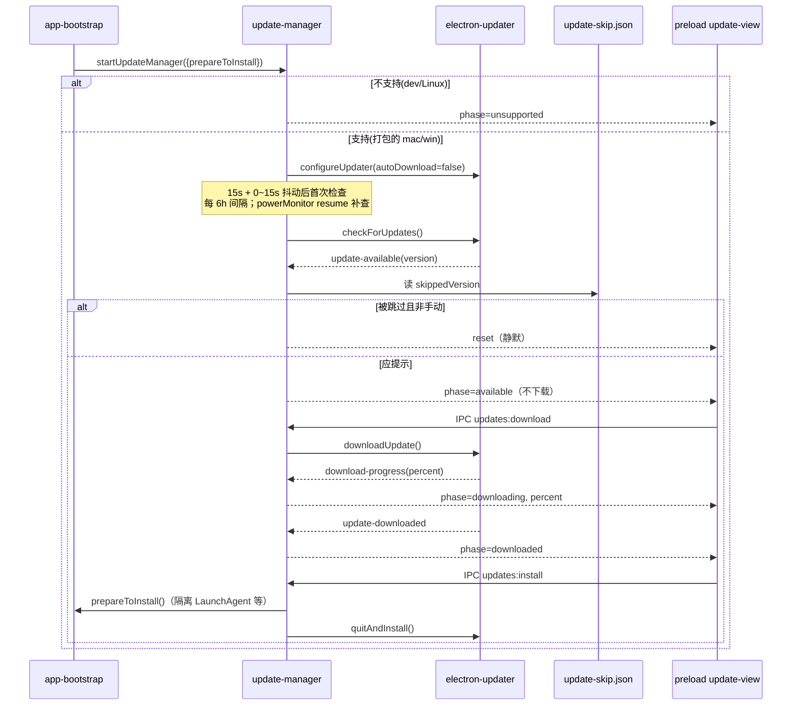
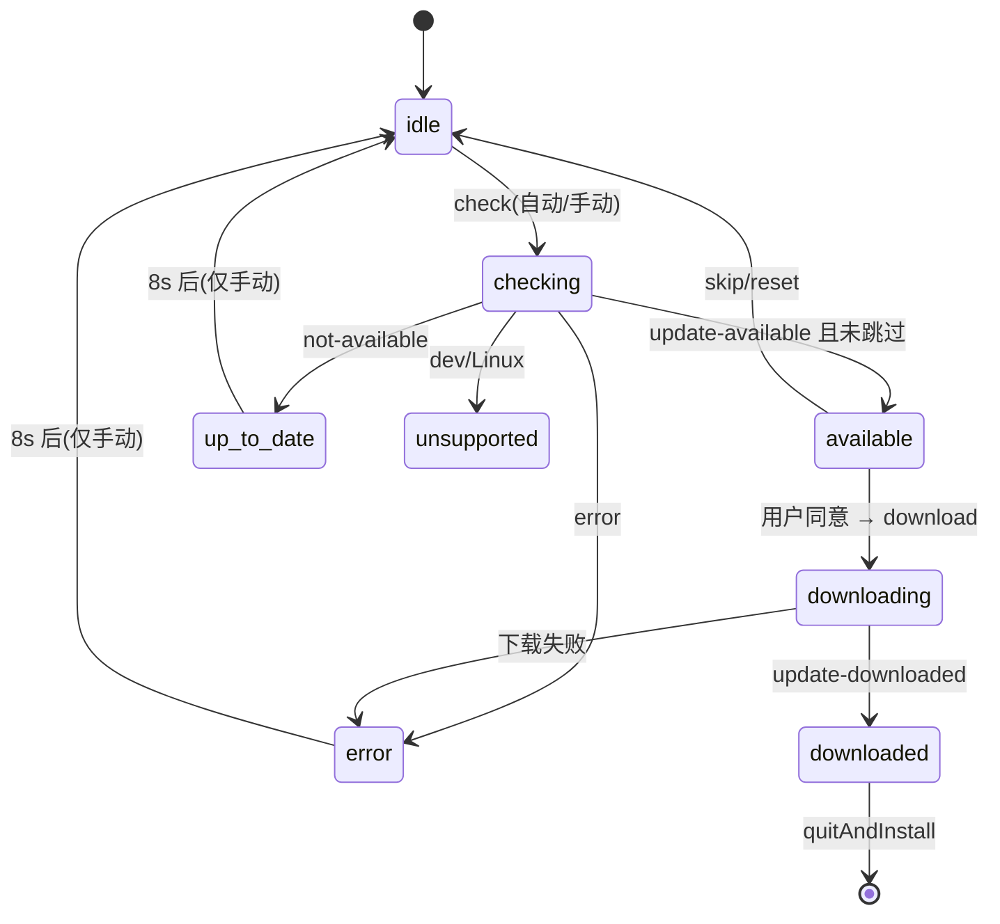

# 自动更新（auto-update）

`src/main/update/` 封装 `electron-updater`，把"检查—提示—下载—安装"建模为一个纯 reducer 状态机 + 一组副作用定时器，并通过 IPC 把状态广播给 [[preload-ui]] 的更新提示条。状态枚举定义在 [[shared-contracts]] 的 `UpdatePhase`/`UpdateStatus`。

## 架构概述

## 组件约束索引

| Component                          | Constraints | Risks | Summary                                             |
| ---------------------------------- | ----------- | ----- | --------------------------------------------------- |
| `configureUpdater`                 | 3           | 1     | autoDownload=false：用户同意前不产生下载流量                     |
| `update-available` handler         | 2           | 1     | 按版本 skip 门控；手动检查无视 skip                             |
| `checkForUpdates`                  | 3           | 1     | 并发去重（checkPromise/阶段锁）；不支持平台短路                      |
| `installDownloadedUpdate`          | 2           | 2     | 仅 downloaded 阶段；先 prepareToInstall 再 quitAndInstall |
| `reduceUpdateStatus`               | 2           | 0     | 纯函数 reducer，8 类事件收敛到 UpdateStatus                   |
| `supportsAutoUpdates`              | 1           | 1     | 仅 isPackaged 且 darwin/win32                         |
| `skipUpdate` / `shouldOfferUpdate` | 2           | 1     | 跳过按版本持久化；手动检查可重新取回                                  |

## 组件职责

### update-policy.ts — 平台与节奏策略

- `supportsAutoUpdates(isPackaged, platform)`：**仅打包安装版（`app.isPackaged`）且平台为 darwin/win32** 才支持自动更新。dev 构建、Linux 落到 `unsupported` 阶段。
- 节奏常量：启动后 `UPDATE_STARTUP_DELAY_MS = 15s` + `0~UPDATE_STARTUP_JITTER_MS(15s)` 随机抖动做首次检查（避免所有安装实例同时打发布源）；`UPDATE_CHECK_INTERVAL_MS = 6h` 周期检查；`AUTO_INSTALL_ON_APP_QUIT = false`（退出时不自动安装）。
- `shouldCheckAfterResume(lastCheckedAt, now)`：系统从睡眠 resume 后，距上次检查超过 6 小时才补查。

### update-state.ts — 纯 reducer

`UpdateStateEvent` 是 8 类事件的判别联合：`check` / `available` / `progress` / `downloaded` / `not-available` / `error` / `unsupported` / `reset`。`reduceUpdateStatus(current, event)` 无副作用地把事件折叠为新 `UpdateStatus`：

| 事件            | 目标 phase      | 备注                                           |
| ------------- | ------------- | -------------------------------------------- |
| check         | `checking`    | 携带 manual                                    |
| available     | `available`   | 记 availableVersion                           |
| progress      | `downloading` | percent 经 `clampPercent` 夹取到 0–100 并保留 1 位小数 |
| downloaded    | `downloaded`  | 记版本                                          |
| not-available | `up-to-date`  |                                              |
| error         | `error`       | 记 message                                    |
| unsupported   | `unsupported` | 记 message                                    |
| reset         | `idle`        | 回到初始                                         |

`initialUpdateStatus(currentVersion)` 产出 `{phase:'idle', currentVersion, manual:false}`。

### update-manager.ts — 副作用与编排

模块级单例状态（`status`、`checkPromise`、`downloading`、`installing`、`manualCheck`、各 timer）。

- `startUpdateManager({prepareToInstall})`：不支持平台直接转 `unsupported`；否则 `configureUpdater()` 并挂三个触发源——启动延迟定时器、6h 间隔定时器、`powerMonitor.on('resume', checkAfterResume)`。`prepareToInstall` 回调由 [[app-bootstrap]] 注入（安装前隔离 macOS LaunchAgent，见 [[profile-state]] 的 launchd 审计）。
- `configureUpdater()`：**`autoUpdater.autoDownload = false`** 是核心决策——更新在 `available` 阶段只提示不下载，直到用户在提示条上点击（同一动作触发下载）；`allowPrerelease = false`；挂 6 个 electron-updater 事件转成 reducer 事件。`update-available` 时先用 `shouldOfferUpdate(version, skippedVersion, manualCheck)` 门控，被跳过的版本静默 reset。
- `checkForUpdates(manual)`：阶段锁——已有 `checkPromise` 在飞、或当前处于 `available/downloading/downloaded` 时直接返回；失败转 `error`，手动检查触发 `scheduleReset()`（8 秒后回到 idle，让提示条消失）。
- `downloadAvailableUpdate()`：仅 `phase==='available'` 且未在下载时执行 `autoUpdater.downloadUpdate()`。
- `installDownloadedUpdate()`：仅 `phase==='downloaded'`；先 `await prepareToInstall()`，再 `autoUpdater.quitAndInstall(false, true)`。
- `transition(event, manualOverride?)`：调用 reducer，然后向**所有**未销毁窗口 `webContents.send('updates:status-changed', status)` 广播。
- IPC handlers（`registerUpdateHandlers`，幂等）：`updates:status`（拉取当前状态）、`updates:download`、`updates:install`、`updates:skip`。

### skipped-version.ts — 按版本跳过

跳过版本持久化在 `userData/update-skip.json`。`shouldOfferUpdate(version, skipped, manual)` = `manual || version !== skipped`：**手动检查无视跳过**（这是用户取回一个被跳过版本的方式，无需"取消跳过"UI）；新版本号是新问题，照常提示。写失败只丢失跳过记录、不影响启动（`writeSkippedVersion` 返回 boolean）。

## 关键业务约束

- **用户同意前不下载**（confidence: 0.95）
  
  > Evidence: `update-manager.ts:185` `autoUpdater.autoDownload = false`；`downloadAvailableUpdate` 仅由 IPC `updates:download` 触发；注释 "Offered, not fetched: nothing leaves the network until the user accepts"。

- **仅打包版 mac/win 支持**（confidence: 0.95）
  
  > Evidence: `update-policy.ts:6-8` `isPackaged && (darwin || win32)`；dev/Linux 走 `unsupported`。

- **跳过按版本持久化、手动检查可覆盖**（confidence: 0.9）
  
  > Evidence: `skipped-version.ts:22-28` `shouldOfferUpdate` 返回 `manual || version !== skippedVersion`；`update-manager.ts:199` update-available 门控。

- **检查并发去重 + 阶段锁**（confidence: 0.85）
  
  > Evidence: `checkForUpdates` 中 `if (checkPromise || ['available','downloading','downloaded'].includes(phase)) return`；`downloading`/`installing` 布尔锁。

- **手动检查的临时状态 8 秒后自动复位**（confidence: 0.85）
  
  > Evidence: `TRANSIENT_STATUS_MS = 8_000` 与 `scheduleReset()` 仅在 `status.manual` 时挂 reset 定时器。

## 与其他模块的关系

- [[shared-contracts]]：`UpdatePhase`/`UpdateStatus` 类型来源。
- [[app-bootstrap]]：启动时 `startUpdateManager` 并注入 `prepareToInstall`（macOS 安装前 `quarantineInstalledLaunchAgentsForUpdate`）；注册 IPC。
- [[preload-ui]]：`update-view.ts` 消费 `updates:status-changed` 推送、显示/关闭提示条、发 `updates:download/install/skip`。
- [[profile-state]]：安装前 LaunchAgent 隔离的具体逻辑。

## 跨模块引用

- 更新提示条的 renderer 侧文案与显示判定见 [[preload-ui]]。
- 发布源配置（generic provider 指向 GitHub releases）见 `package.json` 的 `build.publish` 与 [[build-tooling]]。
