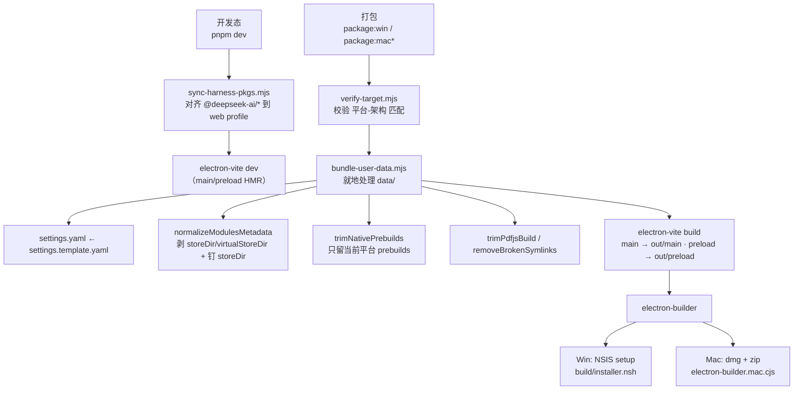

# 构建与打包工具链（build-tooling）

本仓库的工具链围绕一个目标：**产出零安装、便携的桌面应用**——可执行文件旁带 `data/`（DSH_HOME，含 profile/设置/记忆 CLI），离线拷贝即运行。构建分三层：electron-vite 编译 main/preload → `bundle-user-data.mjs` 就地规范化 data/ → electron-builder 打包安装器。

## 架构概述

## 脚本/配置索引

| 路径                                                                                                     | 作用                                                                                                       |
| ------------------------------------------------------------------------------------------------------ | -------------------------------------------------------------------------------------------------------- |
| `electron.vite.config.ts`                                                                              | main/preload 构建；`externalizeDepsPlugin` 外置依赖；preload 多入口（`index` + `windows-menu`），CJS 格式输出 `[name].cjs` |
| `vitest.config.ts`                                                                                     | 单元测试配置（`pnpm test` = `vitest run`）                                                                       |
| `scripts/bundle-user-data.mjs`                                                                         | 打包前**就地**处理 `data/`（核心，见下）                                                                               |
| `scripts/sync-harness-pkgs.mjs`                                                                        | 把仓库根 `node_modules/@deepseek-ai/*` 对齐到 `data/profiles/web/node_modules/@deepseek-ai/`                    |
| `scripts/verify-target.mjs`                                                                            | 打包目标平台校验（mac arm64/x64、win x64），强制"在目标机器上构建"                                                             |
| `scripts/install-brand-assets.mjs`                                                                     | postinstall 安装品牌资源                                                                                       |
| `scripts/generate-app-icons.mjs`                                                                       | 生成应用图标                                                                                                   |
| `scripts/finalize-windows-release.mjs` / `merge-mac-update-metadata.mjs` / `verify-release-assets.mjs` | 发布后处理与校验（Windows 定稿、Mac 更新元数据合并、资产校验）                                                                    |
| `scripts/prepare-macos-signing-keychain.mjs`                                                           | macOS 签名钥匙串准备（CI）                                                                                        |
| `electron-builder.dev.cjs` / `electron-builder.mac.cjs`                                                | 开发版/ Mac 打包配置变体                                                                                          |
| `build/installer.nsh`                                                                                  | NSIS 安装脚本（直落 `$INSTDIR\data`、覆盖安装、快捷方式）                                                                  |
| `build/harness-node-entry.mjs` / `splash.html` 等                                                       | 运行时入口与启动屏资源                                                                                              |

## bundle-user-data.mjs（核心）

`data/` 目录双重身份：**既是 dev 态的 DSH_HOME（存放用户实时会话/凭据），又是打包输入**。脚本绝不删除实时数据，只重处理三类构建输入，实际发货内容由 electron-builder 的 extraResources `filter` 白名单决定（见 package.json build 配置：只打包 `settings.yaml` 与 `profiles/web/**/bin/**` 等，`.credentials.yaml`、sessions、缓存天然被排除）。

处理步骤：

1. **settings.yaml**：从 `data/settings.template.yaml` 逐字复制。**刻意不读用户活的 `~/.dsh/settings.yaml`**（含个人 model/provider 配置与机器相关 cliPath），保证发货包便携且不泄密；记忆 CLI 路径由主进程启动时注入 `MNEMON_CLI_PATH`（见 [[harness-runtime]]）。
2. **profiles/web**：**直接以 `data/profiles/web` 为唯一真相源**（市场 UI 或 `pnpm add` 就地更新它），不再从活的 `~/.dsh` 拷贝。只做就地规范化与裁剪；缺失即致命报错（提示先安装 web profile）。
   - `normalizeModulesMetadata`：递归拷贝的树里 `.modules.yaml` 残留**源机器绝对路径**，pnpm `checkCompatibility` 会在市场 UI 首次增删插件时抛 `ERR_PNPM_UNEXPECTED_STORE/VIRTUAL_STORE`。这里删掉 `virtualStoreDir`（可选检查，pnpm 重算）与 `storeDir`（运行时由 [[harness-runtime]] 的 `syncModulesMetadata` 重写为当前机器路径）；并在 `pnpm-workspace.yaml` 钉 `storeDir` 为**当前构建平台**的用户家目录缓存（Win `~/AppData/Local/pnpm/store`、mac `~/Library/pnpm/store`、Linux `~/.local/share/pnpm/store`）——避免 pnpm 回退到卷根 `.pnpm-store` 造成双倍缓存。pin 块每次按平台重写（该文件入 git，Win 钉的路径不能漏进 mac 包）。
   - `trimNativePrebuilds`：构建总在目标机器上跑（verify-target 强制），`${platform}-${arch}` 即目标——删除所有 `*.pdb`（node-pty 预编译里 ~58MB 调试符号）、非目标平台的 `prebuilds/` 目录（如 win32-x64 构建删 darwin-*/linux-*/win32-arm64）、`build/Release/conpty` 下其他架构子目录。**就地裁剪 dev profile**：Win 裁过的树不能再打 mac 包，需重装 profile 依赖（CI 每 job 全新安装不受影响）。
   - `trimPdfjsBuild`：裁剪 pdfjs 冗余构建产物。
   - `removeBrokenSymlinks`：pnpm `link:` 依赖产生指向 profile 外的符号链接（如指向 `E:/work/...` 的开发插件），拷贝到 dist 后成为断链，NSIS 压缩时 7za 会 exit 1；有效链接解析为真实内容拷贝，断链删除。
3. **bin/**（mnemon 记忆 CLI + 运行时 DLL）：本机有活的 `~/.mnemon/bin` 则刷新（build 输入，可安全重建）；CI 无 `~/.mnemon` 时**保留 git 跟踪的预 staged `data/bin`**，绝不静默丢失记忆 CLI。

## sync-harness-pkgs.mjs

npm 上 `@deepseek-ai/*` 的 latest 仍是 `0.0.1-rc.1`，web profile 经 pnpm install 解析出的核心包是旧版，会遮蔽 0.1.2-alpha.1 核心，导致 `does not provide an export named 'ToolCallId'`、`llm/listProviders HTTP 404`。pnpm v11 overrides 的 file:/link: 值在传递依赖场景不生效（实测），故用本脚本在**每次 pnpm install 之后**把仓库根 `node_modules/@deepseek-ai/*` 按版本对齐（缺失或版本不同则覆盖，一致跳过）到 web profile 顶层。`pnpm dev` 先跑它再起 electron-vite。

## electron-builder 关键决策（package.json build）

- **`asar: false`**：Harness 需要以真实文件树加载插件/node_modules/pnpm，asar 归档会破坏文件访问与 pnpm 操作。
- **extraResources vs extraFiles**：
  - `extraResources`：图标、`harness-node-entry.mjs`、`dsh-desktop.patch.yml`、HTML 页等构建资源。
  - `extraFiles`：`data/` 直落安装目录 `$INSTDIR\data`（便携 DSH_HOME，配合 [[app-bootstrap]] 的 `portableDshHome`）；filter 白名单只含 `settings.yaml` 与 `profiles/web/**/bin/**` 等，`.credentials.yaml`（API key）等敏感/运行时数据天然不发货。
- **Win（NSIS）**：`build/installer.nsh` 采用**直接覆盖安装**（不做安装时二次 CopyFiles、不弹备份/YESNO、卸载 `RMDir /r $INSTDIR` 会清 data——故升级须直接覆盖安装，勿先卸载）；写 `DSH_HOME` 环境变量 + 创建快捷方式。
- **Mac**：target `dmg` + `zip`（zip 供自动更新），`hardenedRuntime`；`electron-builder.mac.cjs` 处理签名/公证与 darwin prebuilds。
- **dev 变体**（`.dev.cjs`）：本地未签名打包，留 darwin prebuilds 的 Mac dev 配置分离。
- **发布**：`publish` 用 generic provider 指向 GitHub releases（配合 [[auto-update]] 的 electron-updater）。

## 关键业务约束

- **data/ 实时数据绝不删除，发货内容由 extraResources filter 白名单决定**（confidence: 0.95）
  
  > Evidence: `bundle-user-data.mjs:34-47` 注释 "We must NEVER delete those... extraResources filter is the single source of truth for what actually ships"。

- **settings.yaml 只来自干净模板，永不读活的用户配置**（confidence: 0.95）
  
  > Evidence: `:52-56` "deliberately NEVER read the user's live ~/.dsh/settings.yaml... portable and leak-free by construction"。

- **prebuilds 按目标平台裁剪，构建必须在目标机进行**（confidence: 0.9）
  
  > Evidence: `trimNativePrebuilds` 注释 `:207-223` "The build always runs ON the target machine (verify-target.mjs enforces it)"；就地裁剪后不可跨平台打包。

- **CI 无 ~/.mnemon 时保留预 staged bin，不得删**（confidence: 0.9）
  
  > Evidence: `:112-116` 无活 mnemon 且无预置 bin 才警告缺失；有预置则保留。

- **@deepseek-ai/* 必须在每次 install 后版本对齐**（confidence: 0.85）
  
  > Evidence: `sync-harness-pkgs.mjs:14` "pnpm install 会重建 node_modules，本脚本必须在每次 install 之后重新执行"。

## 与其他模块的关系

- [[app-bootstrap]]：打包后的 resources/data 布局决定 `dshEntryPath`/`portableDshHome`/`harnessNodeEntryPath` 的路径解析。
- [[harness-runtime]]：`syncModulesMetadata` 在运行时完成 `.modules.yaml` 的机器相关重写（本脚本只做剥离）；`bundledPnpmRunnerPath` 指向 [[desktop-extensions]] 的 runner。
- [[auto-update]]：dmg/zip/NSIS 产物与 publish 配置是 electron-updater 的更新源。
- [[desktop-extensions]]：4 个 `dsh-desktop-*` 包经 node_modules/profile 进入发货树。

## 跨模块引用

- NSIS 覆盖安装与 data 直落约定见发布运行手册（`repowiki/wiki/modules/release-runbook.md`，旧文档）。
