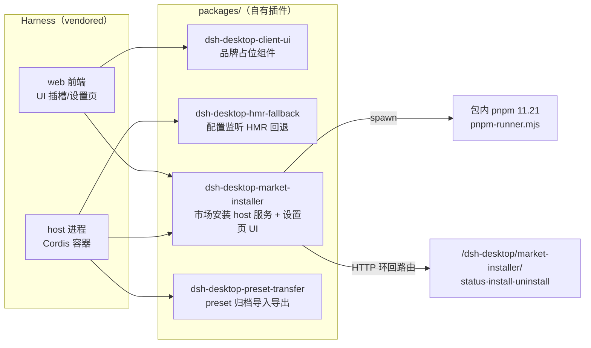

# 桌面扩展插件包（desktop-extensions）

`packages/` 下 4 个 `dsh-desktop-*` 包是桌面外壳自有的 Cordis 插件。Harness 本体（`@deepseek-ai/dsh-*`）是 vendored 依赖，不属于本仓库代码；这 4 个包通过 Harness 的插件契约（`name`/`inject`/`apply(ctx)` 导出 + package.json 的 `dsh.client.inject` 声明）扩展它。

**双重身份**：

- **host 侧**：Node 端 `index.js` 的 `apply(ctx)` 在 Harness 主进程注册服务/路由（Cordis `ctx.provide`/`ctx.plugin`/`webServer.register`）。
- **client 侧**：`client.js` 经 package.json `dsh.client.inject` 声明注入点，被 Harness web 前端加载，向 UI 插槽注入 React 组件。

## 组件约束索引

| Component | Constraints | Risks | Summary |
|-----------|------------|-------|---------|
| `isTrustedRequest` | 3 | 2 | 仅环回 socket、无转发头；变更类还要求 Origin==Host 且环回 |
| market install/uninstall 路由 | 3 | 1 | POST + 可信 + 单飞（409）；状态机 phase 驱动 |
| `createDesktopPnpmService` | 3 | 2 | 全部包操作走包内 pnpm，不探测系统包管理器；15min 超时 |
| `ensurePnpmShim` / `stagePnpmRunner` | 2 | 1 | shim 必须路由到 lock-recovery runner，否则静默丢恢复 |
| `ConfigWatchHmr.registerConfig` | 3 | 1 | 仅当 loader.internal 缺失才注册；watch 目录、mtime+size 判定、串行 refresh |
| `createPresetArchive` | 2 | 1 | fflate zip 打包 preset 目录 + manifest.json；自定义 MIME |
| client-ui `apply`（host） | 1 | 0 | host 侧空函数，纯 client 插槽占位 |

## 包详解

### dsh-desktop-client-ui — 品牌占位

- 职责：把 Harness UI 插槽中的默认品牌（conversation/renderer/sidebar 三处）替换为桌面版品牌（`DesktopBrandMark`/`DesktopBrandName`/`ConversationBrandMark`），并 `installStyles` 注入品牌 CSS。
- 注入声明（package.json `dsh.client.inject`）：`@deepseek-ai/dsh-client-ui-conversation`、`...-renderer`、`...-sidebar`，`platform: 'web'`。
- host 侧 `index.js` 的 `apply()` 是空函数（`/** Host half for the browser-only ... occupants. */`）——这是纯 client 插件。

### dsh-desktop-hmr-fallback — 打包环境 HMR 回退

Harness 的 `runProfile` 在启动后若无 `hmr` 服务会创建完整 Cordis HMR 服务，而该服务构造时需要 `ctx.loader.internal`（Node 内部模块加载器），缺失即抛错并拖垮整个 profile 启动（含用户 patch 层监听）。打包 Electron 应用正是这种 host：macOS 下 Harness 跑在 utility process，`--expose-internals` 进了 `execArgv` 却没进 Node 选项解析器，internal loader 始终缺失；`node-addon-require-builtin` 回退在 Electron 下报 `Unsupported/no-realm`。

- `apply(ctx)`：**仅当 `ctx.loader.internal === undefined` 才注册** `ConfigWatchHmr`（服务名 `'hmr'`）；dev 与内置 Node 平台保留真 HMR（含模块级热替换）。
- `ConfigWatchHmr.registerConfig(filename, refresh)`：实现 HMR 契约中 `watchUserPatches` 实际用到的子集——监听配置文件变更并串行回调。`watch()` 目标是**文件所在目录**（macOS 目录事件常不给出变更文件名），用 `stamp`（`mtimeMs:size`）判断文件本身是否变化；100ms 防抖；refresh 串行执行（重叠刷新会让 patch 层作用在半应用树上）；返回 disposer。
- 模块级热替换需要 Node internals，**不在此复现**——其余变更桌面靠完整重启 Harness 完成。

### dsh-desktop-market-installer — 插件市场固定目标安装器（最大包）

为可选的 `dshmarket` 社区插件提供"固定目标"安装入口。常量：`MARKET_PACKAGE='dshmarket'`、`MARKET_PROFILE='web'`、`RECOMMENDED_MARKET_VERSION='latest'`；依赖包内 `pnpm@11.21.0`。

**host 侧 `apply(ctx)`**：
- `ensurePnpmShim(home)` 在 profile 的 `.desktop-bin` 放置 pnpm shim；`stagePnpmRunner` 把 `pnpm-runner.mjs`（Windows 锁文件恢复 runner）复制到同目录——shim 必须路由到该 runner，否则会用普通 pnpm 静默丢掉锁恢复（与 [[harness-runtime]] 的 `pnpmRunnerPath` 约束同源）。
- `ctx.provide('desktopProfiles', createDesktopProfilesService(home))` 与 `ctx.provide('desktopPnpm', createDesktopPnpmService({binDirectory}))`：这是 dsh-market 1.6+ 消费的集成边界——市场插件因此**永不探测/准备系统包管理器**，所有变更都落在包内 Node/pnpm 对上。
- 经 `ctx.inject(['webServer'])` 注册三个**精确匹配** HTTP 路由：

| 路径 | 方法 | 鉴权 | 作用 |
|------|------|------|------|
| `/dsh-desktop/market-installer/status` | GET | `isTrustedRequest(req)` | 返回安装状态机（absent/incomplete/installed/installing/uninstalling/uninstalled/error + installedVersion + recommendedVersion + restartRequired） |
| `.../install` | POST | `isTrustedRequest(req, true)` | 单飞：已有操作返回 409；已安装返回 200；否则 202 后台 `runInstall`（`pnpm add dshmarket@latest`） |
| `.../uninstall` | POST | `isTrustedRequest(req, true)` | 单飞；本就无依赖则直接置 uninstalled + restartRequired |

- `isTrustedRequest(req, mutation)`：**第一道安全边界**——`req.socket.remoteAddress` 必须是环回（`127.0.0.1`/`::1`/`::ffff:127.0.0.1`）且**不能带任何转发头**（`forwarded`/`x-forwarded-for`/`x-real-ip`/`x-forwarded-host`，防反向代理/隧道绕过）；变更请求额外要求 `Origin` 头存在且与 `Host` 同 host、协议 http、hostname 环回（防 CSRF/跨站 drive-by）。
- 命令执行：`desktopPnpm.runPlugin(args, directory)` spawn 包内 pnpm；`runProfileCommand` 采集输出尾部（`detail` 取最后一行 ≤800 字符）、`OPERATION_TIMEOUT_MS = 15min` 超时 cancel；失败时清理临时目录并删除 `pnpm-lock.yaml`（锁文件可能已半写）后进入 error。
- 辅助：`updateProfileNpmrc`、`cleanStaleTemporaryDirectories`（`isDisposableModuleDirectory` 判定可弃临时目录）、`readMarketInstallation`（读 manifest 判定 installedVersion/dependency）、`killProcessTree`、`atomicWrite`。
- `generations/` 子模块（`registry.mjs`/`installer.mjs`/`projection.mjs`）：generation 注册表、代次安装、投影（把 desired 代次投影为 profile 实际链接），是 [[profile-state]] generation 机制在插件侧的实现配套。

**client 侧 `client.js`**（约 29KB）：注入 `dsh-client-ui-settings`/`...-plugins`/`dsh-client-locale`，在设置页挂载 `MarketManagementTab`/`MarketInstallerSection`/`UninstallConfirm` React 组件；`install`/`uninstall`/`restart` 发 POST，`poll`/`readStatus` 轮询 status 路由（`marketAlreadyComposed` 判断市场是否已组合）。

### dsh-desktop-preset-transfer — preset 归档导入导出

- `inject = ['connection']`；用 `fflate` 的 `zipSync`/`unzipSync`/`strToU8` 在浏览器/Node 内做 zip（无外部 zip 二进制）。
- `createPresetArchive(ctx)`：遍历 preset 目录（`visit` 递归收集文件），打包为 zip 并写入 `manifest.json`（preset 元数据）；归档 MIME 为 `application/vnd.dsh.preset+zip`；`collectPresetArchiveFiles`/`safePresetArchivePath` 处理文件选择与安全路径；`presetArchiveWarnings`/`presetArchiveFailure` 收集可恢复警告与致命错误。导入侧 `unzipSync` 解包校验。用于 agent preset 的分享/迁移。

## 关键业务约束

- **安装路由只接受环回、无转发、同源的请求**（confidence: 0.95）
  > Evidence: `isTrustedRequest`（`index.js:153-166`）：环回地址 + 无转发头 + 变更类 Origin/Host 同源校验。这是防"任意网页/局域网设备驱动安装"的核心。

- **包操作只用包内 Node/pnpm，不碰系统包管理器**（confidence: 0.9）
  > Evidence: `apply` 注释（`:596-599`）"the market therefore never probes or provisions a system package manager"；`resolvePnpmEntry` 从包内 pnpm 解析；服务经 `ctx.provide` 暴露给市场插件。

- **HMR 回退仅在 internal loader 缺失时生效**（confidence: 0.9）
  > Evidence: `hmr-fallback/index.js:93` `if (ctx.loader.internal !== undefined) return`；dev/内置 Node 保留真 HMR。

- **配置刷新基于 mtime+size 且串行**（confidence: 0.85）
  > Evidence: `stamp` 返回 `${mtimeMs}:${size}`；`registerConfig` 用 Promise 队列串行 `refresh()`，注释说明重叠刷新的风险。

- **安装/卸载单飞，冲突返回 409**（confidence: 0.85）
  > Evidence: install/uninstall handler 中 `if (operationPromise) sendJson(res, 409, ...)`。

## 与其他模块的关系

- [[harness-runtime]]：主进程启动 Harness 时也用包内 pnpm/runner 做 profile 修复（`bundledPnpmRunnerPath` 指向本包 `pnpm-runner.mjs`）；`--no-frozen-lockfile` 与锁恢复语义一致。
- [[profile-state]]：generation 注册表/投影与本包 `generations/` 子模块配套；插件卸载清理也作用于这些包装出的内容。
- [[app-bootstrap]]：这些包随 profile/node_modules 分发，主进程不直接 import 其代码（market-installer 的 HTTP 路由由 Harness host 加载后注册）。
- [[preload-ui]]：市场 UI 是注入 Harness 设置页的 client 组件，与 preload 注入的桌面原生 UI 是两条不同注入路径。

## 跨模块引用

- 包如何进入 profile 与安装包见 [[build-tooling]]（package.json 依赖 + bundle-user-data）。
- dsh 插件契约（name/inject/apply、`dsh.client.inject`）属 Harness vendored 能力。
