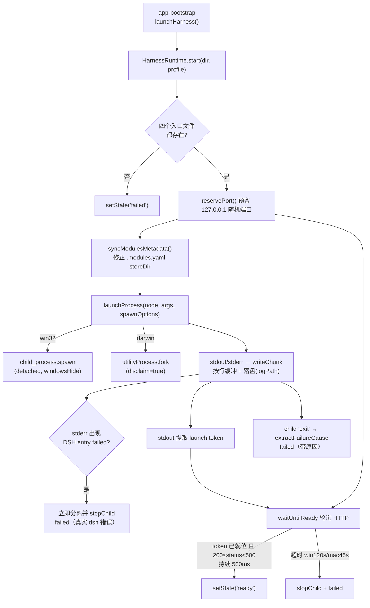

# Harness 运行时与子进程管理（harness-runtime）

桌面外壳本身不含 agent 逻辑——DeepSeek Harness 是一个 Node 应用，本模块负责把它**作为子进程拉起、判断就绪、采集日志、并在启动失败时从日志中定位肇事插件**。三个文件：

- `harness-runtime.ts`：常驻 Harness 服务进程的生命周期与日志诊断（核心）。
- `profile-plugin-command.ts`：在 profile 内执行**一次性** `dsh plugin install/remove` 命令（含 pnpm shim 与防卡死监控）。
- `disclaimed-utility-process.ts`：macOS 下用 Electron `utilityProcess` 承载 Harness 并声明 TCC 免责的适配器。

## 架构概述

## 组件约束索引

| Component | Constraints | Risks | Summary |
|-----------|------------|-------|---------|
| `HarnessRuntime.start` | 5 | 2 | 四入口预检→预留端口→spawn→探活；早期 dsh 失败立即终止不等待超时 |
| `waitUntilReady` | 3 | 1 | 100ms 轮询，token 就位且状态码 <500 持续 500ms 才算就绪 |
| `extractPluginReferences` | 4 | 1 | 4 类日志正则收集插件引用；loader 失败链收集整条嵌套链 |
| `buildHarnessSpawnOptions` | 4 | 2 | DSH_HOME 便携化、ELECTRON_RUN_AS_NODE 条件注入、新建进程组、NO_COLOR |
| `resolveShellEnvironment` | 2 | 1 | 登录 shell 环境一次性解析；Windows 强制 UTF-8 输出；失败回退 process.env |
| `runProfileCommand` | 4 | 2 | 空闲 2min 判卡死、30min 硬上限；进度靠文件系统采样 |
| `buildProfileInstallArguments` | 2 | 1 | `--no-frozen-lockfile`：受损 profile 的 lockfile 不可信，以 manifest 为准 |
| `UtilityProcessAdapter` | 2 | 1 | 把 utilityProcess 包装成 child_process 接口；SIGKILL 走 process.kill(pid) |

## HarnessRuntime 生命周期（harness-runtime.ts）

### 启动序列 `start(launchDirectory, profile='web')`

1. `await this.stop()` 先清理旧进程；重置 token/url/日志余数。
2. **四入口预检**（缺失即 `failed`，不 spawn）：`dshEntryPath`（dsh 入口）、`nodeExecutablePath`（内置 Node 运行时，或复用 Electron 二进制）、`nodeEntryPath`（诊断/加载入口）、`dshPatchPath`（桌面侧补丁文件）。
3. 建 `dshHome` 与日志目录，打开追加式日志流；`syncModulesMetadata` 修正 pnpm 元数据（见下）。
4. `reservePort()`：用 `net.createServer().listen(0)` 从 OS 取一个空闲环回端口后立刻关闭，URL 固定为 `http://127.0.0.1:<port>`。
5. 参数：`buildNodeArguments` → `['--expose-internals', nodeEntryPath, dshEntryPath, ...buildHarnessArguments(port, patchPath, profile)]`。
6. spawn（`launchProcess` 注入，win 用 `child_process.spawn`，mac 走 [[#disclaimed-utility-process]]）。启动超时：**Windows 120s / macOS 45s**。
7. 写日志分隔行 `[desktop] starting <ISO时间>`——该行是"本次尝试"的分界标记，所有诊断函数只取它之后的日志。

### 就绪判定 `waitUntilReady` + `isHarnessStartupProbeHealthy`

- 每 100ms `fetch(url, {redirect:'manual'})`，1s 请求超时；启动中连接被拒是预期，重置稳定计数。
- 健康条件（`isHarnessStartupProbeHealthy`）：**launch token 已从 stdout 解析到** 且 HTTP 状态码 `200 ≤ status < 500`。未鉴权探针返回 401 也算健康——环回有响应只证明端口开了，token 才证明渲染器能完成 cookie 兑换。
- `updateReadyStability`：健康状态需持续 **500ms** 稳定窗口才判 ready，防止启动中途的瞬时响应误判。
- 超时则 `stopChild` 并 `failed`。

### 提前失败短路

stderr 数据到达时，若仍在 `starting`，调 `extractDshEntryFailureCause`：一旦命中 `DSH entry failed: ...`，**立即把 `this.child` 置空（脱离该 launch）并 `stopChild`**，状态置 `failed` 携带真实原因。注释说明：若等就绪超时再停，后续优雅 SIGTERM 的退出码（可能 exit 0）会覆盖真正的 dsh 失败原因。

### 退出与状态

`child.once('exit')`：`flushLogRemainders` 冲刷半行日志，`extractFailureCause(logLines)` 从最后一次尝试的 stderr 中提取原因（优先级：`DSH entry failed` → `uncaught exception`/`unhandled rejection` → 最后一条含 error/failed 且 <200 字符的行 → 最后一条 stderr），置 `failed`。状态枚举见 [[shared-contracts]] 的 `RuntimePhase`；每次 `setState` 通过 `options.onChanged(snapshot)` 回调 [[app-bootstrap]] 广播。

### 日志采集与编码

- `writeChunk(source, chunk)`：Buffer 按 `\n` 切行，半行存入 `logRemainders[source]` 等下次拼接；每行加 `[stdout] `/`[stderr] ` 前缀。
- `writeLog`：内存环形缓冲 **200 行**（超出从头丢弃）+ 追加写日志文件。
- token 从 stdout 行解析（`extractLaunchToken`），只在 ready 前有效。

### Shell 环境解析 `resolveShellEnvironment`（进程生命期 memoize）

GUI 启动（macOS Finder/Spotlight、Windows 资源管理器）继承的是最小环境，不加载 shell 配置，导致 Homebrew/mise/`~/.local/bin`、PowerShell `$PROFILE` 里的 conda/nvm/scoop 对 Harness 及其子进程不可见。

- **Windows**：`execFileSync('powershell', ['-NoLogo','-NonInteractive','-OutputFormat','Text','-Command', ...])` 加载用户 profile 后导出环境；**先 `[Console]::OutputEncoding = UTF8`** 再输出——否则 CJK 系统（ACP 936）下非 ASCII 路径（如 `C:\Users\数据项素`）变成 U+FFFD，被原样透传的 TEMP 指向不存在目录，Harness 在 `mkdtemp` 阶段就死。
- **macOS/Linux**：起登录交互 shell（`$SHELL -lic`）输出环境。
- 解析失败回退 `process.env`。`parseEnvOutput` 解析 `KEY=VALUE` 行；`withoutUndecodableValues` 丢弃含 U+FFFD 的值（双保险）。

### spawn 选项 `buildHarnessSpawnOptions`

关键环境变量：
- `DSH_HOME=<dshHome>`：指向可执行文件旁的 data 目录，使 profile（插件/设置/凭据）**便携化**，不写用户家目录。
- `MNEMON_CLI_PATH=<dshHome>/bin/mnemon.exe`：让 dsh-mnemon 插件用包内 CLI。
- `ELECTRON_RUN_AS_NODE=1`：仅当复用 Electron 二进制作 Node 运行时（`useElectronRuntime`）时注入；用独立内置 Node 时必须**剥离**。
- `NO_COLOR=1`、`npm_config_side_effects_cache=false`（注释：强制 clone-or-copy 曾让 150+ 包的安装在 Windows 上变成最长 30 分钟；Windows 锁文件重命名问题改由专用 lock-recovery runner 处理）。
- `windowsHide: true`；`detached: win32`（Windows 新建进程组，使 `killProcessTree` 能整组清理，避免 buggy 子进程拖死桌面主进程——issue #208）。

### `syncModulesMetadata`（便携包 pnpm 兼容）

profile 由 `bundle-user-data.mjs` 递归拷贝而来，`node_modules/.modules.yaml` 里残留**源机器**的绝对 storeDir 路径，pnpm `checkCompatibility` 会在市场 UI 首次增删插件时抛 `ERR_PNPM_UNEXPECTED_STORE`/`ERR_PNPM_UNEXPECTED_VIRTUAL_STORE`。本函数在启动时把 `storeDir` 改写为当前机器的 `%LOCALAPPDATA%\pnpm\store\v11`（与内置 pnpm 11 的 STORE_VERSION 对齐），删除 `virtualStoreDir`（让 pnpm 按树位置重算）。任何异常非致命。

## 故障诊断正则层

所有提取函数都只扫描 `latestHarnessAttemptLogs`（最后一个 `[desktop] starting ` 之后）。

| 函数 | 目标日志模式 | 输出 |
|------|-------------|------|
| `extractFailureCause` | `DSH entry failed:` / `uncaught exception:` / `unhandled rejection:` / 末条 error 行 | 失败原因字符串 |
| `extractPluginReferences` | ① `failed to (apply|import) loader entry ... (<pkg>)`（**matchAll 收集整条嵌套链**——内层 cordis:include 包裹的第三方 bundle 才是可卸载的真正主人）② `cannot resolve profile bundle "<pkg>"` ③ `profile bundle "<pkg>" declares no dsh.bundle` ④ `plugin(s) failed to load: <pkg>` | 包名集合 |
| `extractPluginFailureReferences` | 同上，接受谓词 `isPackageReference`（合法包名、不含冒号） | 全部疑似包 |
| `extractOffendingPlugins` | 同上，接受谓词 `isActionablePluginReference`：**排除**核心 bundle（`@deepseek-ai/dsh-base`、`@deepseek-ai/dsh-web-app`、`dshmarket`）与所有 `@deepseek-ai/*` | 可卸载的第三方插件 |
| `extractDuplicateLoaderEntryId` | `duplicate loader entry id: <id>` | 冲突的 loader entry id |
| `extractSlotConflictName` | `single slot "<name>" already has a registration`（主进程）/ `UI slot "<name>" has duplicate registrations`（渲染） | 插槽名 |

这些结果喂给 [[recovery-views]] 的 `detectPluginRecovery` → [[profile-state]] 的 `resolveProfileRecoveryPlugins` 映射为已安装插件。

## profile 插件命令（profile-plugin-command.ts）

与常驻 `HarnessRuntime` 不同，这里跑**一次性命令**完成插件安装/移除/修复：

- `buildProfileInstallArguments`：`[dshEntry, 'plugin', '--profile', 'web', 'install', '--no-frozen-lockfile']`。**显式允许 lockfile 漂移**：修复在 Harness 启动前运行（唯一能替换被占用包的时机），而受损 profile 的 `pnpm-lock.yaml` 恰不可信——`pnpm add` 在 linking 阶段失败时已把新版本写进 lockfile 而 package.json 仍是旧版，CI 模式下 frozen 安装会抛 `ERR_PNPM_OUTDATED_LOCKFILE`，把唯一的修复路径堵死。manifest 才是目标态，lockfile 跟随它。
- `buildProfilePluginRemoveArguments`：`... 'remove', <plugin>`。
- **pnpm shim**：`ensureProfilePnpmShim`/`buildPnpmShimCommand` 在 profile 内放置指向包内 pnpm 的 shim（桌面环境不保证系统有 pnpm）；若提供 `pnpmRunnerPath`（lock-recovery runner），shim 必须路由到它——否则会用普通 pnpm 悄悄丢掉 Windows 锁文件恢复能力。
- `runProfileCommand`：spawn 后监控，**双超时**——`IDLE_TIMEOUT_MS = 2min` 无进展判卡死（真正的终止条件）、`REPAIR_CAP_MS = 30min` 硬上限（注释：旧的 5 分钟墙钟在 Windows 上短于健康安装——reflink 在 NTFS 不存在，杀软介入下逐文件拷贝，kill 落在 rename 中途会留下恰好触发下次修复的损坏目录，每次启动清得更多）。进度通过每 5s 采样文件系统（深度 5、上限 1024 目录）判断。输出截断 32KB。
- `killProcessTree`：Windows 按进程树 taskkill；`shellQuote` 做 POSIX 单引号转义。

## disclaimed-utility-process.ts（macOS）

macOS 下 Harness 经 Electron `utilityProcess.fork` 运行而非独立 spawn：

- `buildDisclaimedUtilityProcessSpec`：要求 node 参数形如 `['--expose-internals', modulePath, ...args]`，否则抛错；`serviceName: 'DSH Harness'`。
- **`disclaim: true`（默认）**：Harness 会加载用户安装的插件、启动第三方工具，disclaim 让这些 TCC 权限请求（摄像头/麦克风/磁盘等）**不计入 DSH Desktop 的责任链**。
- `UtilityProcessAdapter` extends `EventEmitter`，把 `UtilityProcess` 适配为 `HarnessChildProcess`（stdout/stderr/exitCode/kill/事件）；fork 后若无管道输出立即 kill 并抛错。`SIGKILL` 走 `process.kill(child.pid)`，其余走 `child.kill()`。

## 关键业务约束

- **就绪必须同时满足 token 就位 + HTTP 非 5xx + 持续 500ms**（confidence: 0.95）
  > Evidence: `isHarnessStartupProbeHealthy`（`:304-309`）要求 `launchToken !== undefined && status>=200 && status<500`；`updateReadyStability` 500ms 窗口。环回响应仅证明端口开放。

- **DSH entry 一旦报错立即终止，不等就绪超时**（confidence: 0.9）
  > Evidence: `start` 中 stderr handler `:413-428`：命中 `extractDshEntryFailureCause` 即 `this.child=undefined` 并 `stopChild`，避免优雅退出码覆盖真实失败。

- **诊断只看最后一次启动尝试、且只从 stderr 提取**（confidence: 0.9）
  > Evidence: 所有 extract 函数以 `latestHarnessAttemptLogs` + `line.startsWith('[stderr] ')` 过滤。

- **核心 bundle 永不出现在"可卸载插件"建议中**（confidence: 0.9）
  > Evidence: `CORE_BUNDLES` 集合 + `isActionablePluginReference` 排除 `@deepseek-ai/` 前缀。

- **修复安装必须 --no-frozen-lockfile**（confidence: 0.9）
  > Evidence: `buildProfileInstallArguments:80-82` 及注释：受损 profile 的 lockfile 与 manifest 已分叉，frozen 会把修复路径变成 ERR_PNPM_OUTDATED_LOCKFILE。

- **DSH_HOME 便携化、不写用户家目录**（confidence: 0.9）
  > Evidence: `buildHarnessSpawnOptions` 注释 `:234-237` "stays portable beside the executable instead of in the user's home"。

## 与其他模块的关系

- [[app-bootstrap]]：持有 `HarnessRuntime` 实例，决定 node/dsh/patch 路径与 `launchProcess` 实现，消费 `onChanged` 快照。
- [[recovery-views]]：消费本模块的 `extract*` 函数与日志缓冲做检测/展示。
- [[profile-state]]：`resolveProfileRecoveryPlugins` 把诊断证据映射为已安装插件；插件命令在 [[desktop-extensions]] 的 market-installer 中也有对应 host 侧实现。
- [[shared-contracts]]：`RuntimePhase`/`RuntimeSnapshot` 类型来源。

## 跨模块引用

- 打包时如何准备内置 Node/pnpm 与 data 目录见 [[build-tooling]]。
- 插件市场安装的 host 侧 pnpm 服务见 [[desktop-extensions]]。
