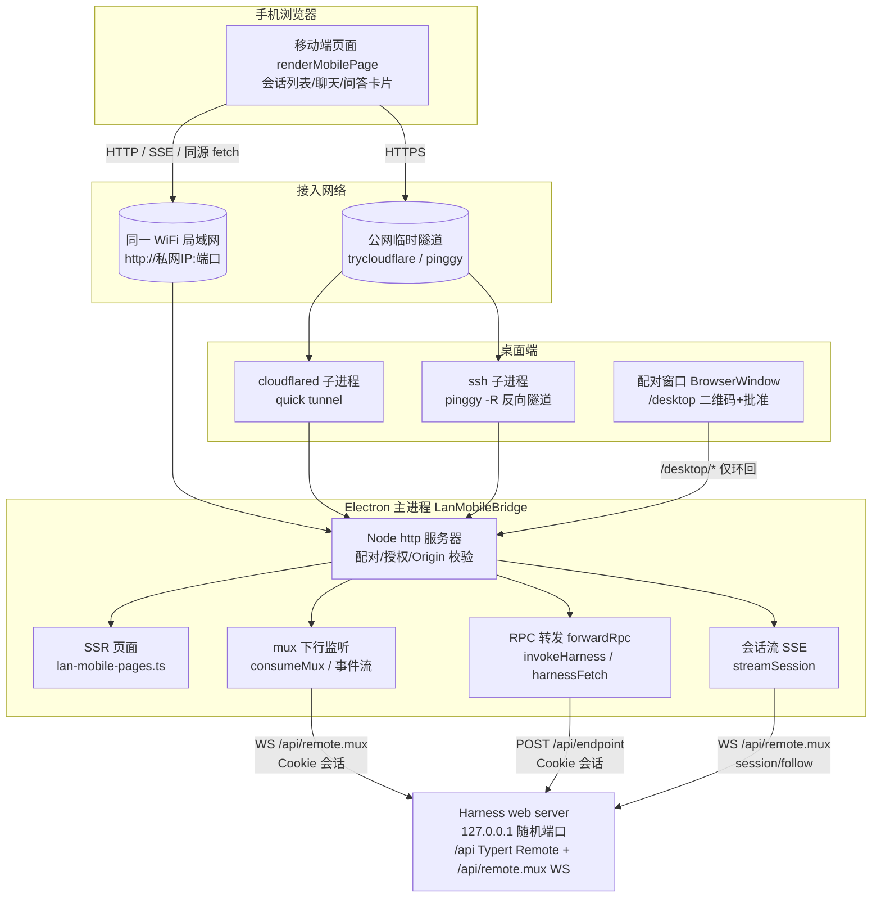
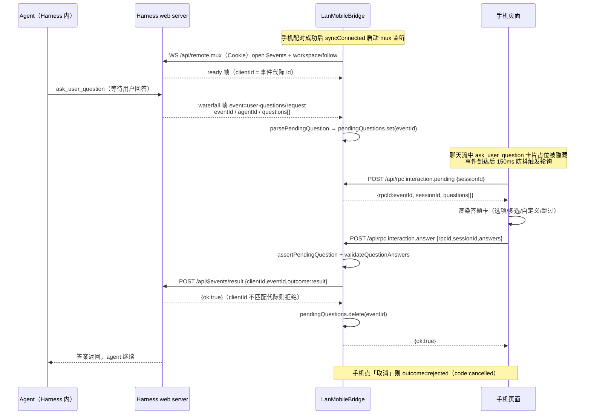

# 移动端配对桥接（mobile-bridge）

## 架构概述

移动端桥接是 DSH Desktop 的「手机遥控桌面 Harness」能力。桌面端在 Electron 主进程内启动一个原生 Node HTTP 服务（`LanMobileBridge`），手机浏览器经**局域网直连**或**公网临时隧道**访问该服务；配对授权后，桥把手机的 RPC 调用与会话流请求代理到本机 127.0.0.1 上的 Harness web server（外部独立进程）。手机端页面是桥直接吐出的服务端渲染 HTML，无独立构建步骤。

核心数据面有三条：

1. **RPC 转发（手机 → Harness）**：手机 `POST /api/rpc`，桥按白名单翻译方法名，并携带自己换取的 Harness 会话 Cookie，转发到 `127.0.0.1:<harnessPort>/api/<endpoint>`。
2. **会话流（Harness → 手机）**：手机打开会话时建 `EventSource('/api/session/stream')`；桥为每个连接开一条到 Harness 的 WebSocket（mux carrier），打开 `session/follow` 逻辑流，再以 SSE 帧转发给手机。
3. **事件下行（Harness → 桥，常驻）**：手机配对成功后，桥自身维持一条到 Harness 的 mux WebSocket，多路复用两条逻辑流：
   - `$events`：转发事件流，承载 agent 提问；
   - `workspace/follow`：工作区投影，首帧 `baseline` 即工作区列表快照。

### agent 提问 → 手机应答时序

agent 在会话中调用 `ask_user_question` 时，Harness 通过 Gateway 的转发事件流把问题「瀑布式（waterfall）」推给桥；手机轮询拉到待答问题、渲染答题卡，答案再经桥结算回 Harness：

## 组件职责

| 文件 | 导出 | 职责 |
|---|---|---|
| `lan-mobile-bridge.ts` | `LanMobileBridge` | 桥核心类：HTTP 服务、配对令牌生命周期、授权与 Origin 校验、RPC 转发、mux 下行监听、会话 SSE 转发、问答桥接、隧道开关、状态快照 |
| `lan-mobile-bridge.ts` | `preferredLanAddress` | 遍历网卡，返回首个非 internal 的 IPv4 私网地址，用于拼配对 URL |
| `lan-mobile-bridge.ts` | `isPrivateAddress` / `isLoopbackAddress` / `normalizeRemoteAddress` | 私网/环回地址判定；剥离 `::ffff:` IPv4-mapped 前缀 |
| `lan-mobile-bridge.ts` | `isInternetTunnelHost` | 按 Host 后缀识别隧道域名（trycloudflare/pinggy 三个后缀） |
| `lan-mobile-bridge.ts` | `cookiePair` | 从 `Set-Cookie` 头数组提取第一个 `name=value` 对，供后续 `Cookie` 请求头使用 |
| `lan-mobile-pages.ts` | `renderMobilePage` | 手机端单页（HTML+内联 CSS/JS 字符串模板）：工作区切换、会话列表、聊天流、答题卡、会话设置（preset/模型/思考强度）、todo 坞、乐观发送 |
| `lan-mobile-pages.ts` | `renderDesktopPairingPage` | 桌面配对窗口页：二维码、配对 URL、WiFi/互联网模式切换、待批准请求提示、断开管理 |
| `lan-mobile-pages.ts` | `renderMobileReconnectPage` | 手机断连引导页（按 lan/tunnel 模式给不同文案，按钮链 `/reconnect`） |
| `lan-mobile-pages.ts` | `renderPairingWaitPage` | 手机等待批准页：900ms 轮询 `/pair/status`，支持拒绝/过期/不可达重试（`/pair/retry`） |
| `lan-mobile-pages.ts` | `escapeHtml`（模块内部） | 配对 URL 等插值的 HTML 转义（`& < > " '` 五字符） |
| `internet-tunnel.ts` | `startTunnelWithFallback` | 隧道抽象：先试 cloudflared，失败回退 pinggy，两者皆败聚合两条错误信息抛出 |
| `cloudflared-tunnel.ts` | `ensureCloudflaredBinary` | cloudflared 二进制定位（customPath → PATH → 缓存目录）、按平台下载、SHA256 校验、解包/加执行位 |
| `cloudflared-tunnel.ts` | `startCloudflareQuickTunnel` / `extractTryCloudflareUrl` | spawn `cloudflared tunnel --url`，30s 内从输出正则提取临时域名 |
| `pinggy-tunnel.ts` | `startPinggyTunnel` / `findSshOnPath` / `extractPinggyUrl` | 基于系统 OpenSSH 的 pinggy 反向隧道（`ssh -R 0:127.0.0.1:<port>`），从输出解析域名 |

### 主进程装配

桥的唯一装配方是 `src/main/index.ts`：

- `bootstrap()` 中 `new LanMobileBridge({...})`（index.ts L2076-2093），注入：
  - `harnessUrl: () => runtime.snapshot().url`、`harnessAuthToken: () => runtime.snapshot().authToken`；
  - `locale: harnessLocale`、品牌 Logo（light/dark）与应用图标路径；
  - `cloudflaredCacheDir: <userData>/bin`；
  - `forceCloudflareFailure: process.env.DSH_TUNNEL_FORCE_PINGGY === '1'`（测试/强制回退开关）；
  - 固定端口：dev 43128 / 生产 43127；
  - `onReconnectRequested`：手机请求重连时弹出配对窗口；
  - `onConnectedChange`：向渲染器广播连接状态。
- 非 Safe Mode 下随应用启动自动 `mobileBridge.start()`（L2094）；应用退出时 `runtime.stop()` 与 `mobileBridge.stop()` 并行收尾（L2319）。
- 「连接手机」菜单经 IPC `mobile:open-pairing` → `showMobilePairing()`（L1981-2037）：启动桥；Harness 未就绪则提示等待；无配对 URL 且未开隧道时自动 `toggleTunnel(true)`；随后开 560×720 沙箱 `BrowserWindow`（`contextIsolation/sandbox/webSecurity` 全开）加载 `http://127.0.0.1:<port>/desktop`。
- 功能总开关：`src/shared/features.ts` 的 `ENABLE_MOBILE_BRIDGE`（当前 `true`），主进程与 `src/preload/index.ts` 共用。

### 桥内部状态（LanMobileBridge 私有字段）

| 字段 | 类型 | 作用 |
|---|---|---|
| `server` / `port` | http.Server / number | 监听 `0.0.0.0` 的桥服务与实际端口（dev 43128 / 生产 43127） |
| `pairingToken` / `pairingExpiresAt` | string / number | 当前配对令牌与其过期时刻；批准后立即清空（一次性） |
| `sessions` | `Map<token, MobileSession>` | 已授权手机：会话令牌 → `{token, remoteAddress}` |
| `suspendedSessions` | `Map<token, MobileSession>` | 桌面主动断开后挂起的令牌，同设备重连批准时恢复；上限 16 |
| `pendingPairings` | `Map<id, PendingPairing>` | 待桌面批准的配对请求（id/remoteAddress/mode/expiresAt/decision） |
| `pendingQuestions` | `Map<eventId, PendingMobileQuestion>` | 待手机回答的 agent 提问（rpcId=eventId、sessionId、questions） |
| `eventClientId` | string | mux `$events` 流 `ready` 帧给出的事件代际 id，答案结算必须引用 |
| `workspaceSnapshot` | unknown | `workspace/follow` baseline 帧缓存，回答 `workspace.list` |
| `harnessCookie` | `{base, cookie}` | 按 Harness base URL 缓存的会话 Cookie |
| `tunnelInstance` / `tunnelActive` / `tunnelLoading` / `tunnelError` / `tunnelLaunch` | — | 隧道实例与开关状态；`tunnelLaunch` 为在途启动 Promise，用于去重与停止时收口 |
| `muxAbort` / `muxTask` | AbortController / Promise | 常驻 mux 监听的生命周期句柄 |
| `sessionStreamAborts` | `Set<AbortController>` | 每条手机 SSE 连接一个中止器，停桥时全量中止 |
| `lastConnected` | boolean | 连接态边沿，避免重复广播 `onConnectedChange` |

### 公开方法

| 方法 | 作用 |
|---|---|
| `start()` | 幂等启动：已在跑则令牌过期就轮换、重放连接态；否则建服务、监听端口、轮换令牌、返回快照 |
| `stop()` | 停隧道与在途启动、清空全部会话/配对/问题表、中止 SSE 与 mux、`closeAllConnections()` 后关闭服务 |
| `toggleTunnel(enable?)` | 开/关公网隧道；无参取反；在途启动直接返回 loading 快照；返回最新快照 |
| `snapshot()` | 桌面 UI 数据：running/connected/port/pairingUrl/expiresAt/desktopUrl/隧道四元组（active/loading/url/provider/error） |

### 关键常量

| 常量 | 值 | 含义 |
|---|---|---|
| `MAX_BODY_BYTES` | 64 KiB | 请求体大小上限，超限抛错 |
| `PAIRING_TTL_MS` | 5 分钟 | 配对令牌与配对请求 TTL |
| `MUX_RECONNECT_MS` | 500ms | mux 断线初始重连间隔 |
| `MUX_RECONNECT_CAP_MS` | 30s | mux 重连退避上限 |
| `MUX_STABLE_MS` | 5s | 连接持续超过此值后断线视为瞬时故障，快速重试而非退避 |
| 会话 Cookie Max-Age | 31536000（1 年） | `dsh_mobile` Cookie 有效期 |
| suspended 容量 | 16 | 挂起会话令牌 LRU 上限 |
| 桥监听端口 | 43127 / 43128 | 生产 / dev，绑定 `0.0.0.0` |
| cloudflared 版本 | `2026.8.2` | 下载 URL 与 5 平台 SHA256 清单内置 |
| 隧道启动超时 | 30s | cloudflared 与 pinggy 各自的域名等待超时 |

## 组件约束索引

| # | 约束/不变量 | 位置（lan-mobile-bridge.ts 除注明外） |
|---|---|---|
| 1 | 每个响应都带安全头：`cache-control: no-store`、`x-content-type-options: nosniff`、`x-frame-options: DENY`、`referrer-policy: no-referrer`、严格 CSP | `handle()` 开头 L373-380 |
| 2 | 传输层远端地址必须是私网/环回，否则 403「Private network only.」 | L382-383 |
| 3 | 所有 `/desktop/*` 路由要求环回地址，否则 403「Desktop only.」 | L426/455/467/472/490/532/542 |
| 4 | 状态变更类桌面接口（tunnel/disconnect/decide）、`/pair/retry` 与手机 `/api/rpc` 必须过 `verifySameOrigin`；`/desktop` 页与 SSE 流过 `verifyTrustedOrigin` | `verifyTrustedOrigin` L763-771；调用点 L427/491/533/543/566/641/647 |
| 5 | 配对令牌 = `randomBytes(32).toString('base64url')`，TTL 5 分钟，批准后立即作废（一次性） | `rotatePairingToken` L363-366；L617-618 |
| 6 | 令牌比较用 `timingSafeEqual`（先比长度），防时序侧信道 | `validPairingToken` L694-700 |
| 7 | 配对批准后下发 `dsh_mobile` Cookie：`HttpOnly; SameSite=Strict; Path=/; Max-Age=31536000` | L619 |
| 8 | 授权判定：Cookie 令牌命中会话表，或同一远端 IP 已有活动会话（同设备重连免再批） | `authorized` L724-728 |
| 9 | 挂起会话容量上限 16，超出淘汰最旧；仅接受 43 字符 base64url 形态的令牌 | `rememberMobileContext` L735-751 |
| 10 | 请求体上限 64KB | `readBody` L1325-1335 |
| 11 | 手机 RPC 方法白名单：8 个 HARNESS_ENDPOINTS 方法 + `session.history` + `workspace.list`；不在白名单 403 | L84、L680-682 |
| 12 | 转发 Harness 的 RPC 信封必须回带相同 `rpcId` 且 `result.ok === true`，否则判失败 | `invokeHarness` L918-935 |
| 13 | Harness 会话 Cookie 仅用启动令牌经 `GET /?token=...`（redirect:manual）换取一次并缓存；401 时作废重换一次 | `harnessSession`/`harnessFetch` L807-842 |
| 14 | mux 下行只在有手机连接时运行；断线指数退避 500ms→30s，稳定连接（≥5s）断开后快速重试 | `syncConnected`/`monitorMux` L944-1011 |
| 15 | 答案必须逐题对应、选项标签合法、单选不许多选；结算必须引用当前 `clientId`（事件代际），重连后旧代际答案被拒 | `validateQuestionAnswers` L1420-1438；`respondToQuestion` L1238-1251 |
| 16 | 隧道切换必须在无手机连接时进行（否则 409）；切换进行中重复请求 409 | L492-513 |
| 17 | cloudflared 下载后必须 SHA256 匹配平台清单，不匹配即删除报错；`.download-*` 临时文件启动时清扫 | cloudflared-tunnel.ts L117-135 |
| 18 | pinggy 仅用系统 ssh：`-p 443 -R 0:127.0.0.1:<port>`，`BatchMode=yes`、`StrictHostKeyChecking=accept-new`、独立 `UserKnownHostsFile` | pinggy-tunnel.ts L56-83 |
| 19 | 隧道回退顺序固定：cloudflared 失败（含强制失败开关）才试 pinggy | internet-tunnel.ts L18-33 |
| 20 | 桥停止时等在途隧道启动、停隧道、中止全部 SSE/mux、`closeAllConnections()` 后 `close()` | `stop()` L217-254 |

## 关键业务约束（安全模型）

### 1. 私网/环回地址判定是网关第一道边界（置信度：高，代码直接证据）

HTTP 服务虽然 `listen(0.0.0.0)`（L210），但每个请求先取 TCP 对端地址并归一化，然后强制私网校验：

- 地址归一化：`normalizeRemoteAddress` 剥掉 `::ffff:` IPv4-mapped 前缀（L1309-1311），保证 `::ffff:192.168.1.5` 与 `192.168.1.5` 判定一致。
- `isPrivateAddress`（L1317-1323）放行范围：
  - 环回 `127.0.0.1` / `::1`；
  - `10.0.0.0/8`、`192.168.0.0/16`；
  - `172.16.0.0/12`——正则提取第二段并严格限定 16–31；
  - IPv6 唯一本地地址 `fc00::/7`（`f[cd]` 前缀）与链路本地 `fe80::/10`。
- 非私网地址在进入**任何路由之前**即 403（L383）：同机其他程序或公网直达无法访问网关。
- 隧道模式下真实客户端地址取自 `cf-connecting-ip` / `x-forwarded-for` 的首个值（L385-391）。原因：隧道子进程把流量回送到环回，传输层地址永远是 127.0.0.1，不看转发头就无法识别真实来源，也无法区分 lan/tunnel 模式。
- `/desktop/*` 管理面在私网之上再加**环回约束**（`isLoopbackAddress` 仅认 `127.0.0.1` 与 `::1`）：批准配对、隧道开关、断开手机等操作只能由本机浏览器发起。局域网内其他设备即使能访问网关，也调不到管理接口。

### 2. Origin / Fetch Metadata 校验防 CSRF 与跨站驱动（置信度：高）

`verifyTrustedOrigin`（L763-771）两道检查：

- `Sec-Fetch-Site` 头存在且不为 `same-origin` / `none` 时拒绝——跨站 fetch/表单被拦；`none` 放行用户直接导航、书签、扫码跳转。
- `Origin` 与 `Host` 头的 host 部分不一致时拒绝——跨域 fetch 拦在门外。
- 两类头都缺失时放行：本地工具与自动化测试不带浏览器头。这是显式权衡（注释 L757-762），代价是非浏览器客户端不受此检查保护，但它们仍要过私网地址、配对 Cookie/令牌两关。

`verifySameOrigin` 当前直接委托 `verifyTrustedOrigin`（L753-755），覆盖所有状态变更端点（隧道开关、断开、批准、配对重试、手机 RPC）。其意义在于：配对页托管在桥自身源上，恶意网页无法借用户浏览器向 `127.0.0.1:<port>` 的管理面或手机 API 发跨站 POST（经典「环回服务 drive-by CSRF」攻击面）。响应侧 CSP 进一步收窄：`default-src 'self'`，仅放行内联 style/script 与 `data:` 图片、`connect-src 'self'`（L377-380），页面无法外连或加载外部资源。

### 3. 配对令牌：短时、一次性、恒定时间比较（置信度：高）

- **发放**：桌面打开 `/desktop` 时确保令牌有效（无效即 `rotatePairingToken`，L432-434）；二维码内容为 `http://<preferredLanAddress>:<port>/pair?token=<token>`，隧道激活时改用隧道域名（`snapshot()` L341-348）。
- **扫码**：手机打开 `/pair?token=...`：已授权 → 302 到 `/`；令牌无效/过期 → 401；有效 → 创建 `pendingPairings` 记录（id=UUID，记录远端地址与连接模式，过期时间沿用令牌 TTL），渲染等待页（L574-594）。
- **批准回路**：桌面配对窗口每 800ms 轮询 `/desktop/pending` 拉最早一条未决请求，显示设备地址与连接方式；用户点「允许/拒绝」调 `/desktop/decide`（lan-mobile-pages.ts L282-284）。
- **手机轮询**：等待页每 900ms 调 `/pair/status?id=...`：
  - `approved`：桥生成新的**会话令牌**（又一个 `randomBytes(32).base64url`）写入 `sessions` 表，经 `Set-Cookie: dsh_mobile=...; HttpOnly; SameSite=Strict; Path=/; Max-Age=31536000` 下发，随即清空配对令牌（一次性，L609-620），手机 `location.replace('/')`；
  - `denied` / `expired`：分别展示拒绝/过期文案。
- **恒定时间比较**：`validPairingToken` 用 `timingSafeEqual` 且先比 Buffer 长度（L697-699），避免令牌比较的时序泄露。
- **重连免批**：`/reconnect` 与 `/pair/retry` 走 `reconnectPairing`，同 IP+同模式的未决请求复用（L702-722）；批准时会把 `suspendedSessions` 中**同远端地址**的旧会话令牌恢复进活动表（L610-614）。桌面「断开连接」把全部活动会话移入 suspended 并轮换配对令牌（L534-538）；手机持旧 Cookie 再来时 `rememberMobileContext` 将其存入 suspended（上限 16 条 LRU 淘汰，且令牌形态必须匹配 43 字符 base64url 正则），若同 IP 已有活动会话则直接恢复授权（L735-751）。

### 4. 手机到 Harness 的调用面：白名单 + 服务端 Cookie 模型（置信度：高）

- 手机永远不接触 Harness 凭据。桥用 Harness 启动令牌（`harnessAuthToken`，每进程一次性）以服务端身份 `GET <base>/?token=<token>`（`redirect: 'manual'`，10s 超时）完成交换，拿到 Harness 会话 Cookie 后按 base URL 缓存；后续调用带 Cookie，收到 401 则作废 Cookie 并重换一次（`harnessSession`/`harnessFetch` L807-842）。
- Cookie 按请求 authority 签名，因此桥始终打环回 base，而不是转发手机带来的 Host（注释 L791-804）。
- 0.1.2-alpha.1 起 Harness 每个 API 调用都先鉴权：启动令牌只接受根路径 `GET /?token=`，不接受 API 路径、不接受 Authorization 头（注释 L791-799）。
- 手机 RPC 仅 10 个方法可用（白名单见约束 #11），其中：
  - `interaction.pending` / `interaction.answer` / `interaction.cancel` 三个问答方法在桥内本地处理，不出本机；
  - `workspace.list` 由桥 mux 维护的 `workspace/follow` baseline 帧回答（Host 已无一元工作区查询，未加载时报「not loaded yet」，L858-866）；
  - `session.history` 翻译为两步调用：先 `session/list` 找到该会话行的游标 `projections.asOfSeq`，再 `session/page` 按游标分页（Host 拒绝超过会话自身游标的 `throughSeq`），最后把 `records` 重新包装成手机页面契约的 `events`（L868-905）。
- 转发信封为 Typert Remote 的 `{type:'client-request', rpcId, method: endpoint, payload:{args}}`；方法映射表 `HARNESS_ENDPOINTS`（L57-82）负责手机旧词汇到新端点的翻译（如 `session.prompt` → `session/prompt`，参数包 `request` 并补 `requestId: randomUUID()`）。手机页面词汇刻意冻结——旧缓存页面仍可用，形状迁移全部收敛在桥侧。
- mux carrier（`/api/remote.mux`，WebSocket）的升级同样携带 Harness Cookie 鉴权（L1022-1028）；一条 socket 上按 `streamId` 多路复用逻辑流，`open` 帧按名开流。

### 5. 问答结算的代际绑定防过期答案（置信度：高）

- 事件流开流后 Harness 先发 `ready` 帧给出 `clientId`（事件客户端代际），桥记下；每次结算都回传该 id（`respondToQuestion` L1238-1251）。
- 重连产生新代际：针对旧 `clientId` 的答案被 Gateway 拒绝，答案不会错配到重连后的新问题（注释 L1230-1237）。
- 问题帧为 `waterfall`、event 名 `user-questions/request`，携带 `eventId`（即手机侧 rpcId）、`agentId`（顶层会话即 sessionId——网关在跨线前剥掉了活 Agent 与取消信号，身份只能从帧上取，注释 L1207-1211）与 questions 数组；`cancel` 帧删除待答问题。
- 答案校验（`validateQuestionAnswers` L1420-1438）：题数必须一一对应、答案 id 无重复、每题选中的标签必须在该题选项集合内、非单选不得多选。
- 解析侧限额（防畸形/放大）：问题 ≤20 个、每题选项 ≤50 个、答案数组 ≤20、单次选中 ≤50（`parsePendingQuestion`/`parseQuestionResponse` L1364-1418）。

### RPC 方法映射表（手机词汇 → Harness 端点）

| 手机方法 `method` | Harness 端点 | 参数翻译要点 |
|---|---|---|
| `agentPreset.list` | `agentPresets/list` | 无参 |
| `agentPreset.select` | `agentPresets/select` | `agentId = payload.sessionId`（顶层会话 id 即 agent id） |
| `session.list` | `session/list` | `{_request:{}}` |
| `session.models` | `session/modelCatalog` | 目录不随会话，丢弃 sessionId |
| `session.selectModel` | `session/selectModel` | 整包入 `request` |
| `session.create` | `session/create` | 整包入 `request` |
| `session.prompt` | `session/prompt` | 补 `requestId: randomUUID()` 后入 `request` |
| `session.cancel` | `session/cancel` | 整包入 `request` |
| `session.history` | `session/list` + `session/page`（两次调用） | 先取行游标 `asOfSeq` 再分页读，`records` 包装回 `events` |
| `workspace.list` | 不出桥 | 取 mux 缓存的 `workspace/follow` baseline |
| `interaction.pending/answer/cancel` | 不出桥（answer/cancel 结算走 `$events/result`） | 问答专用，见安全模型第 5 条 |

### mux carrier 帧速览

| 方向 | 帧 | 含义 |
|---|---|---|
| 桥 → Harness | `{type:'open', streamId, endpoint, payload:{args}}` | 在共享 WS 上开一条逻辑流 |
| Harness → 桥 | `{type:'item', streamId, value}` | 逻辑流数据帧；`streamId` 决定路由 |
| Harness → 桥 | `{type:'error'|'end', streamId}` | 流错误/结束，桥据此收尾 |
| `$events` 流 | `value.type='ready'` | 给出 `clientId`（事件代际） |
| `$events` 流 | `value.type='waterfall'`, `event='user-questions/request'` | agent 提问：含 `eventId`/`agentId`/`request.questions` |
| `$events` 流 | `value.type='cancel'`, `eventId` | 提问被取消，删除待答记录 |
| `workspace/follow` 流 | `value.type='baseline'` | 工作区全量投影，桥只留这一帧 |
| `session/follow` 流 | `value.type='snapshot'` / 其他 | 会话 SSE 中分别转成 `event: snapshot` / `event: event` |

## HTTP 路由速览

| 方法+路径 | 鉴权要求 | 用途 |
|---|---|---|
| `GET /desktop` | 环回 + TrustedOrigin | 桌面配对页（二维码，令牌过期自动轮换） |
| `GET /desktop/pending` | 环回 | 轮询最早一条未决配对请求 |
| `GET /desktop/status` | 环回 | 手机是否已连接 |
| `GET /desktop/tunnel/status` | 环回 | 隧道状态 + 当前二维码 SVG |
| `POST /desktop/tunnel/toggle` | 环回 + SameOrigin | 切换 LAN/隧道模式（有连接时 409） |
| `POST /desktop/disconnect` | 环回 + SameOrigin | 挂起全部手机会话并轮换令牌 |
| `POST /desktop/decide` | 环回 + SameOrigin | 批准/拒绝一条配对请求 |
| `GET /pair?token=` | 私网 + 有效令牌 | 手机扫码入口，建待批准记录 |
| `GET /pair/status?id=` | 私网 | 手机轮询批准结果；批准时下发会话 Cookie |
| `POST /pair/retry` | 私网 + SameOrigin | 重新发起配对（隧道模式返回 redirectUrl） |
| `GET /reconnect` | 私网 | 断连后重新申请配对（等待页） |
| `GET /disconnected` | 私网 | 断连引导页 |
| `GET /` | 配对授权 | 手机主页面（renderMobilePage） |
| `GET /api/status` | 配对授权 | 连通性探测（手机每 1.5s 调，401 则跳重连） |
| `POST /api/rpc` | 配对授权 + SameOrigin | 手机 RPC 统一入口（白名单转发 + 问答本地处理） |
| `GET /api/session/stream?sessionId=` | 配对授权 + TrustedOrigin | 会话事件 SSE（桥内转 WS session/follow） |
| `GET /brand-logo/{light,dark}`、`GET /app-icon` | 私网 | 品牌资源（PNG，独立缓存策略） |

## 数据流

### 配对流

1. 桌面：用户点「连接手机」→ IPC `mobile:open-pairing` → `showMobilePairing()`：`mobileBridge.start()`（监听端口、轮换配对令牌）；Harness 未就绪则弹窗提示等待；若既无有效配对 URL 又未开隧道，自动 `toggleTunnel(true)`（index.ts L1994-2009）。
2. 桌面：开沙箱 BrowserWindow 加载 `/desktop`（环回 + Origin 校验），页面展示二维码（`QRCode.toString` 生成 SVG）与 URL；每秒倒计时，5 分钟过期自动 `location.reload()` 触发轮换。
3. 手机：扫码 → `/pair?token=...`，过私网校验；若桥刚启用隧道而手机落在旧 LAN URL 上，`tunnelMigrationUrl` 直接 302 到隧道域名对应路径（L786-789），`/disconnected`、`/reconnect`、`/pair/retry`、`/` 同样有此迁移。
4. 手机：渲染等待页，900ms 轮询 `/pair/status`；桌面：800ms 轮询 `/desktop/pending` 弹出「允许/拒绝」卡片（显示设备 IP 与连接方式）。
5. 批准：桥生成会话 Cookie 下发、配对令牌作废；手机跳 `/` 加载 `renderMobilePage`；`syncConnected()` 检测到 `sessions.size > 0`，启动 mux 下行并经 `onConnectedChange` 广播桌面 UI。
6. 拒绝/过期：手机展示对应文案，可经 `/pair/retry` 重新发起（隧道模式返回 `redirectUrl` 引导切到隧道域名）。

### RPC 转发流（手机 → Harness）

1. 手机页面所有数据操作走同源 `POST /api/rpc {method, payload}`（页面内 `rpc()`；HTTP 401 时跳 `/disconnected`）。
2. 桥处理顺序：私网校验 → 模式识别 → 授权（Cookie 令牌或同 IP 活动会话）→ `verifySameOrigin` → 读体（≤64KB）。
3. 问答三方法（`interaction.pending/answer/cancel`）本地处理；其余方法过白名单后交 `forwardRpc`。
4. `forwardRpc` 按 `HARNESS_ENDPOINTS` 翻译端点与参数（`workspace.list`/`session.history` 特殊处理），`invokeHarness` 带 Harness Cookie POST 到环回 `/api/<endpoint>`，30s 超时。
5. 校验响应：HTTP 非 2xx → 传输错误；`rpcId` 不匹配 → 协议错误；`result.ok !== true` → 透传 Host 错误消息；成功则把 `result.value` 原样返回手机。

### 会话流与 mux 下行（Harness → 手机/桥）

- **会话 SSE**（每个打开的聊天页一条，`streamSession` L1094-1173）：
  - 手机建 `EventSource('/api/session/stream?sessionId=...')`；桥开 WS 到 Harness mux，发 `open` 帧开 `session/follow`（`maxMessages:100`）；
  - carrier 帧按 `streamId` 过滤，`item` 帧转 SSE（`snapshot`/`event` 事件名），`error`/`end` 或手机断连即清理；响应头先写 `retry: 500`；
  - 每条 SSE 连接登记一个 `AbortController` 到 `sessionStreamAborts`，`stop()` 时全部中止。
- **手机侧渲染**：snapshot 帧全量替换、event 帧增量追加，rAF 合并渲染（`queueStreamRender`）；SSE 断开时回退自适应轮询 `session.history`——活跃 250ms、空闲退避至 5s 上限，页面隐藏（`document.hidden`）时停轮询。
- **桥常驻 mux**（全局一条，`monitorMux`/`consumeMux` L971-1091）：
  - 仅在有手机连接时运行（无连接不轮询，避免桌面空转）；
  - 开流后 `consumeMuxEnvelope` 按 streamId 路由：`workspace/follow` 只保留首帧 `baseline`（后续 delta 手机面不消费）；`$events` 的 `ready` 记 `eventClientId`、`waterfall` 解析提问入 `pendingQuestions`、`cancel` 删除；
  - 断线重连：指数退避 500ms→30s；连接曾稳定 ≥5s 才断视为瞬时故障，立即快重试；base URL 变化或重连时清空待答问题；
  - ws 库在 CONNECTING 状态被 abort 关闭时会异步抛 error，代码挂永久空 error 监听器防 unhandled error 崩进程（注释 L1029-1035）。

### 问答流

1. Harness 侧 agent 调 `ask_user_question`，请求作为转发事件经 `$events` waterfall 帧到达桥。
2. 桥 `parsePendingQuestion` 解析（限 20 题/50 选项）入 `pendingQuestions`（键为 eventId）。
3. 手机聊天流里正在运行的 `ask_user_question` 工具卡片被隐藏（答题卡取代之）；每次非 chunk 事件到达后 150ms 防抖调 `interaction.pending` 拉取当前会话待答问题。
4. 答题卡支持：单选/多选、选项 label 尾部 `(Recommended)`/`(推荐)` 标记推荐项、自定义文本答案、逐题前进/后退/跳过、「取消这次提问」。
5. 提交：`interaction.answer` → 桥 `assertPendingQuestion`（rpcId+sessionId 双匹配）→ `validateQuestionAnswers` → `respondToQuestion` 以 `{kind:'result', value:{answers}}` 调 `$events/result`（带 clientId+eventId）；成功后删除待答记录。
6. 取消：`interaction.cancel` → 以 `{kind:'rejected', error:{code:'cancelled', message:'the user closed this question request'}}` 结算。

### 隧道流

1. 桌面配对页切「互联网连接模式」→ `POST /desktop/tunnel/toggle {enable:true}`（环回 + SameOrigin + 无活动会话）→ `toggleTunnel` → `launchTunnel`；在途启动用 `tunnelLaunch` Promise 去重，避免并发启动 orphan 第二个 cloudflared。
2. `startTunnelWithFallback` 先试 cloudflared：
   - `ensureCloudflaredBinary` 解析顺序：`customPath` → PATH（`where/which cloudflared`）→ 缓存目录 `<userData>/bin/cloudflared(.exe)`；
   - 缺失则按平台从 GitHub Release（`2026.8.2`，5 个平台资产内置 SHA256）下载到 `.download-<ts>-*` 临时文件，流式算 SHA256 比对，不匹配即删文件报错；macOS 资产是 tgz 用 `tar -xzf` 解包，非 Windows 加 0755 位；
   - `spawn cloudflared tunnel --url http://127.0.0.1:<port>`（`windowsHide`），30s 内从 stdout/stderr 正则提取 `https://<随机>.trycloudflare.com`（显式排除 `api.trycloudflare.com`）。
3. cloudflared 失败（下载/校验失败、超时、进程提前退出，或 `DSH_TUNNEL_FORCE_PINGGY=1`）→ 回退 pinggy：
   - `findSshOnPath` 定位系统 ssh（缺失即报错——不自带二进制）；
   - `spawn ssh -p 443 -R 0:127.0.0.1:<port> -o ExitOnForwardFailure=yes -o BatchMode=yes -o ConnectTimeout=15 -o ServerAliveInterval=30 -o ServerAliveCountMax=3 -o StrictHostKeyChecking=accept-new -o UserKnownHostsFile=<cacheDir>/pinggy-known-hosts free.pinggy.io`；
   - 30s 内从输出（保留尾部 16KB，剥 ANSI）提取 `*.pinggy.link` / `*.pinggy-free.link` / `*.pinggy.online`。
4. 隧道 URL 进入 `snapshot()`，配对二维码/URL 改用隧道域名；桥据 Host 后缀（`isInternetTunnelHost`）或 `cf-connecting-ip` + `cf-ray` 头判定 tunnel 模式，真实客户端 IP 取转发头。
5. 停止路径（关隧道/停桥）：先等在途启动 Promise 落地再 kill 子进程（SIGTERM，2s 后 SIGKILL 兜底），防止孤儿 cloudflared/ssh（L223-232、L259-269）。

### 时序与轮询参数一览

| 参数 | 值 | 位置 |
|---|---|---|
| 配对令牌 TTL | 5 分钟 | `PAIRING_TTL_MS` |
| 手机等待页轮询 `/pair/status` | 900ms | renderPairingWaitPage 内联脚本 |
| 桌面配对页轮询 pending/status | 800ms | renderDesktopPairingPage 内联脚本 |
| 二维码过期自动刷新 | 倒计时归零且无连接/无请求时 `location.reload()` | 桌面页 setInterval 1s |
| 手机连通性心跳 `/api/status` | 1.5s | renderMobilePage `checkConnection` |
| 历史轮询（SSE 断开/活跃/空闲） | 250ms / 750ms 起退避 / 5s 封顶 | 手机页 `HISTORY_POLL_*` |
| 待答问题同步防抖 | 150ms | `PENDING_SYNC_DEBOUNCE_MS` |
| mux 重连退避 | 500ms 起，翻倍封顶 30s；稳定连接断开后重置 | `MUX_RECONNECT_*` |
| Harness RPC 超时 | 30s | `invokeHarness` AbortSignal.timeout |
| 令牌交换超时 | 10s | `harnessSession` |
| cloudflared/pinggy 起隧道超时 | 30s | 两个隧道模块 `timeoutMs` |
| pinggy SSH 保活 | ServerAliveInterval 30s × 3 次；ConnectTimeout 15s | pinggy-tunnel.ts |

### 隧道 provider 对比

| 维度 | cloudflared quick tunnel | pinggy |
|---|---|---|
| 二进制 | 自动下载到 `<userData>/bin`，SHA256 清单校验 | 不自带，依赖系统 OpenSSH |
| 协议 | cloudflared 子进程出站连 Cloudflare | SSH 反向隧道（443 端口）到 free.pinggy.io |
| 域名 | `*.trycloudflare.com` 临时随机 | `*.pinggy.link` / `*.pinggy-free.link` / `*.pinggy.online` |
| 主机密钥 | 不涉及 | `StrictHostKeyChecking=accept-new` + 独立 known-hosts 文件 |
| 优先级 | 首选 | cloudflared 失败时回退 |

## 手机端行为要点（renderMobilePage 内联脚本）

手机页是一个无依赖的原生 JS 单页，以下行为直接影响桥接口的设计：

- **启动序列**：`loadWorkspaces()` → `syncWorkspaceUi()` → `loadSessions()` → `openRecentSession()`（自动打开最近会话）；无工作区时引导用户回桌面端创建。
- **双通道消息**：打开会话优先建 `EventSource('/api/session/stream')`；SSE 正常时历史轮询放慢到 5s，SSE 报错则回退自适应轮询（活跃 250ms / 空闲 750ms 起、1.5 倍退避至 5s 封顶）；`document.hidden` 时停轮询，回到前台立即拉一次。
- **乐观发送**：发消息先本地渲染气泡并进入运行态，`session.prompt` 失败则回滚气泡、恢复输入框原文；运行态切换发送/停止按钮，停止调 `session.cancel`。
- **待答同步**：非 `assistant/chunk` 的流事件到达后 150ms 防抖调 `interaction.pending`；答题卡出现时隐藏聊天输入区与「Deep diving...」状态条。
- **连通性心跳**：每 1.5s `GET /api/status`；401 直接 `location.replace('/disconnected')` 走重连/重新配对流程。
- **会话设置**：弹层并行拉取模型目录/preset 列表/会话列表；preset 与模型选择即时生效（首条消息后 preset 锁定）；模型支持思考强度（reasoning effort）下拉。

## 运维与排障提示

- **强制回退 pinggy**：设置环境变量 `DSH_TUNNEL_FORCE_PINGGY=1` 启动桌面端（index.ts L2086），cloudflared 路径直接抛错走回退，用于无 GitHub 下载条件的环境。
- **cloudflared 缓存**：二进制落 `<userData>/bin/cloudflared(.exe)`；下载中断残留的 `.download-*` 文件在下次确保二进制时自动清扫；校验失败的文件立即删除，不会留在缓存里被复用。
- **pinggy 依赖**：回退路径要求系统 PATH 有 OpenSSH 客户端（Windows 10+ 自带「OpenSSH 客户端」可选功能）；known-hosts 独立写在 `<userData>/bin/pinggy-known-hosts`，不污染用户 `~/.ssh`。
- **端口冲突**：桥固定监听 43127（生产）/43128（dev）；`listen` 失败会让 `start()`  reject，`showMobilePairing` 弹窗提示重试。
- **隧道域名是临时的**：trycloudflare 与免费 pinggy 域名每次启动都变，二维码/URL 随之刷新；桥重启后旧链接失效，需重新扫码配对。
- **局域网前提**：LAN 模式要求手机与电脑同一二层网络且客户端地址落在私网段；公司网络的客户端隔离（AP isolation）会导致手机直连不通，此时应切互联网模式。
- **日志**：隧道事件经 `tunnelLog` 打到主进程 console（`[cloudflared] Tunnel online: ...` / `[pinggy] ...` / `[tunnel] Cloudflare unavailable, falling back to Pinggy: ...`）。

## 页面渲染

`lan-mobile-pages.ts` 是纯字符串模板的服务端渲染层：无框架、无打包、无构建步骤。

- 四个导出函数各自返回完整 `<!doctype html>` 文档；CSS/JS 全部内联（与 CSP 的 `'unsafe-inline'` style/script 对应）。
- 双语：`locale: 'en'|'zh'` 在渲染期插值（文案对象 `zh ? ... : ...`）；手机页把整包文案 `JSON.stringify` 进内联脚本常量 `L`。
- 插值安全：桌面页对配对 URL 用 `escapeHtml`（`& < > " '`）；手机页动态内容一律经内联 `esc()` 转义后再插入 DOM。
- 手机页能力（内联 JS）：工作区/会话列表与相对时间、SSE+轮询双通道聊天流、乐观消息发送（失败回滚）、agent 运行态与停止按钮、todo 坞、会话设置弹层（preset/模型/思考强度，首条消息后锁定 preset）、答题卡、1.5s 连通性心跳、visualViewport 适配（iOS 键盘）。
- 契约稳定性：手机可能持有旧缓存页面，因此方法名与字段形状的翻译全部收敛在桥侧（`HARNESS_ENDPOINTS`、`session.history` 两段式包装），页面词汇不随 Harness 版本变动。

## 设计取舍与已知边界

- **同 IP 授权的宽严权衡**：`authorized` 允许「同一远端地址已有活动会话」时免 Cookie 放行（L724-728）。这让手机切后台丢 Cookie、网络重协商后无需重新批准；代价是 NAT 后同公网 IP（隧道模式经 Cloudflare 回环时转发头已区分真实 IP，风险主要在 LAN 同一公网出口）理论上共享授权。私网准入 + 配对批准两道门仍是主防线。
- **无 Fetch Metadata 即放行**：非浏览器客户端不带 `Sec-Fetch-Site`/`Origin` 时 `verifyTrustedOrigin` 不拦，便利本地工具与测试，安全依赖私网边界与 Cookie/令牌。
- **手机能力刻意收窄**：仅 10 个 RPC 方法、64KB 请求体、问答选项限额；手机能看会话、发消息、切 preset/模型、答题，但不能触碰文件系统、shell 等桌面专属能力——桥不转发这类端点。
- **配对令牌而非账号体系**：没有用户/密码概念，信任锚是「桌面用户当场扫码并点允许」；令牌 5 分钟有效、一次性、批准后换发 1 年期 HttpOnly Cookie。桌面端「断开连接」会挂起全部会话并轮换令牌，等价于吊销手机访问。
- **隧道无鉴权域名**：trycloudflare/pinggy 临时域名本身靠随机性与不公开性保护；未配对访客拿到域名也只能看到配对等待/重连页，且仍需桌面端当场批准——但域名暴露期间同 URL 持有者可发起配对请求（桌面端会看到批准弹窗，拒绝即可）。
- **单活动会话语义**：`sessions` Map 可存多个令牌，但连接态 UI 与隧道切换守卫按「有无手机连接」处理；隧道模式切换要求先断开手机。

## 与其他模块的关系

- [[app-bootstrap]]：`bootstrap()` 构造 `LanMobileBridge` 并注入 Harness 运行时快照（URL/启动令牌）、端口、资源路径与回调；非 Safe Mode 随应用启动自动 `start()`；退出时与 Harness runtime 并行收尾。
- [[window-shell]]：「连接手机」入口与连接状态徽标由渲染器经 preload 暴露（`src/preload/index.ts` 中受 `ENABLE_MOBILE_BRIDGE` 守卫的 `mobile:open-pairing` / `mobile:status`）；配对窗口是加载桥 URL 的沙箱 BrowserWindow，不属于主窗口 webContents，也不加载 Harness 前端。
- [[architecture]]：运行时拓扑中桥是主进程指向 Harness Web UI 的第二条访问路径（主窗口之外），公网隧道为可选旁路；Harness web server 是独立外部进程，桥对它而言只是一个持会话 Cookie 的服务端客户端。
- `src/shared/features.ts`：`ENABLE_MOBILE_BRIDGE` 功能总开关，主进程与 preload 编译期共用。

## 跨模块引用

| 来源 | 引用点 | 说明 |
|---|---|---|
| `src/main/index.ts` | `import { LanMobileBridge }`（L40）；实例化 L2076-2093；`showMobilePairing` L1981-2037；IPC L2133-2140；退出 L2319；启动 L1168/L1808/L2230 | 桥的唯一装配与生命周期管理方 |
| `src/shared/features.ts` | `ENABLE_MOBILE_BRIDGE = true`（L9） | 功能开关 |
| `src/preload/index.ts` | L124、L285 | 向渲染器暴露配对入口与状态推送 |
| Harness web server（外部进程，`data/profiles/web` 内的 dsh web） | `POST /api/<namespace>/<method>` Typert Remote；`/api/remote.mux` Gateway stream carrier（WS）；`GET /?token=` 启动令牌交换 | 桥的上游协议；0.1.2-alpha.1 从 ApiProxy 迁到 Typert Remote 的兼容翻译全部在桥内 |
| 外部二进制 | cloudflared（自动下载至 `<userData>/bin`，SHA256 校验）；系统 OpenSSH（pinggy 回退） | 隧道 provider，均 spawn 子进程且 `windowsHide: true` |
