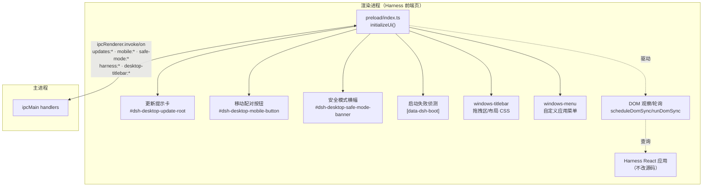

# 预加载层与桌面 UI 注入（preload-ui）

Harness 前端是独立的 web 应用（`@deepseek-ai/dsh-web-frontend`），桌面外壳**不修改其源码**，而是在页面加载时注入一个 preload 脚本，靠 DOM 查询/观察把桌面专属 UI 挂进去、把桌面事件桥接进去。`src/preload/index.ts` 是核心，其余文件按功能拆分。

## 架构概述

注入的元素都带独立容器 id（`dsh-desktop-update-root`、`dsh-desktop-mobile-button`、`dsh-desktop-safe-mode-banner`），样式与 Harness 页面隔离；所有宿主 DOM 经 `liveElement`/`element` 缓存查询，DOM 重渲染后自动重挂。

## 组件约束索引

| Component | Constraints | Risks | Summary |
|-----------|------------|-------|---------|
| `initializeUi` / `mount` | 3 | 1 | 启动更新监听 + 三类 UI 挂载；依赖宿主 DOM 就绪 |
| `checkBootFailureInDom` | 2 | 1 | 只认 `[data-dsh-boot]` 根内的失败标题，避免会话正文误判 |
| `isPluginLoadError` | 3 | 1 | 三类正则识别插件加载错误；错误对象形状多样逐一兜底 |
| `mountSafeModeBanner` | 2 | 1 | 拉 safe-mode:status；横幅动作走 manage/exit IPC |
| `applyStatus` / `render`（更新卡） | 3 | 1 | shouldShowUpdate 门控；下载/安装/跳过按钮动作；dismiss 记忆 |
| `mountWindowsTitlebarLayout` | 3 | 2 | 注入拖拽区与布局 CSS；-webkit-app-region drag/no-drag |
| `mountWindowsMenu` | 2 | 1 | 菜单开关/缩放/主题经 IPC 与主进程菜单子窗口协作 |

## 组件职责

### index.ts — 注入与 IPC 桥

- `initializeUi()`：入口，注册 `updates:status-changed` / `mobile:status-changed` 监听，挂载三类 UI，启动 DOM 同步。
- **更新提示卡**（`render`/`applyStatus`）：消费 [[shared-contracts]] 的 `UpdateStatus`。显示判定走 `update-view.shouldShowUpdate`：`available/downloading/downloaded` 始终显示；`checking/up-to-date/error/unsupported` 仅在手动检查时显示（给用户即时反馈）。卡片按钮：`available` → `updates:download`；`downloaded` → `updates:install`；`updates:skip`（跳过版本）。`dismissCurrent` 记忆被关闭的版本/临时阶段（`isUpdateDismissed`），`isBusy` 在下载/安装中禁用按钮。
- **移动配对按钮**（`mountMobileButton`/`renderMobileButton`/`applyMobileStatus`/`refreshMobileStatus`）：受 `ENABLE_MOBILE_BRIDGE` 守卫（[[shared-contracts]]）；点击 `mobile:open-pairing`；`mobile:status-changed` 推送与 `mobile:status` 拉取共同驱动连接态。
- **安全模式横幅**（`mountSafeModeBanner`）：启动时 `safe-mode:status` 查询是否处于安全模式，是则挂横幅；"管理"→`safe-mode:manage`、"退出并重启"→`safe-mode:exit`。
- **启动失败侦测**（`checkBootFailureInDom`/`queueBootFailure`/`addBootFailureMessage`）：`BOOT_FAILURE_SETTLE_MS = 400ms` 等待 DOM 稳定后，用 `findBootFailureText` 检查 Harness 自己的启动屏；同时监听前端插件加载错误（见下），命中则 `harness:open-recovery` 通知主进程进入恢复流程（见 [[app-bootstrap]] 的前端恢复队列）。
- **DOM 同步调度**（`scheduleDomSync`/`runDomSync`）：Harness 是 SPA，路由切换/重渲染会抹掉注入节点；通过观察/节流周期性 `runDomSync` 重新挂载丢失的 UI。
- **暴露给页面的 API**：preload 还向 Harness 前端暴露受控接口，如 `pick`（目录选择，`directory-picker:open`）、`restartHarness`、`openInFinder`、recovery `action`、safe-mode `action` 等——主进程 handler 侧均校验来源窗口（见 [[app-bootstrap]]）。

### boot-failure.ts — 启动失败文本提取

`findBootFailureText(document)` 只在 `[data-dsh-boot]` 根节点内查找固定标题 `Failed to load plugins`。注释强调**必须限定在启动屏根节点**——会话内容可能合法引用这段标题文字，全局搜索会误判。`extractBootFailureText` 归一化多行文本（trim、去空行）。

### plugin-error-view.ts — 插件加载错误识别

- `isPluginLoadError(error)`：从多种错误形状（`Error`（message+stack）、字符串、`{message}`、`{reason}`、`{reason.message}`）提取文本，匹配三类插件故障模式：`client-modules: bundle script ... failed to load`、`failed to import loader entry`、`client-modules: ... missed the module table`。
- `extractPluginName(error)`：从 `loader entry <hash> (@scope/pkg)` 或 `/plugins/<name>/client.js` 路径提取包名。
- `pluginErrorMessage(locale, pluginName?)`：生成中英双语"插件加载异常/请重启 Harness"提示。

### update-view.ts — 更新卡文案与显示判定

- `shouldShowUpdate(status)`：如上。
- `isUpdateDismissed(status, dismissedVersion, dismissedTransientPhase)`：有 availableVersion 时按版本号记忆关闭；否则按阶段记忆（手动检查的临时反馈）。
- `updateHeadline`/`updateMessage`：8 个 phase 各自的中英双语文案。设计要点（注释）：版本号放在第二行而非标题——版本号回答"是哪个"，不回答"现在该做什么"。

### windows-titlebar.ts — Windows 自定义标题栏

Windows 下应用使用无边框窗口 + 原生 caption 按钮，preload 负责把页面布局与系统标题栏对齐：

- `installLayout`：注入 CSS——用 `env(titlebar-area-x/width)` 计算 caption 宽度 CSS 变量，给 body 加布局类、给会话头部右侧留出 caption+菜单按钮空间（`padding-right`）。
- `installDragRegion`：插入透明 `#dsh-desktop-windows-drag-region`（高 36px、`-webkit-app-region: drag`、`pointer-events: none`）作为窗口拖拽区；所有按钮/链接/输入等显式 `no-drag`。
- `trackSidebarLayout`：`ResizeObserver` + `MutationObserver` 跟踪 Harness 侧边栏宽度，写入 CSS 变量供布局避让。
- `syncTheme`/`documentIsDark`：检测暗色主题（`data-ds-dark-theme` 属性 → body 背景色亮度计算（Rec.601 权重）→ `prefers-color-scheme` 兜底），经 `desktop-titlebar:set-theme` 通知主进程同步原生标题栏/菜单子窗口配色；`MutationObserver` 监听 body 属性变化。
- 页面任意 `pointerdown` → `desktop-titlebar:close-menu`（点别处关菜单）。

### windows-menu.ts — Windows 自定义应用菜单

`mountWindowsMenu` 在标题栏菜单按钮位置挂载自定义菜单（`menuEntries`/`renderMenu`），菜单开关经 `desktop-titlebar:set-menu-open` 控制主进程的菜单 `WebContentsView`（见 [[window-shell]] 的 `windowsMenuViewBounds`）；缩放读 `desktop-menu:get-zoom-factor`、主题随 `applyTheme`。

## 关键业务约束

- **启动失败判定限定在 Harness 启动屏根节点**（confidence: 0.9）
  > Evidence: `boot-failure.ts:11-19` 注释 "Callers must pass the `[data-dsh-boot]` root... conversations may legitimately quote this title"。

- **插件错误识别只认三类明确模式**（confidence: 0.85）
  > Evidence: `plugin-error-view.ts:16-20` 三条正则；错误形状逐级兜底但不放宽模式匹配。

- **更新卡自动阶段才持续显示，手动反馈 8 秒后由主进程复位**（confidence: 0.85）
  > Evidence: `shouldShowUpdate` 对 checking/up-to-date/error/unsupported 要求 `status.manual`；主进程侧 `scheduleReset` 见 [[auto-update]]。

- **拖拽区必须 pointer-events:none 且交互元素显式 no-drag**（confidence: 0.85）
  > Evidence: `windows-titlebar.ts:71-82` drag region `pointer-events: none` + `app-region: drag`；`:62-70` 按钮/输入/`[data-dsh-no-drag]` 强制 `no-drag`。

- **注入节点需在 SPA 重渲染后自动重挂**（confidence: 0.8）
  > Evidence: `scheduleDomSync`/`runDomSync` 与 `liveElement` 缓存查询机制；容器 id 固定。

## 数据流与状态

preload 无持久化状态；状态来自主进程推送（`updates:status-changed`、`mobile:status-changed`）与按需 invoke 拉取（`safe-mode:status`、`mobile:status`、`desktop-menu:get-zoom-factor`）。用户动作经 invoke 上行（download/install/skip、open-pairing、safe-mode manage/exit、titlebar set-menu-open/set-theme/close-menu、harness:open-recovery/restart）。主进程→renderer 的状态结构定义在 [[shared-contracts]]。

## 与其他模块的关系

- [[app-bootstrap]]：注册全部对应 `ipcMain.handle`，并校验 sender 来源。
- [[shared-contracts]]：`UpdateStatus`/`DesktopMenuCommand`/`ENABLE_MOBILE_BRIDGE`/`WINDOWS_TITLEBAR_HEIGHT` 类型与常量来源。
- [[auto-update]] / [[mobile-bridge]] / [[recovery-views]]：更新卡、配对按钮、安全模式横幅分别是这三个主进程模块的 renderer 侧入口。
- [[window-shell]]：标题栏/菜单的主进程侧（菜单子窗口、bounds、主题）。

## 跨模块引用

- 安全模式/插件恢复的主进程编排见 [[app-bootstrap]]；视图模型构建见 [[recovery-views]]。
