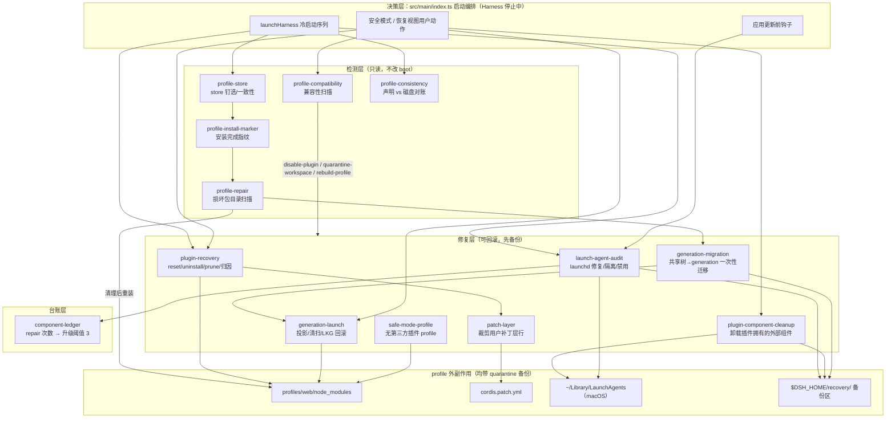
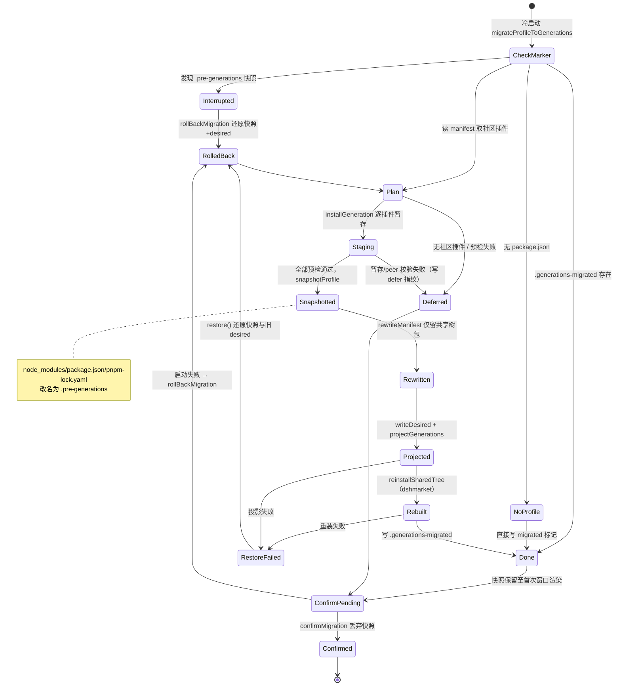

# Profile 状态管理与自愈（profile-state）

> 代码位置：`src/main/state/`（16 个文件）。这是本仓库最复杂的子系统：它在 **Harness 进程启动之前**运行，把一个"第三方插件可能随时弄坏"的可插拔运行时，变成一个可以检测、隔离、修复、回滚而**无需重装整个应用**的 profile。

## 架构概述

### 这个子系统解决什么问题

Harness 的 web profile 是一个完整的 pnpm 工程：`$DSH_HOME/profiles/web/` 下有 `package.json`（声明依赖与 `dsh.profile.bundles`）、`node_modules/`（hoisted 布局）、`cordis.patch.yml`（用户 cordis 补丁层）、`pnpm-workspace.yaml`，以及可选的 `packages/`（本地 workspace 链接插件）。第三方插件通过 `dsh plugin add` 进入这个工程。它的故障模式极多，而且**大多不抛异常**：

- pnpm 安装中途被杀（Windows 上文件锁导致 rename 失败是常态），留下"有名无实"的包目录，之后所有 pnpm 操作在同一个名字上反复失败；
- 安装进程被杀时 `node_modules` 看起来完整，但部分包从未落盘——profile 会"看起来没坏"而永远停在半成品状态；
- 插件升级后引用了新版 Harness 不再提供的 `@deepseek-ai/*` 客户端模块，或 profile 里 hoist 了一个旧版核心包**遮蔽（shadow）**应用自带版本；
- 本地 workspace 插件的 peer/dev 依赖钉在另一个 Harness 代次上；
- 回滚过的安装留下"文件还在、声明没了"的孤儿 bundle；用户补丁层仍 `insert` 一个已卸载的包；
- pnpm 记录的 store 与 `.npmrc` 钉选的 store 不一致时，pnpm 以 `ERR_PNPM_UNEXPECTED_STORE` **拒绝一切操作**（安装、卸载、修复全锁死）；
- 插件在 macOS `~/Library/LaunchAgents` 装了 daemon 化条目：旧版本残留会在应用更新后指向**已被替换的 app bundle 路径**，或每次登录把 Electron 当后台 GUI 进程拉起、抢焦点后崩溃；
- 传统共享树（shared hoisted tree）里的插件修复在 Windows 上会卡死。

这些故障的共同特征是：**Harness 能启动但服务永远等不到 provider**，表现为"启动很慢/界面起不来"，真正的错误要翻一下午日志。本子系统的目标就是在启动前让这些状态**可读、可修、可回滚**。

### 分层架构

所有检测与修复都在"Harness 已停止"的冷启动窗口执行——这是唯一能安全删除/移动 `node_modules` 内容的时刻（运行中的插件可能正从某个 generation 目录 `import`）。



启动序列（`launchHarness`，`src/main/index.ts:1082-1154`）的实际顺序：

1. `runtime.stop()` —— 先停掉旧 Harness（重启场景里上一个实例还在跑）；
2. `ensureStoreDirPinned` —— 在任何 pnpm 操作之前钉住 store，否则修复本身都会被 `ERR_PNPM_UNEXPECTED_STORE` 拒掉；
3. `recoverInterruptedMigration` —— 上次迁移若崩在半路，先把快照还原；
4. `prepareGenerationsForLaunch` —— 清扫无引用的 generation、重新投影符号链接；
5. `migrateProfileToGenerations` —— 一次性把旧共享树插件迁到 generation 模型；**迁移成功则跳过下一步共享树修复**（迁移已重建过树）；
6. 未迁移时 `repairProfilePackages`：`clearDamagedPackageDirectories` → 检查 `.install-complete` 指纹 → 必要时清 marker + `dsh` 重装 + 成功后写 marker；
7. `pruneMissingProfileBundles` —— 把 manifest 里声明但磁盘上不存在的第三方 bundle/dependency 裁掉，防止 Harness 报 "cannot resolve profile bundle"；
8. `reportProfileConsistency` —— 纯报告：一致性发现 + store 漂移逐条写日志，**不阻断启动**；
9. `auditInstalledLaunchAgents`（macOS）—— 修复 daemon 化条目；
10. `runtime.start()`；
11. 启动后若未达 `ready`：迁移过的 profile 走 `rollBackMigration` 回滚到升级前快照；否则 `desiredIsUntried` 为真时 `rollBackToLastKnownGood` 回滚到上一个渲染出窗口的插件集，再重启一次。

### Generation 机制与迁移状态流

**Generation（代次）**是新的插件安装模型：市场插件不再装进共享的 `profiles/web/node_modules`，而是每个插件安装成一个独立的 generation 目录（自带 `node_modules`，peer 依赖通过父级目录走到 `profiles/node_modules` 解析），profile 的 `node_modules` 里只放指向它的符号链接，`package.json` 里以 `link:` 依赖 + bundle 行表达。两个指针决定"哪一代真正启动"：

- `desired.json`：用户/市场侧期望启用的 generation id 集合（市场插件在 Harness 内部安装时移动它）；
- last-known-good（LKG）指针：**上一次真正渲染出窗口**的 generation 集合（由 `commitLastKnownGood` 提交）。

投影（projection，`projectGenerations`）从 `desired` 重新推导 profile 的符号链接与 manifest。`.install-complete` 只证明"pnpm 退出码为零"，而 **窗口渲染**才是插件集可用的证据——这是 LKG 回滚比安装指纹更可信的原因。

一次性迁移把"升级前仍把社区插件装在共享树里"的旧 profile 搬到 generation 模型（共享树修复在 Windows 上会卡死，而 generation 路径只对"作为 generation 安装的插件"生效，所以必须显式搬一次）。迁移全程在 Harness 停止时运行，任何失败都还原到迁移前 profile，并用输入指纹记录失败、避免每次启动重试：



### 典型故障模式与自愈路径

| 故障现象 | 检测者 | 自愈动作 | 备份/回滚 |
|---|---|---|---|
| pnpm 安装中途被杀，留下 `<pkg>_tmp_<pid>` 暂存目录 | `profile-repair.findDamagedPackageDirectories`（名字模式） | `removeTree` 清除后补装 | 无需备份（本就是垃圾） |
| Windows 文件锁导致替换失败，留下 `<pkg>.dsh-old-<ts>` | 同上（名字模式，含嵌套 `node_modules` 内） | 清除后补装；每次失败累积一份，嵌套扫描才能发现 | 无需备份 |
| 目录带包名但无有效 `package.json` | 同上（`isMaterializedPackage` 判定） | 清除后补装 | 无需备份 |
| 安装进程被杀，树"看起来完整"但缺包 | `profile-install-marker`（指纹缺席/不符） | 清 marker → `dsh` 重装 → 成功写 marker | marker 机制本身保证可重入 |
| `.modules.yaml` 的 store 与 `.npmrc` 不一致 | `profile-store.inspectStoreConsistency` | `ensureStoreDirPinned` 原子写回 `.npmrc` | 仅追加/替换 `store-dir` 行 |
| 第三方插件依赖缺失（必需） | `profile-compatibility`：`missing-client-module` | 从 bundles 摘除该插件（包与数据保留） | `recovery/compatibility/<ts>/` 备份 manifest |
| 插件 client bundle 引用已移除的 `@deepseek-ai/*` | 同上（源码正则扫 `require/import/from`） | 同上，disable-plugin | 同上 |
| 旧版核心包 hoist 遮蔽自带版本 | 同上：`core-version-mismatch` | 核心包移入隔离区 + 删 lockfile + 重装 | `recovery/compatibility/<ts>/core-packages/` |
| 本地 workspace 钉在别的 Harness 代次 | 同上：`workspace-version-mismatch` | workspace 目录整体移入隔离区 + 删 lockfile + 重装 | `recovery/compatibility/<ts>/workspaces/` |
| manifest 声明 bundle 但磁盘无包 | `plugin-recovery.pruneMissingProfileBundles` | 自动从 bundles/dependencies 裁剪 + 删 lockfile | 纯声明裁剪 |
| 回滚安装留下孤儿 bundle（文件在、声明无） | `profile-consistency`（仅报告） | 写日志提示，不自动删 | — |
| 补丁层 `insert` 已卸载的包 | `profile-consistency`（报告）；卸载时 `patch-layer` 预防 | 卸载插件时按行裁剪补丁层 | 文档级编辑，保留其余用户内容 |
| 前端 loader 报重复 entry / slot 冲突 | `plugin-recovery.resolveProfileRecoveryPlugins` 归因 | 唯一归因后引导卸载/重置该插件 | reset 只动声明与插件目录 |
| 插件卸载后其 LaunchAgent 残留 | `plugin-component-cleanup`（独占闭包目录匹配） | bootout + plist 移入隔离区 | `recovery/uninstalled-components/<ts>/` |
| LaunchAgent 把 Electron 当 GUI daemon 拉起 | `launch-agent-audit.auditLaunchAgents` | 补 `ELECTRON_RUN_AS_NODE=1` 后 bootstrap；失败则隔离 | `recovery/repaired-components/<ts>/` |
| 同一坏 agent 被反复重建 | 台账 `repairs >= 3` | `launchctl disable` + 隔离，UI 交用户决策 | `recovery/quarantined-components/<ts>/` |
| 应用更新时后台任务占用 bundle 内文件 | `quarantineAppBundleLaunchAgents` | 全部 bootout + 隔离；**失败则中止更新** | 同上 |
| 新插件集启动失败（未达 ready） | `desiredIsUntried` | 回滚 desired 到 LKG + 重新投影 + 重启 | LKG 指针 |
| 迁移后首次启动失败 | `rollBackMigration`（快照存在即触发） | `.pre-generations` 快照整体 rename 回位 + 恢复旧 desired | 快照 + `.generations-pre-migration.json` |

### 安全模式启动路径

正常启动序列中任何一环判定 profile 不可信时，UI 可转入安全模式（`launchSafeHarness`，`src/main/index.ts:1156` 起）：先 `ensureSafeModeProfile` 物化 `desktop-safe-mode` profile（依赖为空、bundles 仅两个核心包、补丁层 `[]`、`nodeLinker: hoisted` + `autoInstallPeers: false`），再以该 profile 启动 Harness。安全模式管理器里：

- `listInstalledProfilePlugins` 不启动 Harness 即可列出正常 profile 的第三方插件（按包目录时间新者在前）；
- `inspectProfileCompatibility` 对**正常 web profile** 做静态扫描（刻意不 import 其代码——客户端 bundle 已坏时仍要能扫）；
- 用户确认后 `repairSafeModeCompatibilityIssues`（`index.ts:1639-1692`）按 resolution 分三组执行：disable-plugin → quarantine-workspace → rebuild-profile（后两组做完清 marker 重装、成功写 marker）；
- 卸载走 `removeProfilePluginCompletely`：先试 generation 路径（`uninstallGenerationPlugin`），否则 `cleanupPluginOwnedComponents` + `uninstallPluginFromProfile`，再不行 `resetPluginProfile(name, false)` 兜底，最后以 `listInstalledProfilePlugins` 的可观察结果为准。

generation 迁移补充要点：

- **预检在旧 profile 完好时全部完成**。暂存的 generation 在 `desired.json` 移动之前是惰性的，暂存失败不影响正在工作的树；
- 快照 = 把 `node_modules`、`package.json`、`pnpm-lock.yaml` 整体 `rename` 成 `*.pre-generations`（同盘 rename 原子且可逆），状态记入 `.generations-pre-migration.json`（含旧 desired 与指纹）；
- `.generations-deferred.json` 记录 `{protocol: 2, fingerprint, reason, failedAt}`：指纹覆盖 manifest + 各插件已装 manifest 的内容，**同一失败输入不重试**，输入变化（插件增删/版本变）后指纹改变才会再次尝试；
- 迁移成功后快照**不立即删除**——要等第一次窗口渲染（`confirmMigration`）才丢弃；这期间启动失败则 `rollBackMigration` 整体回退，旧共享树路径下次启动继续可用。

## 组件职责

按五个功能域分组。

### 一、检测层

| 文件 | 导出 | 职责 |
|---|---|---|
| `profile-store.ts` | `recordedStoreDir` / `configuredStoreDir` / `pinStoreDir` / `storeDirSetting` / `ensureStoreDirPinned` / `inspectStoreConsistency` | 读 `node_modules/.modules.yaml` 里 pnpm 记录的 store，与 profile `.npmrc` 的 `store-dir` 对账；不一致时把记录值原子写回 `.npmrc`（临时文件 + rename）。pnpm 记录含版本段（`…/v10`），设置项是其上一级目录。 |
| `profile-install-marker.ts` | `isProfileInstallComplete` / `markProfileInstallComplete` / `clearProfileInstallMarker` / `profileInstallMarkerPath` | `.install-complete` 标记：内容是 `package.json` + `pnpm-lock.yaml` 的 SHA-256 指纹。仅在安装退出码为零后写入、安装开始前删除；**缺席即"未完成"**，manifest/lockfile 被改过也读作未完成。 |
| `profile-repair.ts` | `findDamagedPackageDirectories` / `clearDamagedPackageDirectories` / `hasProfile` | 递归扫描 `node_modules`：① 名字含 `_tmp_`（pnpm 中断暂存）或 `.dsh-old-`（打包 pnpm runner 在 Windows 拒绝替换时挪开的副本）的目录直接判定为可清理；② 无可读 `package.json`（或缺 `name` 字段）的"有名无实"目录判定损坏；③ 完整包还要钻进它自己的 `node_modules` 查嵌套残留（如 `cytoscape-fcose/node_modules/cose-base.dsh-old-…`）。符号链接不动（pnpm 隔离布局靠它们指向 virtual store）。删除后逐一 `lstat` 确认真的没了。 |
| `profile-compatibility.ts` | `inspectProfileCompatibility` / `disableProfilePlugins` / `quarantineProfileWorkspaces` / `quarantineProfileCorePackages` | 不 import 任何 profile 代码（安全模式必须在客户端 bundle 无法求值时仍可用）。扫描三类 blocking 问题并给出 resolution；修复动作一律先把 `package.json`/`pnpm-lock.yaml`/`pnpm-workspace.yaml`/`cordis.patch.yml` 备份到 `$DSH_HOME/recovery/compatibility/<时间戳>/`。 |
| `profile-consistency.ts` | `inspectProfileConsistency` / `patchLayerInsertedPackages` | 纯报告。四类"不抛异常但服务等不到 provider"的矛盾：bundle 声明了但没装；包装了且声明 bundle patch 却没被 compose；`node_modules` 里存在、manifest 任何地方都没声明、也不是任何声明包的传递依赖的孤儿 bundle（回滚安装的典型残留）；补丁层 `insert` 了一个没装的包。 |

`inspectProfileCompatibility` 的三类 issue：

- `core-version-mismatch`（resolution `rebuild-profile`）：profile `node_modules` 里的 `@deepseek-ai/*` 包版本与应用自带（bundled）版本不同——旧包遮蔽新包。若该不匹配唯一归属于某个不兼容 workspace，则归到该 workspace 组；否则归 "Profile core dependencies" 组。修复：`quarantineProfileCorePackages` 把冲突包 rename 进 recovery 区、删 lockfile、重装。
- `missing-client-module`（resolution `disable-plugin`）：对每个**在用第三方插件**（同时在 dependencies 与 bundles 中、且非核心），从其真实安装目录（generation 插件要 `realpath` 跟随符号链接进 generation 目录）出发做 `pluginDependencyClosure`（dependencies=必需、optionalDependencies=可选的 BFS 闭包）；闭包里缺包、且不是 bundled 提供、也无法从插件目录 `require.resolve` 到 → 必需依赖缺失；再读各包 `lib/client.js`/`lib/index.js`/`main`/`module` 源码，正则提取 `require()`/`import`/`from` 的字面模块请求，引用了 Harness 不再提供的 `@deepseek-ai/*` 模块 → 客户端模块缺失。修复：`disableProfilePlugins` 只从 `dsh.profile.bundles` 移除该插件（**不删包、不删配置、不删数据**）。
- `workspace-version-mismatch`（resolution `quarantine-workspace`）：`packages/` 下本地 workspace 包的 peer/dev 依赖里钉了 `@deepseek-ai/*` 版本，与 bundled 版本不满足 `^`/`~`/精确匹配（或 bundled 已移除该包）。修复：`quarantineProfileWorkspaces` 把整个 workspace 目录 rename 到 `recovery/compatibility/<ts>/workspaces/<名>`（`/` 转 `__`），删 lockfile；**永不删源码与数据**。

### 二、修复层（插件恢复与清理）

| 文件 | 导出 | 职责 |
|---|---|---|
| `plugin-recovery.ts` | `isThirdPartyPackageName` / `listInstalledProfilePlugins` / `resolveProfileRecoveryPlugins` / `pluginDeclaredEntryIds` / `prunePluginPatchLayer` / `uninstallPluginFromProfile` / `resetPluginProfile` / `pruneMissingProfileBundles` / `profilePackageJsonPath` / `profileCordisPatchPath` / `isDisposableModuleDirectory` | 插件故障恢复核心 + 全子系统共享的路径常量（`profiles/web/package.json`、`profiles/web/cordis.patch.yml`）。 |
| `patch-layer.ts` | `bundleEntryIds` / `prunePatchLayer` | 以 YAML **文档**（保留注释）方式裁剪用户补丁层：删除"目标插件声明的 loader entry id"的行，以及 `insert` 列表中名字等于插件或以 `插件/` 开头的条目；整行 insert 全属该插件则删行、否则保留其余。首行头部注释保留并迁移到保留下来的首行；行尾注释随行走。无匹配时原样返回（无关卸载绝不重写文件）。 |
| `plugin-component-cleanup.ts` | `cleanupPluginOwnedComponents` / `orphanedPluginPackageDirectories` | 卸载插件时清理它**独占拥有**的外部组件（目前为 macOS LaunchAgent）。`packageClosure` 从插件根 BFS 出依赖闭包（dependencies + optionalDependencies，`realpath` 去重），减去"其余所有根插件闭包仍引用"的目录，得到"只会因为这次卸载而消失"的包目录集合；再扫描 `~/Library/LaunchAgents` 中 `Program`/`ProgramArguments` 指向这些目录（词法路径或 realpath 后路径落在其中）的 plist，bootout 后 rename 到 `recovery/uninstalled-components/<ts>/`。非 darwin 直接 no-op。 |
| `remove-tree.ts` | `removeTree` / `removeTreeIfPossible` | 跨平台目录删除。Node 递归 `fs.rm` 在 Windows 上对**含非 ASCII 字符的路径**静默不删却报成功（`C:\Users\数据项素\…` 会让所有清理失效）；改为手工 `readdir` 递归：文件 `unlink`、目录退出时 `rmdir`，**符号链接只 unlink 不跟随**（绝不顺着链接删掉 pnpm store 的内容）。`removeTreeIfPossible` 失败后再兜底试一次原生递归 `rm` 并以 `lstat` 复核。 |

`plugin-recovery.ts` 关键行为：

- **第三方判定**：包名合法、不以 `@deepseek-ai/` 开头、且不在核心集 `{@deepseek-ai/dsh-base, @deepseek-ai/dsh-web-app, dshmarket}` 中。"插件"= 同时出现在 `dependencies` 与 `dsh.profile.bundles` 里的第三方包（传递依赖不算插件）。
- `resolveProfileRecoveryPlugins`：把运行时/前端报来的故障（报错里点名的包、重复 loader entry id、slot 冲突名）**归因到唯一配置插件**，证据链四级：① 点名的就是已配置根插件，或某 bundle 的 manifest 依赖/补丁 YAML 里拥有该子包（`bundleOwnsPackage`）；② 插件代码/依赖里引用了该点名包（动态创建官方叶子包的情况，`pluginReferencesPackage`）；③ 某 bundle 自己的 patch 声明了重复 loader entry（`bundleDeclaresLoaderEntry`，正则 `- id: <id>`）；④ slot 冲突：插件文件内容含 slot 名（`pluginMatchesSlot`），或 `@deepseek-ai/dsh-client-ui-*` 包中提供该 slot 的官方 UI 包能被归因回唯一插件（`packagesProvidingSlot`）。**证据不唯一或没有直接证据就返回空数组——永不猜测**。
- `uninstallPluginFromProfile`：先走调用方注入的 `removePlugin`（实际执行 `dsh plugin remove`），之后**验证** manifest 依赖、bundle 行、`node_modules` 目录、lockfile importer 四处都已移除，验证通过才裁剪补丁层；任一不符返回 false。
- `resetPluginProfile`：兜底重置。指定插件时删除其依赖/bundle 行（`matchRelatedPackages` 控制是否连带同名/同 scope 包，恢复 UI 传 `false` 以防扩大化）、物理 `removeTree` 插件目录与 `packages/<插件>` 源码目录、裁剪补丁层、删 lockfile；不指定插件时是"从头开始"：bundles 重置为 `dsh-base`+`dsh-web-app`（有 dshmarket 依赖则保留）、依赖只留核心包、补丁层整体清为 `[]`。
- `pruneMissingProfileBundles`：启动前自动裁掉 manifest 里声明但磁盘缺失的第三方 bundle/依赖（顺带清 `_tmp_`/`.dsh-old-` 残留），修改后删 lockfile。防止 Harness 因 "cannot resolve profile bundle" 启动失败。
- `listInstalledProfilePlugins`：安全模式管理器用——不启动 Harness 列出已装插件，按包目录 `max(birthtime, mtime)` 新者在前排序（profile 不持久化 installedAt，这是最接近的通用信号）。

### 三、台账层

| 文件 | 导出 | 职责 |
|---|---|---|
| `component-ledger.ts` | `readComponentLedger` / `recordComponentRepair` / `shouldEscalateRepairs` / `REPAIR_ESCALATION_THRESHOLD` | `$DSH_HOME/recovery/launch-agent-ledger.json`：`{ [label]: { repairs, lastRepairAt } }`。同一 LaunchAgent label 每修复一次计数 +1；达到阈值 **3**（`REPAIR_ESCALATION_THRESHOLD`）后不再静默修复——因为一个每次修复后都重建恶意条目的插件会让应用陷入"修正→被覆盖"的死循环，超阈值后改为 `launchctl disable` + 隔离，并交由 UI 让用户决策。台账丢失只损失升级历史，不影响安全性。 |

### 四、macOS launchd 审计域

| 文件 | 导出 | 职责 |
|---|---|---|
| `launch-root.ts` | `launchRootPath` / `ensureLaunchRoot` | 在 userData 下建 `launch-root/` 目录（launchd 相关辅助根目录）。 |
| `launchctl-service-state.ts` | `launchServiceIsStoppedAfterBootout` | bootout 后置条件校验：`launchctl bootout` 退出码非零时，用 `launchctl print <service-target>` 失败 + `print <domain-target>` 成功来区分"服务确实没了"与"整个 launchd 域不可访问"，不依赖 launchctl 的本地化/版本相关文案。 |
| `launch-agent-audit.ts` | `auditLaunchAgents` / `quarantineAppBundleLaunchAgents` / `repairedLaunchAgent` / `describesDaemonisedAppBinary` / `referencesAppBundleExecutable` / `appBundlePathFromExecutable` / `pluginOwnerFromArguments` | 扫描 `~/Library/LaunchAgents/*.plist`（用 `/usr/bin/plutil -convert json` 读取、`-convert xml1` 经临时目录写回），10 秒超时、输出截断 64KB。所有 launchctl/plutil 调用都可注入（测试用）。 |

两类审计动作：

- **`auditLaunchAgents`（每次冷启动）**：找出"可执行文件落在当前 app bundle 内、且没有 `ELECTRON_RUN_AS_NODE=1`"的条目。这种条目必然是缺陷——launchd 会拉起一个完整 GUI Electron 进程，抢焦点后崩溃。修复优先于删除：备份原 plist 到 `recovery/repaired-components/<ts>/` → `bootout gui/<uid>/<label>` → 写入只增加 `ELECTRON_RUN_AS_NODE: "1"` 的新 plist（保留调度、参数、环境）→ `bootstrap gui/<uid>` 重新加载 → 台账记一次修复。修复失败则退而隔离（bootout + rename 到 `recovery/quarantined-components/<ts>/`）——"让任务停掉"好过留着它每次登录弹桌面。台账超阈值的 label 直接 `disable` + 隔离。`pluginOwnerFromArguments` 从参数里 `node_modules/<pkg>` 路径反推归属插件名，仅用于向用户展示。
- **`quarantineAppBundleLaunchAgents`（应用更新前，Harness 已停）**：能力判定更宽——**任何**可执行文件位于 app bundle 内的 LaunchAgent 都先 bootout + 隔离，即使它已正确配置为 Node 模式：更新器替换 `.app` 目录时，后台任务可能读到缺失或半写的 Electron framework。调用方必须先停 Harness，防止第三方插件在空档重建任务。任一失败则**中止更新安装**（抛 "Unable to stop background services before replacing DSH Desktop."），不冒险换 bundle。

为什么必须审计：macOS 上应用更新通常以新 `.app`  bundle 替换旧路径（或版本化路径变化），旧 LaunchAgent plist 里硬编码的可执行路径随之失效；而 daemon 化条目在登录时由 launchd 自动拉起，不受应用自身控制。

launchd 域的实现细节与测试接缝：

- 所有外部命令（`/bin/launchctl bootout|print|bootstrap|disable`、`/usr/bin/plutil -convert`）都通过 `LaunchAgentAuditOptions` / `PluginComponentCleanupOptions` 的可注入函数提供，默认实现走 `spawn`，10 秒超时（`SIGKILL`）、stdout/stderr 各截断 64KB——单条 plist 异常不能拖死启动；
- 目标域固定为用户 GUI 域 `gui/<uid>`（`process.getuid()`），label 必须匹配 `/^[a-z0-9._-]+$/i` 才操作，label 或 uid 不可用只记 failure、不动该 plist；
- bootout 成功判定不看 launchctl 文案：`launchServiceIsStoppedAfterBootout` 在退出码非零时再 `print` 服务目标（应失败）与父域目标（应成功）来确认"服务确实没了、域还在"；
- plist 写回走 `mkdtemp` 临时目录中转（JSON → `plutil -convert xml1`），避免半写文件；
- 归属反推（`pluginOwnerFromArguments`）只取参数中最后一个 `node_modules/` 段后的包名（`@scope/name` 两级），仅用于 UI 展示"由哪个插件安装"，**不参与**是否修复的判定；
- 插件组件清理的"独占"语义：`packageClosure` 从被卸载插件根出发 BFS（dependencies + optionalDependencies，`realpath` 规范化去重），再减去其余所有根插件闭包仍覆盖的 canonical 目录——共享依赖不驱动任何外部清理；LaunchAgent 的 `Program`/`ProgramArguments` 用词法路径和 realpath 两种形态与独占目录做包含匹配。

### 五、Generation 域

| 文件 | 导出 | 职责 |
|---|---|---|
| `generation-launch.ts` | `prepareGenerationsForLaunch` / `desiredIsUntried` / `rollBackToLastKnownGood` / `uninstallGenerationPlugin` / `markGenerationsBooted` | 启动期代次编排（委托 `dsh-desktop-market-installer/generations/{registry,projection}`）。 |
| `generation-migration.ts` | `migrateProfileToGenerations` / `recoverInterruptedMigration` / `confirmMigration` / `rollBackMigration` / `isProfileMigrated` | 共享树 → generation 模型的一次性迁移（协议版本 2）。 |
| `safe-mode-profile.ts` | `ensureSafeModeProfile` / `SAFE_MODE_PROFILE` / `SAFE_MODE_BUNDLES` | 物化 `$DSH_HOME/profiles/desktop-safe-mode/` 独立 profile：package.json 依赖为空、bundles 仅 `@deepseek-ai/dsh-base` + `@deepseek-ai/dsh-web-app`、补丁层固定为 `[]`（托管文件，内容不变不重写）。与正常 profile **共享** settings、凭据、会话、工作区，但**绝不读**正常 profile 的 bundle 列表与用户补丁层。 |

`generation-launch.ts` 行为要点：

- `prepareGenerationsForLaunch`：`sweepRegistry` 物理删除两个指针都不引用的 generation 与暂存残留（删不掉的惰性保留，下次冷启动重试）；若 profile 连 `package.json` 都没有，用 `@deepseek-ai/dsh-app-boot` 的 `PROFILE_TEMPLATES.web` + `initProfile` 初始化（**不能让投影凭空造空 manifest**，否则 app-boot 不会装自带 web bundles，桌面 overlay 会永远等不到 connection 等服务）；然后 `projectGenerations` 按 `desired` 重建链接。投影失败不阻断本次启动（下次可恢复）。
- `desiredIsUntried`：`desired` 与 LKG 集合长度不同或有 LKG 不含的 id → 当前期望集是"没试过的新集"。
- `rollBackToLastKnownGood`：`revertToLastKnownGood` 把 desired 回滚到 LKG 后重新投影；调用方随后重启 Harness 一次。
- `uninstallGenerationPlugin`：generation 插件的卸载 = 从 desired 移除（`disableGeneration`）+ 重新投影，**不能**用 `pnpm remove`——投影会在下次启动从 desired 重新推导 manifest，插件会"立刻回来"。非 generation 插件返回 false，调用方回落到共享树 `dsh plugin remove`。
- `markGenerationsBooted`：仅当 Harness 报告 ready **且窗口已渲染**后由调用方触发，`commitLastKnownGood` 提交当前 desired 为 LKG。

## 组件约束索引

> 以下约束均直接来自代码，附文件与函数证据；置信度：高 = 代码直接断言/注释明确，中 = 由代码行为推断。

| # | 约束 | 证据 | 置信度 |
|---|---|---|---|
| 1 | 所有 profile 修复只能在 Harness 停止的冷启动窗口做 | `generation-launch.ts:31-36` 注释"Stopped Harness is the only moment a removal is safe"；`index.ts:1092` 先 `runtime.stop()` | 高 |
| 2 | store 钉选必须先于一切 pnpm 操作 | `index.ts:1093-1096`；`profile-store.ts:9-18`（ERR_PNPM_UNEXPECTED_STORE 锁死安装/卸载/修复） | 高 |
| 3 | `.install-complete` 缺席即"未完成"，且指纹含 lockfile | `profile-install-marker.ts:16-26,56-65` | 高 |
| 4 | marker 先清后装：安装开始前删、退出码为零后写 | `profile-install-marker.ts:67-76`；`index.ts:991-999` | 高 |
| 5 | 损坏目录扫描必须递归进完整包的 node_modules，符号链接不判 | `profile-repair.ts:42-86` | 高 |
| 6 | 删除后必须复核路径真的消失（非 ASCII 路径下 Node rm 谎报成功） | `profile-repair.ts:89-114`；`remove-tree.ts:7-29` | 高 |
| 7 | removeTree 对符号链接只 unlink 不跟随 | `remove-tree.ts:41-46` | 高 |
| 8 | 兼容性扫描不得 import/求值 profile 自身代码 | `profile-compatibility.ts:248-251` | 高 |
| 9 | 缺失模块判定要走 Node 解析语义（generation 目录 + 父级 walk），不能扁平 readdir | `profile-compatibility.ts:8-23,335-344` | 高 |
| 10 | optionalDependencies 缺失不算 blocking | `profile-compatibility.ts:114-151,346-352`（required=false 跳过） | 高 |
| 11 | 恢复动作只在证据指向唯一插件时执行，否则返回空 | `plugin-recovery.ts:370-372`"Never guess" | 高 |
| 12 | disable-plugin 只摘 bundle 行，不删包/配置/数据；隔离 workspace 永不删源码 | `profile-compatibility.ts:460,489` | 高 |
| 13 | 所有 quarantine/disable 修复先备份 manifest 四件套到 recovery 时间戳目录 | `profile-compatibility.ts:449-458,475-481` | 高 |
| 14 | 补丁层按文档编辑保留注释，只动点名该插件的行；无匹配原样返回 | `patch-layer.ts:16-19,61-118` | 高 |
| 15 | reset 指定插件时恢复 UI 传 matchRelatedPackages=false，不扩大到同名/同 scope 包 | `index.ts:1747`；`plugin-recovery.ts:493-516` | 高 |
| 16 | generation 插件卸载必须走 desired+投影，pnpm remove 会被投影撤销 | `generation-launch.ts:98-121`；`index.ts:1700-1707` | 高 |
| 17 | LKG 提交以"窗口渲染"为凭据，而非安装退出码 | `generation-launch.ts:123-127`；`index.ts:691,1134-1137` | 高 |
| 18 | 迁移失败按输入指纹 defer，同一失败输入不重试；协议版本 2 | `generation-migration.ts:32,94-118,283-318` | 高 |
| 19 | LaunchAgent 修复同一 label 达 3 次升级为 disable+隔离并交用户决策 | `component-ledger.ts:10,51-53`；`launch-agent-audit.ts:392-425` | 高 |
| 20 | 更新前 quarantine 任一失败则中止更新 | `index.ts:1076-1079` | 高 |

## 关键业务约束

1. **"不抛异常的故障"必须在启动时命名**。一致性检查（`profile-consistency.ts:6-16`）的全部理由：声明未装、装了未 compose、补丁层 insert 缺失包、孤儿 bundle 都不会让 Harness 报错，只会留下服务等 provider；因此 `reportProfileConsistency` 只报告、不改 boot（`index.ts:1012-1028`），把状态写进日志让故障可读。〔置信度：高〕

2. **修复顺序不可调换**：store 钉选 → 中断迁移恢复 → generation 清扫/投影 → 迁移 →（未迁移才）共享树损坏修复+补装 → 裁缺失 bundle → 一致性报告 → launchd 审计。顺序理由均有代码注释支撑：store 不钉则后续 pnpm 全失败（`index.ts:1093`）；中断迁移不先还原会让投影/修复观察到"切换了一半"的 profile（`index.ts:1097-1100`）；迁移成功就跳过共享树修复，因为迁移已经把树重建为只含共享树包（`index.ts:1105-1128`、`generation-migration.ts:350-360`）。〔置信度：高〕

3. **"清理"之后必须"补装"**。`clearDamagedPackageDirectories` 只删掉损坏残留是"截肢"——包仍然是被需要的；所以损坏清理后紧跟一次 `dsh` 安装把包装回来（`profile-repair.ts:18-23`、`index.ts:974-999`）。半成品 profile（无损坏目录但 marker 指纹不符）同样触发补装，否则会永远停在半建状态。〔置信度：高〕

4. **隔离优于删除，一切外移可回滚**。损坏的 workspace、冲突核心包、危险 LaunchAgent 都被 `rename` 进 `$DSH_HOME/recovery/` 下带时间戳的目录，而不是删除；manifest 修改前先复制四件套备份。唯一物理删除的是：`_tmp_`/`.dsh-old-` 残留、无 manifest 的损坏包目录、以及 reset 时指定插件的目录。〔置信度：高〕

5. **归属判定必须能力化、证据化**。LaunchAgent 审计不看包名/服务 label 白名单，只看"可执行文件是否在 app bundle 内"（`launch-agent-audit.ts:110-124`）；插件组件清理不看 label，只算"该包目录是否独占属于被卸载插件的闭包"（`plugin-component-cleanup.ts:106-135`）；插件归因不唯一就不动手（`plugin-recovery.ts:370-372`）。〔置信度：高〕

6. **防死循环台账**。会自我重建 LaunchAgent 的插件可让"每次启动修好、下次启动又坏"无限循环；台账 3 次阈值后升级为 disable + 隔离 + 用户决策（`component-ledger.ts:4-10`）。〔置信度：高〕

7. **安全模式是物化出来的独立 profile，不是开关**。`desktop-safe-mode` profile 有自己的 package.json/补丁层/workspace 文件，与正常 profile 共享数据但不读其 bundle 列表与补丁层（`safe-mode-profile.ts:31-52`）；兼容性扫描刻意不 import profile 代码，以保证客户端 bundle 已坏时安全模式仍可用（`profile-compatibility.ts:248-251`）。〔置信度：高〕

## 数据模型与状态文件

所有路径以 `$DSH_HOME` 为根（便携部署即应用目录下 `data/`，否则为 `%APPDATA%/dsh-desktop[-dev]/harness/`）。

| 文件 | 位置 | 作用 | 写入者 |
|---|---|---|---|
| profile manifest | `profiles/web/package.json` | `dependencies` + `dsh.profile.bundles[]` 决定装什么、compose 什么；插件 = 两者交集中的第三方包 | 安装器 / 本子系统各修复函数 |
| 补丁层 | `profiles/web/cordis.patch.yml` | 用户 cordis 补丁层（含注释），`insert` 包与 loader entry id 覆盖；卸载插件时按行裁剪，reset-all 时清为 `[]` | 用户 / `patch-layer.ts` |
| pnpm store 记录 | `profiles/web/node_modules/.modules.yaml` | pnpm 记录的 `storeDir`（含 `v10` 版本段） | pnpm |
| pnpm 设置 | `profiles/web/.npmrc` | `store-dir=` 钉选，与 `.modules.yaml` 保持一致 | `profile-store.ts` |
| 安装完成标记 | `profiles/web/.install-complete` | 内容 = `sha256(package.json + '\0' + pnpm-lock.yaml + '\0')`；缺席/不符 = 未完成 | `profile-install-marker.ts` |
| 本地工作区 | `profiles/web/packages/<name>/` | 本地链接插件（含 `@scope/` 二级）；不兼容时整个目录隔离 | 用户 / 迁移 |
| 迁移完成标记 | `profiles/web/.generations-migrated` | 存在即已迁移（内容为 ISO 时间戳） | `generation-migration.ts` |
| 迁移延迟标记 | `profiles/web/.generations-deferred.json` | `{protocol:2, fingerprint, reason, failedAt}`；同指纹不重试 | `generation-migration.ts` |
| 迁移快照状态 | `profiles/web/.generations-pre-migration.json` | `{desired, fingerprint}`——回滚时恢复旧 desired 指针 | `generation-migration.ts` |
| 迁移快照 | `profiles/web/{node_modules,package.json,pnpm-lock.yaml}.pre-generations` | 升级前 profile 的整体 rename 快照；首次窗口渲染后丢弃 | `generation-migration.ts` |
| generation 指针 | `desired.json`（market-installer registry 管理，profile 侧） | 期望启用的 generation id 集；市场插件安装/卸载时移动 | generations/registry |
| LKG 指针 | last-known-good 指针（generations/registry：`readLastKnownGood`/`commitLastKnownGood`/`revertToLastKnownGood`） | 上一次渲染出窗口的 generation 集；回滚目标 | generations/registry |
| 修复台账 | `recovery/launch-agent-ledger.json` | `{ [label]: {repairs, lastRepairAt} }` | `component-ledger.ts` |
| 兼容性修复备份 | `recovery/compatibility/<ISO时间戳>/` | manifest 四件套备份；`workspaces/` 下隔离的 workspace；`core-packages/` 下隔离的核心包 | `profile-compatibility.ts` |
| LaunchAgent 修复备份 | `recovery/repaired-components/<ts>/` | 修复前原 plist 副本 | `launch-agent-audit.ts` |
| LaunchAgent 隔离区 | `recovery/quarantined-components/<ts>/` | bootout 后移走的危险/超阈值 plist | `launch-agent-audit.ts` |
| 更新前隔离区 | （复用 quarantine 流程） | 更新前所有指向 app bundle 的 plist | `launch-agent-audit.ts` |
| 卸载组件隔离区 | `recovery/uninstalled-components/<ts>/` | 卸载插件独占拥有的 LaunchAgent plist | `plugin-component-cleanup.ts` |
| 安全模式 profile | `profiles/desktop-safe-mode/` | 仅核心 bundle 的隔离 profile（共享 settings/凭据/会话/工作区） | `safe-mode-profile.ts` |
| launch 根目录 | `<userData>/launch-root/` | launchd 辅助根目录 | `launch-root.ts` |
| macOS 用户代理 | `~/Library/LaunchAgents/*.plist` | launchd 登录项；审计/修复/隔离的外部作用对象 | 插件 / launchctl |

时间戳格式统一为 ISO 8601 并把 `:`、`.` 替换为 `-`（`recoveryStamp`/`timestamp`/`quarantineTimestamp`），保证 Windows/macOS 路径合法。

### 关键文件内容形态

profile manifest（`profiles/web/package.json`）——"插件"的判定依据是 `dependencies` 与 `dsh.profile.bundles` 的交集：

```json
{
  "name": "dsh-profile-web",
  "private": true,
  "dependencies": {
    "@deepseek-ai/dsh-base": "...",
    "@deepseek-ai/dsh-web-app": "...",
    "dshmarket": "^1.35.0",
    "some-third-party-plugin": "^1.2.0"
  },
  "dsh": { "profile": { "bundles": [
    "@deepseek-ai/dsh-base",
    "@deepseek-ai/dsh-web-app",
    "dshmarket",
    "some-third-party-plugin"
  ] } }
}
```

- `disableProfilePlugins` 只从 `bundles` 数组摘除目标插件，`dependencies` 与包文件原样保留；
- `resetPluginProfile`（无插件名）把 bundles 重置为 `dsh-base` + `dsh-web-app`（若依赖里有 dshmarket 则保留），dependencies 只留核心三包；
- 迁移后 `rewriteManifest` 只保留 `KEEP_IN_SHARED_TREE = {dshmarket, @deepseek-ai/dsh-base, @deepseek-ai/dsh-web-app}` 的依赖，bundles 交还给投影（projection）按 generations 重新生成 `link:` 依赖与符号链接；dshmarket 缺失时补 `^1.35.0`。

补丁层（`cordis.patch.yml`）是一个 YAML 序列，行形态有两类：带 `id` 的 loader entry 覆盖行、带 `insert` 列表的包插入行。`prunePatchLayer` 按"entry id 命中该插件 bundle 自己声明的 id"或"insert 项 name 等于插件 / 以 `插件/` 开头"删行；整行 insert 全部属于该插件则整行删除，否则只剔掉属于它的项。

台账（`recovery/launch-agent-ledger.json`）形态：

```json
{
  "com.example.plugin-daemon": { "repairs": 2, "lastRepairAt": "2026-08-30T09:12:44.000Z" }
}
```

迁移延迟标记（`.generations-deferred.json`）形态：`{ "protocol": 2, "fingerprint": "<sha256>", "reason": "<失败原因>", "failedAt": "<ISO>" }`；指纹输入 = `{protocol, plugins, inputs:[package.json 全文, 各插件 node_modules/<名>/package.json 全文]}`，不可读文件以 `<unreadable:<code>>` 哨兵入哈希，因此残缺/畸形的旧 profile 也能被 defer 而不是每次启动重试。

## 与其他模块的关系

- **[[app-bootstrap]]**：决策层。`src/main/index.ts` 的 `launchHarness`/`launchSafeHarness`/更新钩子是本目录所有函数的编排者；它还负责实际的 `dsh`/`pnpm` 子进程执行（`installProfileDependenciesWithDsh`、`removeProfilePluginWithDsh`，通过 bundled node/pnpm/pnpm-runner），本目录只做状态判定与文件操作。generation 初始化复用 `@deepseek-ai/dsh-app-boot` 的 `initProfile`/`PROFILE_TEMPLATES`/`resolveProfileDir`，保证模板默认值单一来源。
- **[[harness-runtime]]**：被管理的运行时。所有检测/修复都在 `runtime.stop()` 之后、`runtime.start()` 之前；启动后以 `runtime.snapshot().phase === 'ready'` 与窗口渲染信号作为"修复成功/插件集可用"的判据，并通过 `runtime.note(line)` 把全部发现与修复动作写入运行日志。市场插件在 Harness **内部**安装 generation 并移动 `desired`，桌面侧只在启动期决定哪一代真正 boot。
- **[[recovery-views]]**：用户交互面。安全模式管理器、故障恢复卡片消费 `listInstalledProfilePlugins`、`inspectProfileCompatibility` 的 issue 列表（按 group 分组展示），把用户选择的修复动作回传到 `disableProfilePlugins`/`quarantineProfileWorkspaces`/`quarantineProfileCorePackages`/`removeProfilePluginCompletely`；台账超阈值（`shouldEscalateRepairs`）的 LaunchAgent 也在此升级为用户决策。
- **[[desktop-extensions]]**：被审计的插件生态。第三方 bundle 通过 `dsh.profile.bundles` 进入 profile、通过 bundle patch 声明 loader entry、可能在 `packages/` 放本地 workspace、可能在 macOS 安装 LaunchAgent——本模块对它们做版本兼容判定（vs bundled `@deepseek-ai/*`）、slot/loader-entry 冲突归因、卸载时的独占组件闭包清理。generation 模型本身由 `dsh-desktop-market-installer` 的 `generations/{registry,projection,installer}` 实现，本目录是其启动期编排与迁移适配层。

## 跨模块引用

- `src/main/index.ts`：导入并编排本目录几乎全部导出（store 钉选、marker、损坏清理、兼容性三动作、一致性报告、prune/reset/uninstall、generation 全套、safe-mode、launchd 审计），见 `src/main/index.ts:25-85, 971-1154, 1639-1752`。
- `src/main/plugin-recovery-detection.ts`：运行时故障检测，调用 `resolveProfileRecoveryPlugins` 把前端/loader 报错归因到插件。
- `src/main/safe-mode.ts`：复用 `ProfileCompatibilityIssue` 类型，驱动安全模式下的兼容性修复流程。
- 外部包依赖：`@deepseek-ai/dsh-app-boot`（profile 模板/初始化/路径解析）、`dsh-desktop-market-installer/generations/*`（generation registry/projection/installer）、`yaml`（补丁层文档级编辑）。
- 平台边界：launchd 审计与插件组件清理在非 `darwin` 平台全部直接 no-op（`launch-agent-audit.ts:275,346`、`plugin-component-cleanup.ts:215`）；Windows 侧的特有故障模型（文件锁 rename 失败、非 ASCII 路径 `rm` 静默失败、pnpm store 锁死）由 `profile-repair.ts`/`remove-tree.ts`/`profile-store.ts` 承载。
