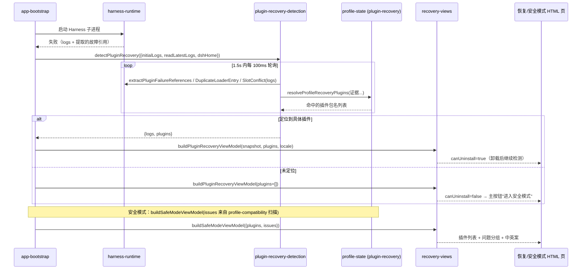

# 安全模式与插件恢复视图（recovery-views）

当 Harness 子进程因插件问题启动失败时，桌面外壳向用户展示两类自助页面。本模块是**诊断 → UI** 的翻译层：纯函数、无 Electron 依赖输入（只接收数据 + locale），输出扁平的视图模型对象（含全部中英文字案），供加载 `dsh-recovery:`/安全模式 HTML 页的渲染端直接消费。检测与修复的实际机制在 [[harness-runtime]]（日志解析）与 [[profile-state]]（profile 扫描/卸载）。

## 架构概述

## 组件约束索引

| Component | Constraints | Risks | Summary |
|-----------|------------|-------|---------|
| `detectPluginRecovery` | 3 | 1 | 合并初始+实时日志，1.5s 超时内每 100ms 轮询，命中或超时即返回 |
| `describePluginFailure` | 6 | 1 | 6 类日志模式正则→中英标题/详情，未命中给通用文案 |
| `buildPluginRecoveryViewModel` | 2 | 1 | 有插件→卸载主按钮；无插件→安全模式主按钮 |
| `buildSafeModeViewModel` | 3 | 2 | 问题按 groupId 聚合；阻断组未清时退出需二次确认 |
| `latestAttemptText` | 1 | 1 | 只取最后一次 `[desktop] starting` 之后的日志 |

## 组件职责

### plugin-recovery-detection.ts — 证据汇聚与轮询

`detectPluginRecovery(options)` 是检测编排函数：

- 输入：`dshHome`、`initialLogs`（子进程已产出的日志）、`readLatestLogs`（读取渲染进程实时 console 缓冲——前端插件故障可能在启动失败 DOM 出现后才发布详细错误）、`excludedPlugins`、`slotProviderNodeModulesPaths`。
- 循环：`mergeLogs(initialLogs, readLatestLogs())` 去重合并 → 调 [[harness-runtime]] 的三个提取函数（`extractPluginFailureReferences`、`extractDuplicateLoaderEntryId`、`extractSlotConflictName`）从日志取证据 → 交给 [[profile-state]] 的 `resolveProfileRecoveryPlugins` 把证据映射为 profile 内实际安装的插件包名。
- 终止：解析出 ≥1 个插件，或到达 deadline。超时时长 `PLUGIN_RECOVERY_EVIDENCE_TIMEOUT_MS = 1500ms`、轮询间隔 `PLUGIN_RECOVERY_EVIDENCE_POLL_MS = 100ms`（均可注入，便于测试）。
- 返回 `{logs, plugins}`：plugins 为空时上层引导用户进安全模式。

### plugin-recovery-view.ts — 启动修复页视图模型

- `describePluginFailure(logs, locale)`：对**最后一次启动尝试**的日志（`latestAttemptText` 从最后一个 `[desktop] starting ` 标记处截取）依次匹配 6 类故障模式，产出 `{title, detail}` 双语：

  | 日志模式（正则） | 中文标题 |
  |------------------|----------|
  | `duplicate prefix route "X"` | 插件使用了重复的服务入口 |
  | `duplicate loader entry id: X` | 插件注册了重复的服务组件 |
  | `cannot resolve profile bundle` | 插件没有完整安装（配置引用但包缺失） |
  | `declares no dsh.bundle` | 安装的包不是兼容的 DSH 插件 |
  | `single slot "X" already has a registration` | 插件存在界面插槽冲突 |
  | `failed to import loader entry` | 插件代码加载失败（损坏/缺依赖/版本不兼容） |

  全部未命中时给通用"插件启动失败，无法自动判断具体原因"。

- `displayPluginName(packageName)`：scoped 包（`@scope/name`）截掉 scope，只显示 `name`。
- `buildPluginRecoveryViewModel({snapshot, plugins, removedPlugins, locale, notice})`：组装整页文案。关键分支：**`canUninstall = plugins.length > 0`**——有明确插件时主按钮是"卸载此插件/N 个插件并继续检测"（卸载后 app-bootstrap 重启检测循环，`removedPlugins` 非空时显示"已处理 N 个，正在继续检查"进度）；定位不到时主按钮改为"进入安全模式"。视图还携带 `launchDirectory`、`rawError`（snapshot.message）供"技术详情"展开。

### safe-mode.ts — 安全模式页视图模型

- 触发：`shouldStartInSafeMode(argv)` —— 命令行含 `--safe-mode`（安全模式 profile 由 [[profile-state]] 的 `ensureSafeModeProfile` 准备，停用全部第三方插件但不删除）。
- `buildSafeModeViewModel({locale, plugins, issues, notice, noticeTone})`：输入来自 [[profile-state]] 的 `inspectProfileCompatibility` 扫描结果（`ProfileCompatibilityIssue[]`），输出：
  - **插件区** `pluginItems`：可卸载的第三方插件，被 `disable-plugin` 类问题命中的标 `incompatible`（"版本不兼容"）。
  - **问题分组** `issueGroups`：非 disable-plugin 的问题按 `groupId`（缺省 `${resolution}:${target}`）聚合，组级别汇总严重度（任一则 blocking）、动作文案（`disable-plugin`→"暂停插件（保留数据）"、`quarantine-workspace`→"隔离 Workspace（可恢复）"、重建依赖→"重建冲突依赖"）与数量。问题 kind 三类：`core-version-mismatch`（核心版本冲突）、`missing-client-module`（插件版本不兼容）、workspace 依赖污染。
  - **阻断确认**：仍存在阻断问题组时，`restartConfirm` 给出二次确认文案（"退出后会重新启用第三方插件，可能再次启动失败"）。
  - 安全承诺固定出现在 `safetyNote`：工作区、会话、模型配置和未选中插件不会被删除。

## 关键业务约束

- **检测有时间盒，不无限等待渲染进程日志**（confidence: 0.9）
  > Evidence: `plugin-recovery-detection.ts:9-10` 超时 1500ms/轮询 100ms；`:59` `plugins.length > 0 || now() >= deadline` 即返回。

- **诊断只基于最后一次启动尝试的日志**（confidence: 0.85）
  > Evidence: `plugin-recovery-view.ts:40-49` `latestAttemptText` 反向找最后一个 `[desktop] starting ` 行，只取其后内容——避免历史失败误导。

- **定位不到插件不得给卸载按钮，改引导安全模式**（confidence: 0.9）
  > Evidence: `buildPluginRecoveryViewModel` 中 `canUninstall = plugins.length > 0`，`primaryLabel` 据此二选一。

- **安全模式只停用不删除；退出有阻断问题须二次确认**（confidence: 0.9）
  > Evidence: `safe-mode.ts:170` summary 明确"暂时停用…不会删除插件"；`:184-186` `blockingGroups > 0` 时才设 `restartConfirm`。

- **所有用户可见文案内建 en/zh 双语**（confidence: 0.95）
  > Evidence: 三个视图模型均以 `locale === 'zh'` 分支返回完整文案对象，无运行时词典依赖。

## 数据流与状态

本模块无持久化状态；输入证据链为：子进程 stderr/stdout（[[harness-runtime]] 采集）→ 正则提取故障引用 → `resolveProfileRecoveryPlugins` 结合 profile 安装清单映射包名 → 视图模型；安全模式侧输入为 profile-compatibility 扫描的 `ProfileCompatibilityIssue[]`。用户动作（卸载/进入安全模式/重启）由 [[app-bootstrap]] 的 `waitForPluginRecoveryAction`/`waitForSafeModeAction` 接收并调 [[profile-state]] 执行，之后重跑检测形成"卸载—再检测"循环。

## 与其他模块的关系

- [[harness-runtime]]：提供日志与 `extract*` 故障证据提取函数。
- [[profile-state]]：`resolveProfileRecoveryPlugins`、`inspectProfileCompatibility`、安全模式 profile、插件卸载/隔离执行。
- [[app-bootstrap]]：检测编排、页面展示（`showPluginRecovery`/`showSafeMode`）、用户动作等待与执行。
- [[shared-contracts]]：消费 `RuntimeSnapshot`（logs/message/launchDirectory）。

## 跨模块引用

- 恢复页通过 `dsh-recovery:` 协议加载，可信协议白名单见 [[window-shell]] 的 `isTrustedAppUrl`。
- preload 侧的安全模式横幅与插件错误侦测见 [[preload-ui]]。
