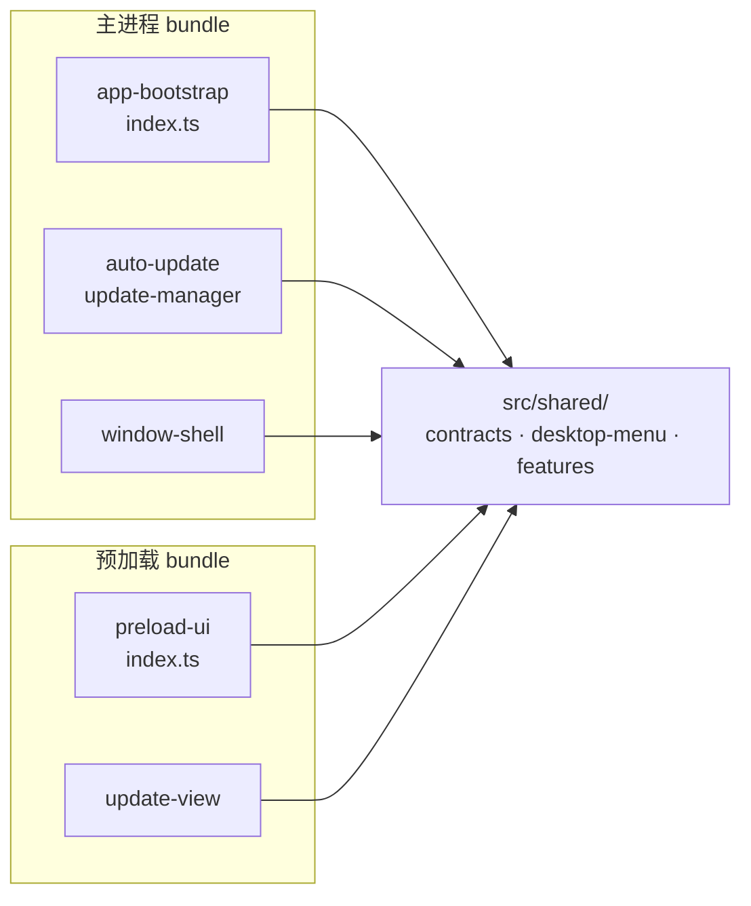

# 共享契约与类型（shared-contracts）

## 架构概述

`src/shared/` 是 **main 进程与 preload 脚本之间唯一的类型共享层**。Electron 的 main 与 renderer（preload）是两个独立 bundle，不能互相 import 各自的运行时模块；`src/shared/` 下的文件刻意**不引入任何 Electron 或 Node 原生模块**（见 `features.ts` 头注释），因此两个 bundle 都能安全 import 同一份常量与类型，作为 IPC 消息、状态快照、菜单命令的 wire format 真相源。

三个文件各自承载一类契约：

| 文件 | 导出 | 作用 |
|------|------|------|
| `contracts.ts` | `RuntimePhase` / `RuntimeSnapshot` / `UpdatePhase` / `UpdateStatus` | Harness 运行时与自动更新的状态枚举及快照结构 |
| `desktop-menu.ts` | `desktopMenuCommands` / `DesktopMenuCommand` / 守卫函数 / `WINDOWS_TITLEBAR_HEIGHT` | 桌面原生菜单命令的联合类型与运行时守卫 |
| `features.ts` | `ENABLE_MOBILE_BRIDGE` | main 与 preload 共用的特性开关常量 |

## 组件职责

### contracts.ts — 状态枚举与快照

**`RuntimePhase`**（Harness 子进程生命周期阶段）取值：

| 取值 | 含义 |
|------|------|
| `idle` | 尚未启动 |
| `starting` | 子进程已 spawn，正在就绪探测中 |
| `ready` | 启动探针通过、web server 可用 |
| `stopping` | 正在停止子进程 |
| `failed` | 启动失败（插件故障、端口占用、入口缺失等） |

**`RuntimeSnapshot`** 字段：`phase`、`message`（人类可读状态/错误文本）、`launchDirectory?`（本次启动的 profile/工作目录）、`logs: string[]`（最近的启动日志，供故障页展示）、`url?`（Harness web server 地址）、`authToken?`（**每进程一次性启动令牌**）。

> 关键约束（见 `contracts.ts:14` 注释）：`authToken` 仅能通过 `GET /?token=` 换取签名会话 cookie；API 路径与 `Authorization` 头一律拒绝它。详见 [[window-shell]] 的 `desktopHarnessUrl` 与 [[harness-runtime]] 的 `extractLaunchToken`。

**`UpdatePhase`**（自动更新阶段）取值：`idle` / `checking` / `available` / `downloading` / `downloaded` / `up-to-date` / `error` / `unsupported`。

**`UpdateStatus`** 字段：`phase`、`currentVersion`、`availableVersion?`、`percent?`（下载进度 0–100）、`message?`、`manual: boolean`（是否为手动触发的检查——手动检查时即便"已是最新"或出错也需给用户反馈）。该结构由 [[auto-update]] 的 reducer 产出，经 IPC 推给 [[preload-ui]] 的 `update-view` 渲染提示条。

### desktop-menu.ts — 菜单命令联合类型

`desktopMenuCommands` 是一个 `as const` 只读数组，定义了 **19 个**桌面菜单命令，`DesktopMenuCommand` 由它派生为联合类型。命令分四组：

| 分组 | 命令 |
|------|------|
| Harness 控制 | `connect-phone`、`restart-harness`、`safe-mode`、`show-harness-log`、`check-for-updates` |
| 编辑 | `undo`、`redo`、`cut`、`copy`、`paste`、`select-all` |
| 视图/窗口 | `reload`、`toggle-devtools`、`zoom-reset`、`zoom-in`、`zoom-out`、`toggle-fullscreen` |
| 应用 | `about`、`quit` |

- `isDesktopMenuCommand(value)`：类型守卫，用 `Set<string>` 在运行时校验 IPC 传入的未知 `value` 是否合法命令——**IPC 边界不可信输入的第一道校验**。
- `isZoomMenuCommand(command)`：判断是否为三个缩放命令之一（缩放走 `webContents.setZoomFactor` 而非转发给页面）。
- `formatZoomPercentage(zoomFactor)`：`zoomFactor`（1.0 = 100%）格式化为百分比字符串。
- `WINDOWS_TITLEBAR_HEIGHT = 36`：Windows 自定义标题栏高度常量，被 [[preload-ui]] 的 `windows-titlebar` 用于布局拖拽区域。

### features.ts — 特性开关

`ENABLE_MOBILE_BRIDGE`：移动端配对桥（"连接手机"）能力开关。该常量被 main（菜单项、IPC handler、是否启动桥）与 preload（侧边栏按钮）同时读取——`false` 时菜单项/按钮/handler 全部 no-op 且桥永不启动。文件注释注明该能力于 2026-08-17 加入。

## 关键业务约束

- **共享层禁止原生依赖**（confidence: 0.95）
  > Evidence: `features.ts:1-3` 注释 "These are plain constants (no Electron import) so both bundles can import them without pulling in native modules." —— 若在 `src/shared/` 引入 electron/Node API，preload bundle 会被污染或构建失败。

- **启动令牌是一次性、仅根路径可兑换**（confidence: 0.9）
  > Evidence: `contracts.ts:14` "only `GET /?token=` exchanges it for a session cookie" —— 快照携带 token 仅供窗口首次导航使用，刷新后旧 token 由 Host 重定向清理。

- **菜单命令必须经运行时守卫校验**（confidence: 0.85）
  > Evidence: `isDesktopMenuCommand` 用 `desktopMenuCommandSet.has(value)` 收窄 `unknown` —— renderer 经 IPC 发来的命令字符串在执行前必须通过此守卫，防止注入任意命令。

## 与其他模块的关系

- [[app-bootstrap]]：消费 `RuntimeSnapshot`（`registerHarnessHandlers` 推送快照）、`DesktopMenuCommand`（`executeDesktopMenuCommand` 分发）。
- [[auto-update]]：`UpdatePhase`/`UpdateStatus` 是其状态机的枚举与输出结构。
- [[preload-ui]]：preload 侧 import `ENABLE_MOBILE_BRIDGE`、`WINDOWS_TITLEBAR_HEIGHT`、菜单命令与守卫。
- [[window-shell]]：`desktopHarnessUrl` 使用 `authToken`；菜单/缩放命令在此处理。

## 跨模块引用

- 状态机的具体转移逻辑见 [[auto-update]]、[[harness-runtime]]。
- 菜单命令的 UI 挂载见 [[preload-ui]]（`windows-menu` / `windows-titlebar`）。
