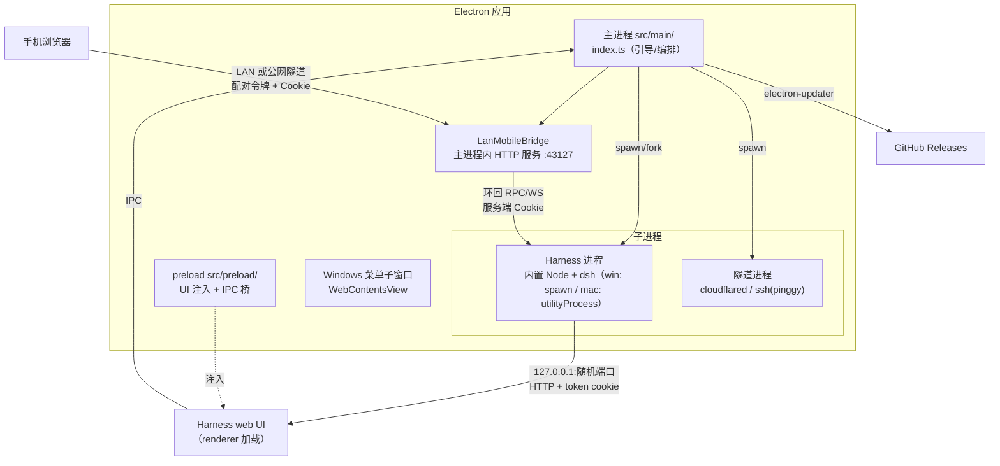
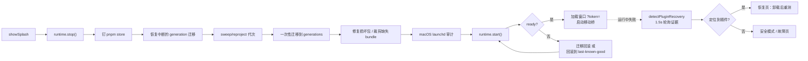

# dsh-desktop 仓库总览

`dsh-desktop`（package.json: `dsh-desktop` v0.3.2）是 **DeepSeek Harness 的跨平台 Electron 桌面外壳**。Harness 本体（`@deepseek-ai/dsh-*`，agent 运行时 + web UI）是一个 Node 应用，以 vendored 依赖形式随包分发；本仓库的自有代码负责：

1. 把 Harness 作为子进程拉起、探活、注入便携环境；
2. 在第三方插件导致启动失败时**检测—隔离—修复—回滚**，无需重装应用；
3. 提供桌面原生体验：窗口/菜单/托盘/标题栏、自动更新、移动端配对访问；
4. 产出零安装、便携的安装包（data 目录随可执行文件走）。

## 技术栈

| 层       | 技术                                                                                  |
| ------- | ----------------------------------------------------------------------------------- |
| 外壳      | Electron（main + preload + renderer 承载 Harness web UI）、electron-vite、TypeScript      |
| Harness | vendored `@deepseek-ai/dsh-*` 0.1.2-alpha.1（Cordis 4 插件容器），包内 Node 运行时 + pnpm 11.21 |
| 扩展      | 4 个本地 Cordis 插件包（`packages/dsh-desktop-*`，JS）                                       |
| 更新      | electron-updater（generic provider → GitHub releases）                                |
| 打包      | electron-builder（Win NSIS / Mac dmg+zip）、`scripts/bundle-user-data.mjs`             |
| 测试      | vitest                                                                              |

## 进程拓扑

关键事实：Harness web server 监听 `127.0.0.1:<随机端口>`；窗口首次导航以 `?token=<每进程启动令牌>` 换取签名会话 cookie（见 [[window-shell]]、[[harness-runtime]]）。移动桥是主窗口之外的**第二条访问路径**（见 [[mobile-bridge]]）。

## 模块地图（自有代码）

自有源码集中在 `src/`（54 个 TS 文件）与 `packages/`（4 个插件包），`packages/harness-0.1.2-alpha.1/` 是 vendored Harness（非自有）。

| 模块                     | 路径                                                        | 职责                                                                                     |
| ---------------------- | --------------------------------------------------------- | -------------------------------------------------------------------------------------- |
| [[app-bootstrap]]      | `src/main/index.ts`                                       | 主进程入口：生命周期、窗口、便携路径、Harness 启动编排（检测→修复→generation→启动→回滚）、IPC、托盘/菜单、恢复流程编排               |
| [[harness-runtime]]    | `src/main/runtime/`                                       | Harness 子进程生命周期、就绪探测（token+HTTP）、日志采集与故障插件正则诊断、profile 插件命令、macOS 免责 utility process   |
| [[profile-state]]      | `src/main/state/`                                         | 最大子系统：profile 兼容性/一致性检测、损坏修复、插件隔离卸载、patch 层裁剪、修复台账、generation 代次迁移/回滚、macOS launchd 审计 |
| [[recovery-views]]     | `src/main/safe-mode.ts` 等                                 | 安全模式与插件恢复页的中英双语视图模型（诊断→可操作 UI）                                                         |
| [[window-shell]]       | `src/main/security*.ts`、`window-*.ts`、`gpu-fallback.ts` 等 | 窗口安全加固、导航/cookie 策略、右键菜单、托盘、GPU 分级降级、渲染崩溃重载、平台差异                                       |
| [[preload-ui]]         | `src/preload/`                                            | renderer 侧 DOM 注入：更新卡、移动按钮、安全模式横幅、启动失败侦测、Windows 标题栏/菜单                                |
| [[shared-contracts]]   | `src/shared/`                                             | main/preload 共享类型真相源：RuntimePhase、UpdatePhase、DesktopMenuCommand、特性开关                  |
| [[mobile-bridge]]      | `src/main/mobile/`                                        | 手机配对桥：LAN/公网隧道 HTTP 网关、配对令牌、RPC 白名单转发、mux/SSE、问答推送、cloudflared/pinggy                  |
| [[auto-update]]        | `src/main/update/`                                        | electron-updater 状态机、平台策略、跳过版本、IPC 推送                                                  |
| [[desktop-extensions]] | `packages/dsh-desktop-*`                                  | 4 个 Cordis 插件：品牌 UI、HMR 回退、插件市场安装器（环回校验 HTTP 路由 + 包内 pnpm）、preset 归档                   |
| [[build-tooling]]      | `electron.vite.config.ts`、`scripts/`、`package.json`       | electron-vite 构建、bundle-user-data 就地裁剪、electron-builder（NSIS/dmg）、harness 包版本对齐        |

## 启动与自愈主线

这是本仓库最重要的一条链（`launchHarness()`，见 [[app-bootstrap]]）：

两层"已知良好"判定：进程到达 `ready`（token+HTTP 健康）只是必要条件，**窗口真正渲染**（`markHarnessRendered`）才提交 last-known-good 代次。

## 便携部署模型

- **DSH_HOME 便携化**：打包态 `DSH_HOME = <可执行文件目录>/data`（[[app-bootstrap]] 的 `portableDshHome`），profile/settings/凭据全在可执行文件旁；Windows 另写 `HKCU\Environment\DSH_HOME` 让 CLI 可见。
- **data/ 双重身份**：dev 态是活的 DSH_HOME，打包时是构建输入；`bundle-user-data.mjs` 只就地规范化（剥机器路径、按平台裁剪 prebuilds、清断链），敏感/运行时数据由 electron-builder filter 白名单排除（见 [[build-tooling]]）。
- **包内 Node/pnpm**：优先复用 Electron 二进制作 Node 运行时（`ELECTRON_RUN_AS_NODE=1`），回退包内 node；插件安装只用包内 pnpm（经 lock-recovery runner），不依赖系统包管理器（见 [[harness-runtime]]、[[desktop-extensions]]）。

## 安全边界要点

- 主窗口只允许导航到 `file:`、`dsh-recovery:` 与环回 HTTP；权限白名单 + 主框架 + Harness 源三重条件（[[window-shell]]）。
- 敏感 IPC handler 校验 `event.sender === 主窗口 webContents`；菜单命令经类型守卫（[[app-bootstrap]]、[[shared-contracts]]）。
- 市场安装 HTTP 路由仅接受环回 socket、无转发头、变更类要求同源 Origin（[[desktop-extensions]]）。
- 移动桥：私网/环回地址判定、Sec-Fetch-Site+Origin 校验、一次性配对令牌（恒定时间比较）、HttpOnly Cookie、RPC 方法白名单（[[mobile-bridge]]）。

## 平台差异

| 主题         | Windows                                    | macOS                                      |
| ---------- | ------------------------------------------ | ------------------------------------------ |
| Harness 进程 | `child_process.spawn`（detached 进程组）        | `utilityProcess.fork`（disclaim TCC，dev 关闭） |
| 关窗         | 驻留托盘                                       | Dock 行为                                    |
| 标题栏/菜单     | 无边框 + 自定义标题栏 + 菜单子窗口                       | 原生菜单                                       |
| 守护残留       | —                                          | launchd/LaunchAgent 审计与更新前隔离               |
| 打包         | NSIS（覆盖安装、data 直落 $INSTDIR）                | dmg + zip（供更新）、hardenedRuntime             |
| 隧道         | cloudflared 自动下载（SHA256 校验）；pinggy 用系统 ssh | 同左                                         |

## 文档索引与旧文档

`wiki/modules/` 下另有 5 份早期英文文档可作补充参考：`architecture.md`、`development.md`、`preset-packages.md`、`release-runbook.md`（发布流程）、`wiki_overview.md`。如与本总览或模块文档冲突，以代码与本次生成的中文模块文档为准。

## 给开发者的入口建议

- 改启动/修复行为：先读 [[app-bootstrap]] 的启动序列，再深入 [[profile-state]] 对应层。
- 加 IPC：主进程 handler 必须加 sender 校验，类型放 [[shared-contracts]]，renderer 侧经 [[preload-ui]]。
- 动打包：读 [[build-tooling]]，注意 data/ 就地裁剪会影响 dev profile（跨平台打包需重装 profile 依赖）。
- 排查"插件导致起不来"：看 `harness.log`（日志解析在 [[harness-runtime]]），恢复页逻辑在 [[recovery-views]]。
